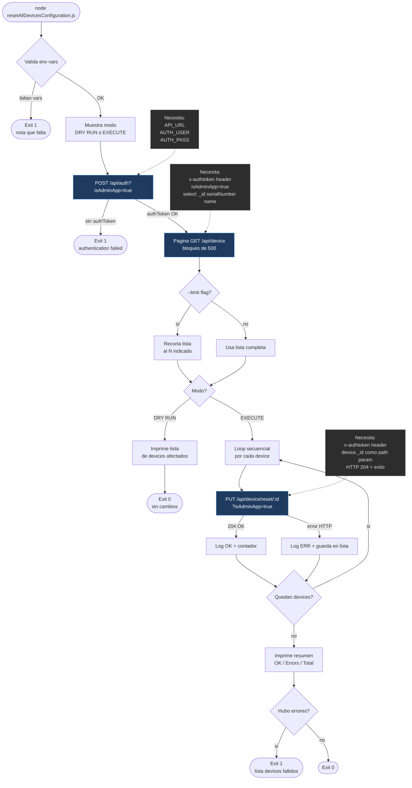

```mermaid
flowchart TD
    A(["node resetAllDevicesConfiguration.js"]) --> B{"Valida env vars"}

    B -->|faltan vars| Z1(["Exit 1<br/>nota que falta"])
    B -->|OK| C["Muestra modo<br/>DRY RUN o EXECUTE"]

    C --> D["POST /api/auth?isAdminApp=true"]:::api
    NOTE1["Necesita:<br/>API_URL<br/>AUTH_USER<br/>AUTH_PASS"]:::note
    NOTE1 -.-> D

    D -->|sin authToken| Z2(["Exit 1<br/>authentication failed"])
    D -->|authToken OK| E["Pagina GET /api/device<br/>bloques de 500"]:::api

    NOTE2["Necesita:<br/>x-authtoken header<br/>isAdminApp=true<br/>select: _id serialNumber name"]:::note
    NOTE2 -.-> E

    E --> F{"--limit flag?"}
    F -->|si| G["Recorta lista<br/>al N indicado"]
    F -->|no| H["Usa lista completa"]

    G --> I{"Modo?"}
    H --> I

    I -->|DRY RUN| J["Imprime lista<br/>de devices afectados"]
    J --> K(["Exit 0<br/>sin cambios"])

    I -->|EXECUTE| L["Loop secuencial<br/>por cada device"]

    L --> M["PUT /api/device/reset/:id<br/>?isAdminApp=true"]:::api

    NOTE3["Necesita:<br/>x-authtoken header<br/>device._id como path param<br/>HTTP 204 = exito"]:::note
    NOTE3 -.-> M

    M -->|204 OK| N["Log OK + contador"]
    M -->|error HTTP| O["Log ERR + guarda en lista"]

    N --> P{"Quedan devices?"}
    O --> P

    P -->|si| L
    P -->|no| Q["Imprime resumen<br/>OK / Errors / Total"]

    Q --> R{"Hubo errores?"}
    R -->|si| Z3(["Exit 1<br/>lista devices fallidos"])
    R -->|no| S(["Exit 0"])

    classDef api fill:#1e3a5f,stroke:#4a90d9,color:#ffffff
    classDef note fill:#2d2d2d,stroke:#666666,color:#dddddd
```

