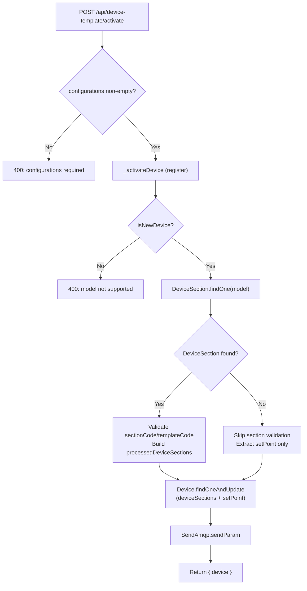
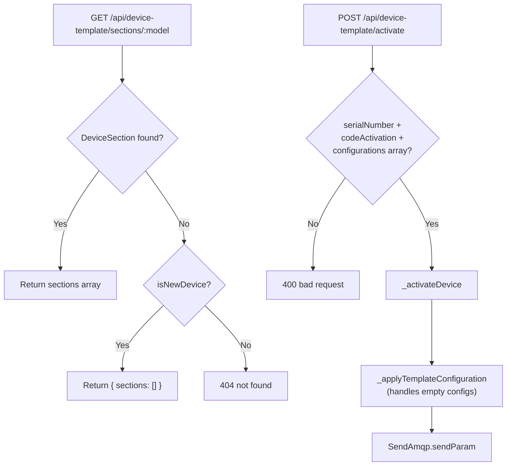
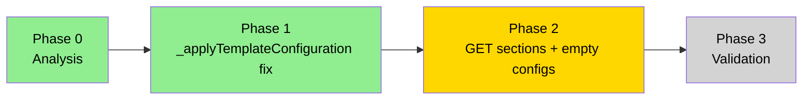

# Task: Panel0ry Activation without confParams

> Task document for AI-assisted work. Follow AGENTS.md workflow.
> **After every phase:** update §8 phase status, add an entry to §10 implementation log, and update the Mermaid diagrams.

---

## 1. Metadata

| Field | Value |
|---|---|
| Task name | Panel0ry activation without confParams |
| Owner | Dani |
| Created | 2026-06-01 |
| Last updated | 2026-06-01 |
| Status | In progress |
| Current phase | Phase 2 — GET sections + empty configurations fix |
| Repository area | `src/controllers/api/device-template.ts`, `src/controllers/api/manufactured-device.ts` |
| Base branch | develop |
| Related ticket | KNT-2334 |

---

## 2. Objective

Enable Panel0ry devices to complete the activation flow even when they don't have a `DeviceSection` document (i.e. no section-based configuration parameters). The device should still activate, optionally receive a `setPoint` value, and emit the correct AMQP event.

A second, pending implementation (see §8) extends this base to cover cases still blocked by current validations.

---

## 3. Non-goals

- Do not change the activation flow for device models that already have a `DeviceSection`.
- Do not remove `sectionCode`/`templateCode` validation for models that have sections.
- Do not alter the AMQP payload shape for devices that have section configurations.

---

## 4. Background

- **Current behavior (before fix):** `_applyTemplateConfiguration` called `DeviceSection.findOne` and immediately rejected with 404 if no document was found. Panel0ry has no `DeviceSection`, so activation always failed.
- **Target behavior (after fix):** If no `DeviceSection` exists, skip section validation, extract only the `setPoint` value (if any), and proceed to update the device and send AMQP. An empty `configurations` path still needs handling (see §8).
- **Why:** Panel0ry is a new device type that doesn't use the template-section model. Its activation must still work end-to-end.
- **Constraints:**
  - `configurations` array must still be non-empty at the controller entry point (line 183). This is the main remaining blocker for a fully empty-config 0ry activation.
  - AMQP payload must remain backwards compatible.

---

## 5. Source of truth

| Type | Path | Why it matters |
|---|---|---|
| Controller | [src/controllers/api/device-template.ts](../../src/controllers/api/device-template.ts) | Entry point (`activateDeviceTemplate`) and core logic (`_applyTemplateConfiguration`) |
| Controller | [src/controllers/api/manufactured-device.ts](../../src/controllers/api/manufactured-device.ts) | `cloudActivationEnableDevice` — device activation and error propagation |
| Helper | `src/lib/helpers/device-classifier.ts` | `isNewDevice` — decides whether model is eligible for template activation |
| Service | `SendAmqp.sendParam` | Sends the activation event to the message broker |
| Model | `DeviceSection` (Mongoose) | Section/template definitions per device model — may not exist for Panel0ry |

---

## 6. Scope

### In scope

- `_applyTemplateConfiguration`: handle missing `DeviceSection` gracefully.
- `activateDeviceTemplate`: relax `configurations` validation for models that don't need sections (new implementation TBD).
- Error propagation fix in `manufactured-device.ts` catch handler.

### Out of scope

- Changes to the AMQP message schema.
- Changes to `isNewDevice` classification.
- Any frontend changes.

### Compatibility requirements

- Existing endpoint path: `POST /api/device-template/activate`
- Existing request/response shapes: unchanged for devices with sections.
- Existing error codes: 400/404/500 semantics preserved.
- Frontend assumptions: must continue to receive `{ device: <updatedDevice> }` on success.

---

## 7. Architecture / strategy

The activation flow has two stages: first the device is registered (`_activateDevice` → `cloudActivationEnableDevice`), then its template configuration is applied (`_applyTemplateConfiguration`). Panel0ry skips the section-configuration step but still needs the AMQP event.

### Current flow (post-fix)



### Full flow (post Phase 2)



---

## 8. Phases

| Phase | Name | Goal | Status |
|---|---|---|---|
| 0 | Analysis | Understand current state and map implementation | Done |
| 1 | Fix: _applyTemplateConfiguration | Handle missing DeviceSection, extract setPoint without sections | Done (KNT-2334, merged to develop) |
| 2 | Fix: GET sections + empty configurations | Return `{ sections: [] }` for new devices; allow `configurations: []` in POST activate | Done |
| 3 | Validation | Run tests, manual checks, document results | Not started |

### Phase progress



> **Do not advance to Phase 3 without user validation in the browser.**

---

## 9. Decisions

| Date | Decision | Reason | Alternatives considered |
|---|---|---|---|
| 2026-05-12 | Make `DeviceSection` optional instead of 404 in `_applyTemplateConfiguration` | Panel0ry has no section definitions but must activate | Keep 404, add a dummy DeviceSection for 0ry |
| 2026-05-12 | Extract `setPoint` from configs even without sections | 0ry needs setPoint propagated to AMQP even without sectionCode/templateCode | Separate setPoint field in payload |
| 2026-05-12 | Propagate original error in manufactured-device catch | Swallowing structured errors (with `.status`) was masking 400/404 from upstream | Wrap all errors in a generic 400 |
| 2026-06-01 | `getDeviceTemplateSections` returns `{ sections: [] }` for `isNewDevice` models | 0ry/0ryH have no DeviceSection; returning 404 was blocking the frontend activation wizard | Return empty array for all models; or keep 404 for all |
| 2026-06-01 | Remove `configurations.length === 0` guard in `activateDeviceTemplate` | Frontend sends `[]` when there are no sections; the downstream `_applyTemplateConfiguration` already handles it | Keep guard and force frontend to omit the field |

---

## 10. Implementation log

### 2026-06-01 — Phase 2: GET sections + empty configurations

#### Summary

- `getDeviceTemplateSections`: when `DeviceSection.findOne` returns null, now checks `isNewDevice(modelName)`. If true, returns `{ sections: [] }` instead of 404. Unknown/old models still get 404.
- `activateDeviceTemplate`: removed `configurations.length === 0` guard. Models without sections (0ry, 0ryH) can now send an empty array. Models with sections continue to work as before because the frontend populates configurations from the GET sections response.

#### Files changed

- [src/controllers/api/device-template.ts](../../src/controllers/api/device-template.ts) — `getDeviceTemplateSections` and `activateDeviceTemplate`

#### Validation

- `npx tsc --noEmit` → no errors in `device-template.ts`
- `src/app.ts` has pre-existing corrupt content (markdown image refs) causing unrelated tsc errors — out of scope.
- Manual test pending (see §3 Validation plan below).

#### Problems found

- None introduced by this change.

#### Next step

- Run the server locally and execute the validation plan below.
- Once confirmed, merge to develop.

---

## Validation plan (Phase 2) — Postman + local

### Prerequisitos

1. Arranca el servidor local:
   ```bash
   npm start
   ```
   El servidor escucha en `http://localhost:3001` (o el valor de `API_PORT` en tu `.env`).

2. Consigue un token de sesión válido:
   - Haz login en el front local / staging y copia el valor de la cabecera `x-authtoken` de cualquier petición en el panel de red del navegador.
   - O llama al endpoint de login con tus credenciales y guarda el token.

---

### Test 1 — GET sections para un 0ry: debe devolver `{ sections: [] }`

**Postman:**
- Method: `GET`
- URL: `http://localhost:3001/api/device-template/sections/panel_0ry_7302`
- Headers: `x-authtoken: <tu_token>`

**Esperado:** `200 { "sections": [] }`
**Antes del fix:** `404 { "message": "Device model panel_0ry_7302 not found" }`

Repite con `panel_0ry_7301`, `panel_0ry_h_7201`, `panel_0ry_h_7202`.

---

### Test 2 — GET sections para un 0ry en staging (sin arrancar local)

Si solo quieres verificar que el endpoint de staging también devuelve 404 antes de mergear, usa el token que ya tenías del navegador:

- Method: `GET`
- URL: `https://api.ako54.akonet.cloud/api/device-template/sections/panel_0ry_7302`
- Headers: `x-authtoken: ZjmVKdYIKedtmBRvuKgCCjFX102SJzvr`

**Esperado staging (sin el fix):** `404` — confirma que el bug existe.  
**Esperado local (con el fix):** `200 { "sections": [] }`.

---

### Test 3 — GET sections para un modelo con secciones: no debe cambiar nada

**Postman:**
- Method: `GET`
- URL: `http://localhost:3001/api/device-template/sections/panel_1ry_6401`
- Headers: `x-authtoken: <tu_token>`

**Esperado:** `200 { "sections": [...] }` con datos reales. Mismo resultado que antes del fix.

---

### Test 4 — GET sections para un modelo desconocido: sigue siendo 404

**Postman:**
- Method: `GET`
- URL: `http://localhost:3001/api/device-template/sections/modelo_inventado`
- Headers: `x-authtoken: <tu_token>`

**Esperado:** `404 { "message": "Device model modelo_inventado not found" }`.

---

### Test 5 — POST activate con `configurations: []` (el caso bloqueado antes)

**Postman:**
- Method: `POST`
- URL: `http://localhost:3001/api/device-template/activate`
- Headers: `x-authtoken: <tu_token>`, `Content-Type: application/json`
- Body (raw JSON):
```json
{
  "serialNumber": "<numero_serie_0ry>",
  "codeActivation": "<codigo_activacion>",
  "configurations": [],
  "defaultParameters": 1,
  "firstActivation": 1
}
```

**Esperado:** `200 { "device": { ... } }`
**Antes del fix:** `400 { "message": "Missing or invalid required payload fields: ... configurations array (must not be empty)." }`

---

### Test 6 — Front-end

Abre el wizard de activación con un dispositivo `panel_0ry_7302` o `panel_0ry_h_7201`.  
El toast `VIEWS.DEVICE.ACTIVATION.PANEL_TEMPLATE.TOAST_ERROR` **no debe aparecer**.

---

### 2026-05-12 — Phase 1: _applyTemplateConfiguration fix

#### Summary

- Made `deviceSectionDefinitionDoc` nullable; no longer rejects if `DeviceSection.findOne` returns null.
- Config items without `sectionCode`/`templateCode` are skipped (continue) unless a `DeviceSection` exists.
- `setPoint` is extracted from configs regardless of whether sections exist.
- `updateQuery.deviceSections` only set when `processedDeviceSections.length > 0`.
- `configurationsForAmqp` falls back to `[]` when no `deviceSectionDefinitionDoc`.
- `setPointValue` only added to AMQP payload if non-null.
- Fixed `manufactured-device.ts` catch to re-reject structured errors instead of always wrapping in generic 400.

#### Files changed

- [src/controllers/api/device-template.ts](../../src/controllers/api/device-template.ts) — `_applyTemplateConfiguration`
- [src/controllers/api/manufactured-device.ts](../../src/controllers/api/manufactured-device.ts) — error catch in activation

#### Validation

- Command: manual API test with Panel0ry payload (no sectionCode/templateCode, only setPoint)
- Result: activation completed, AMQP message sent

#### Problems found

- Entry-point validation at line 183 still blocks `configurations: []` — activation with zero configs still returns 400.

#### Next step

- Clarify with owner: is there a Panel0ry variant that needs to activate with a completely empty configurations array? If so, Phase 2 relaxes the guard at line 183.

---

## 11. Final summary

Complete when the task is done.

| Field | Value |
|---|---|
| Final status | |
| Main changes | |
| Validation completed | |
| Known limitations | |
| Recommended next task | |
