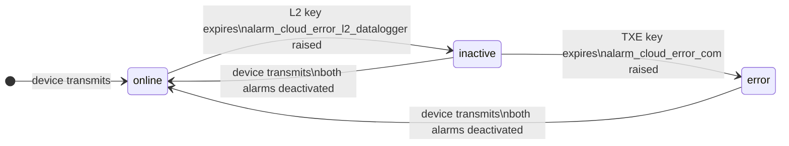
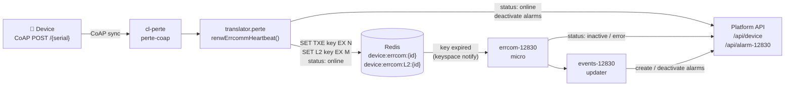
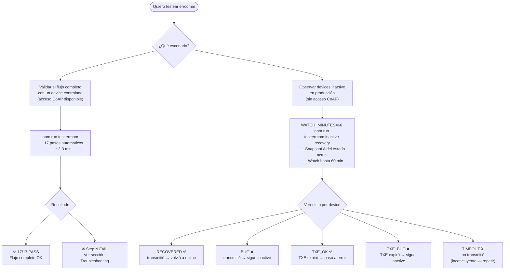

# errocom — Device Communication Timeout Tests

End-to-end test suite that validates the full communication-state lifecycle of
an AkoCloud device: from normal operation through two error windows and back to
recovery.

---

## What this tests

The AkoCloud platform monitors device connectivity through the
`errcom-12830` microservice. It maintains two Redis heartbeat keys per device
and transitions the device through three states when communication is lost:

| Phase | Redis key expired | Device status | Alarm raised |
|---|---|---|---|
| Normal | — | `online` | — |
| Intermediate loss | `device:errcom:L2:{id}` | `inactive` | `alarm_cloud_error_l2_datalogger` |
| Full loss | `device:errcom:{id}` | `error` | `alarm_cloud_error_com` |
| Recovery | — (keys renewed) | `online` | Both alarms deactivated |

---

## State lifecycle



---

## System architecture



**TTL formulas (production):**

| Key | Formula | Example |
|---|---|---|
| TXE (final) | `(2 × txeHours + 1) × 3600 s` | txe=1 → 10 800 s (3 h) |
| L2 (intermediate) | `(2 × l2Minutes + 1) × 60 s` | L2=0 → 420 s (7 min) |

> During the active test, both TTLs are replaced with short values
> (`PENDING_WINDOW_SECONDS` / `ERROR_WINDOW_SECONDS`) written directly to
> Redis after the initial CoAP trigger.

---

## Runner workflow



---

## Module structure

```
src/errocomtest/
├── base/
│   ├── types.ts                   Interfaces: CommTestConfig, TestResult,
│   │                              DeviceState, AlarmEntry, RedisKeySnapshot,
│   │                              StateTransition, TransitionTrigger
│   └── BaseComTestCase.ts         Abstract base: Redis, API, polling, reporting
└── cases/
│   └── error-com/
│       ├── TestCaseErrorComm.ts          17-step active test workflow
│       ├── test-error-comm-real.ts       Entry point (active test)
│       └── test-errcom-inactive-recovery.ts  Entry point (passive watch)
└── reports/                       HTML reports generated per run
    ├── ERROR_COMM_<ts>/           Active test reports
    └── ERROR_COMM_INACTIVE_WATCH_<ts>/  Watch reports
```

---

## Runners

### `test-error-comm-real.ts` — Active test (controlled)

Runs the full 17-step lifecycle against a single device. **Requires CoAP access** to trigger transmissions.

```bash
npm run test:errcom
```

| Step | What is verified |
|---|---|
| 1 | Redis connection (`PING` → `PONG`) |
| 2 | API connection (`GET /api/device/{id}` → 2xx) |
| 3 | CoAP sync trigger sent |
| 4 | Redis TXE key exists with TTL |
| 5 | Redis L2 key exists with TTL |
| 6 | Device status is `online` |
| — | **SETUP** — both keys overridden with short test TTLs |
| 7 | Wait L2 window |
| 8 | Device status is `inactive` |
| 9 | L2 alarm active |
| 10 | Wait TXE window (remainder) |
| 11 | Device status is `error` |
| 12 | TXE alarm active |
| 13 | CoAP recovery trigger sent |
| 14 | Redis TXE key renewed |
| 15 | Device status is `online` |
| 16 | L2 alarm deactivated |
| 17 | TXE alarm deactivated |

Steps 1–3 are **blocking** — a failure aborts the run immediately and writes a partial report.

**Expected duration:** ~2–3 minutes with default windows (`PENDING=30s`, `ERROR=60s`).

---

### `test-errcom-inactive-recovery.ts` — Passive watch (production)

Watches all non-SIM `inactive` devices in production. No CoAP required. Does not modify anything.

```bash
# Default: 20 min watch
npm run test:errcom:inactive-recovery

# Recommended for production observation
WATCH_MINUTES=60 caffeinate -i npm run test:errcom:inactive-recovery
```

**Phase 1 — Snapshot A:** reads current state of all inactive devices (status, last message, TXE/L2 TTL, alarms).

**Phase 2 — Watch:** polls every `POLL_INTERVAL_SECONDS`. Detects two events:
- `lastMsgTimestamp` changes → device transmitted → classifies as `RECOVERED` or `BUG`
- TXE key TTL goes from alive to -2 → key expired → classifies as `TXE_OK` or `TXE_BUG`

| Verdict | Meaning |
|---|---|
| `RECOVERED` | Transmitted → status back to `online` ✅ |
| `BUG` | Transmitted → status still `inactive` ❌ |
| `TXE_OK` | TXE expired → status moved to `error` ✅ |
| `TXE_BUG` | TXE expired → status still `inactive` ❌ |
| `TIMEOUT` | Did not transmit during watch window — inconclusive |

---

## Configuration

### Active test (`.env`)

| Variable | Required | Default | Description |
|---|---|---|---|
| `API_URL` | ✅ | — | Platform API base URL |
| `AUTH_TOKEN` | ✅ | — | `x-authtoken` header value |
| `DEVICE_ID` | ✅ | — | MongoDB ObjectId of the device |
| `DEVICE_MODEL` | | `12830` | Device model string |
| `SERIAL_NUMBER` | ✅ | — | Device serial number (integer) |
| `REDIS_HOST` | | `127.0.0.1` | Redis host |
| `REDIS_PORT` | | `6379` | Redis port |
| `COAP_HOST` | ✅ | — | CoAP server host |
| `COAP_PORT` | | `5683` | CoAP server port |
| `DEVICE_UUID` | ✅ | — | Hex UUID for CRC32 signing |
| `PENDING_WINDOW_SECONDS` | | `30` | Test TTL for L2 key |
| `ERROR_WINDOW_SECONDS` | | `60` | Test TTL for TXE key |

> **DEVICE_UUID** — find it in the device provisioning record or `client-coap-12830.js`.

### Passive watch (`.env.prod`)

| Variable | Default | Description |
|---|---|---|
| `API_URL` | — | Production API base URL |
| `API_KEY_TOKEN` | — | `x-authtoken` header value |
| `REDIS_HOST` | `127.0.0.1` | Redis host |
| `REDIS_PORT` | `6379` | Redis port |
| `WATCH_MINUTES` | `20` | Watch window duration |
| `POLL_INTERVAL_SECONDS` | `30` | Polling interval |
| `DEVICE_LIMIT` | `200` | Max devices to fetch |

---

## Report output

Reports are written to `src/errocomtest/reports/`:

```
src/errocomtest/reports/
├── ERROR_COMM_<ts>/
│   ├── summary.csv
│   ├── steps.csv
│   ├── redis.csv
│   ├── state-transitions.csv
│   └── index.html
└── ERROR_COMM_INACTIVE_WATCH_<ts>/
    └── watch-report.html
```

---

## Troubleshooting

| Symptom | Likely cause |
|---|---|
| Step 3 fails (CoAP error/timeout) | `COAP_HOST` unreachable — check VPN |
| Steps 4–5 fail (Redis keys not found) | `perte-coap` / `translator.perte` not running, or wrong `SERIAL_NUMBER` |
| Step 8 never reaches `inactive` | Redis keyspace notifications not enabled (`notify-keyspace-events Ex`) |
| Steps 16–17 fail (alarms not deactivated) | `events-12830/updater` pipeline lag — increase `RECOVERY_TIMEOUT_MS` |
| Redis connection refused | Wrong `REDIS_HOST` / `REDIS_PORT` or VPN down |
| CRC error / CoAP 4.xx response | Wrong `DEVICE_UUID` |
| Watch: `[redis] ETIMEDOUT` | VPN dropped mid-watch — use `caffeinate -i` to prevent Mac sleep |

---

## External services required

| Service | Role |
|---|---|
| Platform API | Device state and alarm queries |
| Redis | Key TTL inspection; test TTL injection (active test only) |
| CoAP server (`cl-perte`) | Receives simulated sync messages (active test only) |
| `translator.perte` | Processes CoAP → calls `renewErrcommHeartbeat()` |
| `errcom-12830` micro | Subscribes to Redis key expiry → transitions device state |
| `events-12830/updater` | Creates / deactivates alarm records in MongoDB |
