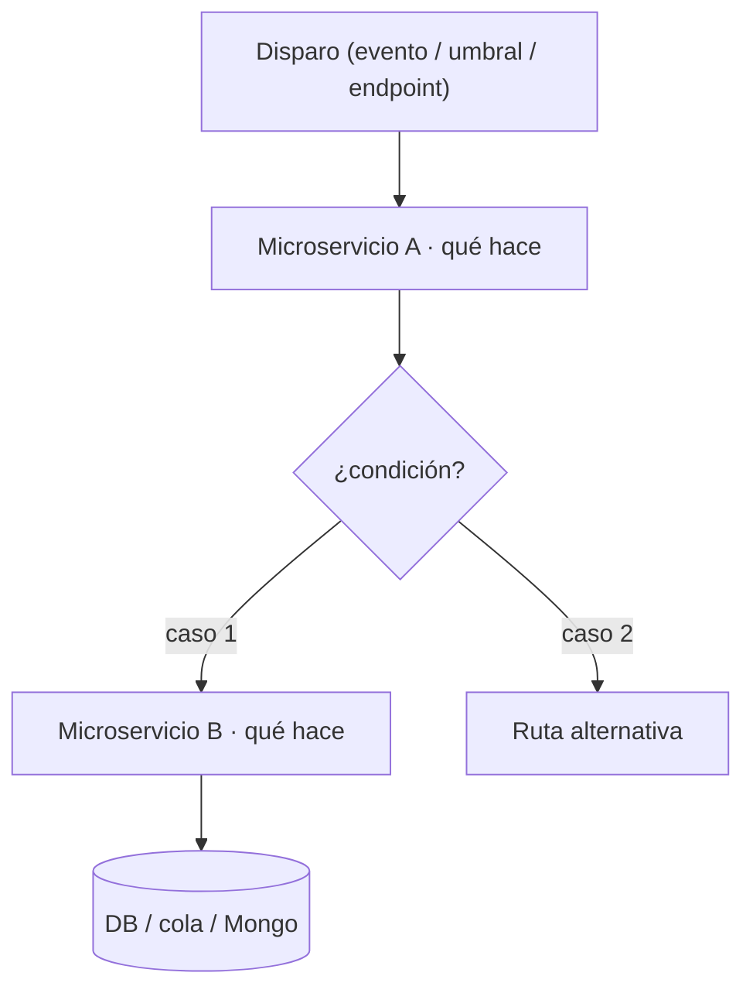
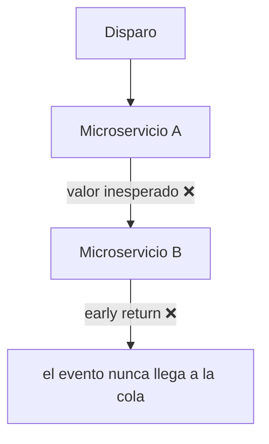

# Casuística: [TICKET-ID] — [Short title]

## ⚠️ Reglas de estructura y claridad del documento (NO negociable)

> El documento debe poder leerlo **alguien que no conoce la casuística** y entenderla —y poder
> explicársela a otro equipo— **sin revisar el código**. Para lograrlo, respeta estas reglas:
>
> 1. **Orden obligatorio del relato** (no saltar pasos ni adelantar conclusiones):
>    1. Objetivo → 2. Scope → 3. Glosario → 4. Contexto funcional →
>    5. Flujo técnico (activación · microservicios · endpoints) → 6. Diagrama del flujo →
>    7. Comportamiento esperado vs. observado → 8. Verificación (reproducción) →
>    9. Hallazgos → 10. Documentación de negocio → Apéndices.
> 2. **No empezar por la conclusión.** Primero se explica cómo funciona (o debería funcionar) el flujo,
>    y solo después qué se observa que falla. La frase "la casuística no funciona" va respaldada por
>    la sección de Verificación, nunca antes.
> 3. **Incluir un Glosario**: no des por entendido ningún término interno (micro, handler, sample,
>    serie, umbral, job, aggregate, activación/desactivación, nombres de colas/colecciones, endpoints,
>    identificadores…). Si se dice "el micro guarda la serie", debe quedar claro **qué micro**, **qué es
>    la serie** y **qué se guarda**.
> 4. **Incluir Contexto funcional**: para qué sirve cada microservicio que interviene en el flujo y qué
>    hace normalmente con la entrada que recibe. Suficiente para que alguien externo entienda el resto.
> 5. **Diferenciar flujo ESPERADO y flujo OBSERVADO**, con un diagrama Mermaid por cada uno cuando aplique,
>    marcando con ❌ dónde el comportamiento real diverge del esperado.
> 6. **La Verificación va antes de cualquier conclusión sobre el fallo.** Si una prueba necesita datos,
>    se siembran reproduciendo el mecanismo real (ver bloque de Integridad de datos), nunca a mano.
> 7. **La Documentación de negocio (no técnica) va al FINAL**, escrita para alguien que no toca código.
> 8. **Diagrama Mermaid intuitivo y autoexplicativo** siempre que la casuística afecte a un flujo de datos,
>    microservicios, handlers, jobs o procesos de negocio (ver "Diagrama del flujo — OBLIGATORIO").

## Metadata

| Field    | Value                                                   |
|----------|---------------------------------------------------------|
| Ticket   | [TICKET-ID]                                             |
| Author   | [name]                                                  |
| Created  | [YYYY-MM-DD]                                             |
| Status   | `planned` / `in-progress` / `done`                      |
| Branch   | `feature/[TICKET-ID]` *(solo si llega a haber cambios)* |

## Objetivo y motivación

> ¿Qué casuística se investiga y por qué? ¿Qué se **espera** que ocurra y qué se **sospecha** que no
> ocurre? Una o dos frases. No adelantes aquí ni la conclusión ni la solución.

## Scope

**In scope:**
- …

**Out of scope:**
- …

## ⚠️ Integridad de datos — fuente de verdad (NO negociable)

> Esta regla aplica a TODA verificación. Léela antes de tocar o sembrar datos.

- **Nunca añadir, inventar ni parchear datos a mano** (Mongo, SQL, ficheros de config) para "hacer que
  funcione" o que falle una prueba. Un parche manual tapa el problema real y produce validaciones falsas.
- **Fuente de verdad de la configuración de un dispositivo:**
  1. La `devicedefinition` (colección `devicedefinitions`) — define `alarms.cloud`, `conf`, `analogInputs`, etc.
  2. El **esquema/documento real del device** en Mongo (colección `devices`) y cómo se puebla desde la definición.
  3. El código que propaga definición → device (akocloud-api / micros), no una inserción manual.
- Si en una prueba **falta un dato** (p. ej. `device.alarms.cloud` ausente), **NO se inyecta a mano**:
  primero hay que entender **qué mecanismo real lo debería poblar** y por qué no lo hizo
  (¿propagación de la definición? ¿endpoint de akocloud-api? ¿paso de provisión?). Ese hueco **ES un
  hallazgo** de la investigación, no un obstáculo a saltar.
- Si para una prueba local hace falta sembrar datos, hazlo **reproduciendo el mecanismo real** (mismo
  origen, mismo shape, idealmente el mismo código/endpoint), documentado y marcado como **"siembra de
  prueba"**, nunca como dato canónico.
- Antes de comparar nombres/valores, **verifica contra la definición y el esquema reales**, no contra
  suposiciones ni contra un documento de prueba editado a mano.

## Glosario (leer antes que nada)

> Una fila por cada término interno que aparezca en este documento. No des por sabido nada: micro, handler,
> sample, serie temporal, umbral, job, aggregate, activación/desactivación, nombres de colas y colecciones,
> endpoints, identificadores… Rellena solo los que uses.

| Término | Qué significa **en esta casuística** |
|---------|--------------------------------------|
|         |                                      |

## Contexto funcional del/de los microservicio(s)

> ¿Qué microservicios intervienen en este flujo y para qué sirve cada uno? ¿Qué hacen normalmente con la
> entrada que reciben? Suficiente para que alguien externo entienda el flujo técnico que viene después.

| Microservicio | Para qué sirve | Qué recibe | Qué produce / a dónde escribe |
|---------------|----------------|------------|-------------------------------|
|               |                |            |                               |

---

## Phases

| # | Phase name                    | Status    |
|---|-------------------------------|-----------|
| 1 | Documentar el flujo (técnica) | `pending` |
| 2 | Verificar la casuística       | `pending` |
| 3 | Documentación de negocio      | `pending` |

> Añade o quita fases según haga falta (p. ej. una fase de fix si la casuística se confirma).
> **Nunca avances de fase sin confirmación explícita del usuario.**

---

## Phase 1 — Flujo técnico

**Status:** `pending`

### Recorrido del flujo

> Narra el camino completo en lenguaje claro: cómo **se activa** (evento / umbral / endpoint que lo dispara),
> qué microservicios lo procesan **en qué orden**, a qué **endpoints / colas / colecciones** apunta cada paso
> y dónde termina. Referencia por `archivo:línea` cuando cites código; no pegues bloques enteros.

1. **Disparo:** …
2. **Procesamiento:** …
3. **Persistencia / salida:** …

### Diagrama del flujo — OBLIGATORIO

> Requisitos del diagrama (igual que el resto del doc, debe entenderse **sin leer el código**):
> - **Pedagógico, no solo correcto.** Etiqueta cada nodo con *qué hace* en lenguaje claro, no solo con el
>   nombre de la clase/columna. Añade **leyenda** (qué representa cada micro, qué emoji/color marca el punto
>   de fallo) y agrupa por microservicio con `subgraph`.
> - Deja explícito: **qué datos entran**, **qué decisiones se toman** (bifurcaciones y qué rama toma cada
>   caso), **cuándo se activa** y **cuándo se desactiva**.
> - Traza el camino completo (evento/endpoint → controller → servicio/use case → DB/colas/Mongo).
> - Incluye **dos** diagramas cuando aplique: **ESPERADO** (cómo debería comportarse) y **OBSERVADO** (cómo
>   se comporta de verdad), con ❌ donde diverge, más una frase que resuma la diferencia clave.

**Flujo ESPERADO**

**Flujo OBSERVADO** *(rellenar tras la Verificación; marca ❌ donde rompe)*

> **Diferencia clave:** una frase. Ej.: "El esperado activa la alarma cloud al superar el umbral; el observado
> sale antes porque `device.alarms.cloud` está vacío."

### Decisiones y riesgos

| Decisión | Razón | Riesgo |
|----------|-------|--------|
|          |       |        |

> Si no puedes rellenar "Razón", la decisión aún no está lista para tomarse.

---

## Phase 2 — Verificación de la casuística

**Status:** `pending`

> Antes de afirmar que la casuística falla, hay que **reproducirla**. Recuerda la regla de Integridad de
> datos: si hace falta sembrar datos, reproduce el mecanismo real, no parchees a mano.

### Hipótesis a comprobar

> La afirmación concreta a verificar. Ej.: "Al superar el umbral X, la alarma cloud debería activarse y
> publicarse en la cola Y, pero no llega."

### Precondiciones / entorno

- Entorno: local / staging / …
- Servicios que deben estar levantados: …
- Datos necesarios y su **origen real** (definición / provisión / endpoint): …

### Pasos de reproducción

| # | Acción | Cómo (endpoint / comando / evento) | Qué observar | Esperado | Observado |
|---|--------|------------------------------------|--------------|----------|-----------|
| 1 |        |                                    |              |          |           |
| 2 |        |                                    |              |          |           |

### Evidencia

> Línea de log clave (no volcados completos), documento de Mongo, mensaje en cola, respuesta de endpoint.
> Referencia por `archivo:línea` o por id.

### Hallazgos

> ¿Se reproduce la casuística? ¿En qué **punto exacto** diverge lo real de lo esperado? Marca ese punto con
> ❌ en el diagrama "Flujo OBSERVADO" de la Phase 1. Si el fallo es un dato ausente, indica qué mecanismo
> real debería haberlo poblado (es un hallazgo, no algo a parchear).

---

## Phase 3 — Documentación de negocio (no técnica)

**Status:** `pending`

> Reescribe la casuística para alguien que **no toca código** (producto, soporte, otro equipo). Sin jerga,
> o con la jerga explicada en una línea. Esta sección debe poder leerse de forma independiente del resto.

**¿Qué es y para qué sirve?**
- …

**¿Qué debería ocurrir?**
- …

**¿Qué ocurre en realidad (la casuística)?**
- …

**Impacto** *(a quién/qué afecta, si es bloqueante, con qué frecuencia)*
- …

**Estado y próximos pasos** *(en lenguaje de negocio)*
- …

---

## Apéndices

<!--
### Apéndice A — Si la casuística se confirma y hay que corregirla

No saltes directamente al fix. En su lugar:
1. Añade una fase `Phase N: Bug fix — [symptom]` a la tabla de fases con estado `pending`.
2. Lista los archivos implicados (`file:line`), expected vs actual de cada bug confirmado.
3. Enumera las opciones de fix, elige una y documenta por qué.
4. Tras implementar, actualiza el diagrama OBSERVADO → DESPUÉS y añade validación end-to-end.

**Bug confirmado #N — [label]**
File: `src/…:line`
Expected: …
Actual: …

| File | Cambio necesario |
|------|------------------|
|      |                  |

### Apéndice B — Validación end-to-end (solo si hubo fix)

| # | Action | Result | Note |
|---|--------|--------|------|
| 1 | `npx tsc --noEmit` | ✅ / ❌ | |
| 2 | … | | |
-->

<!--
### Apéndice C — Problemas colaterales encontrados
Si durante la investigación aparece un `console.log` de debug en producción, un fallback que descarta datos
en silencio, o un script que no sincroniza un campo: déjalo registrado aquí como riesgo. No lo corrijas en
silencio si está fuera de scope.
-->
