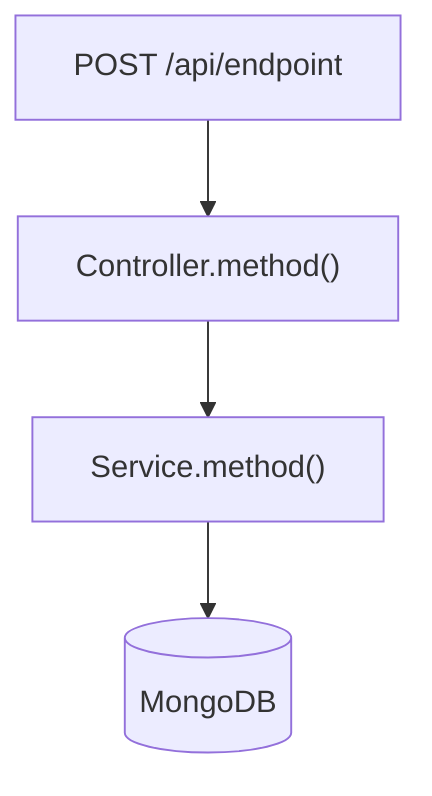
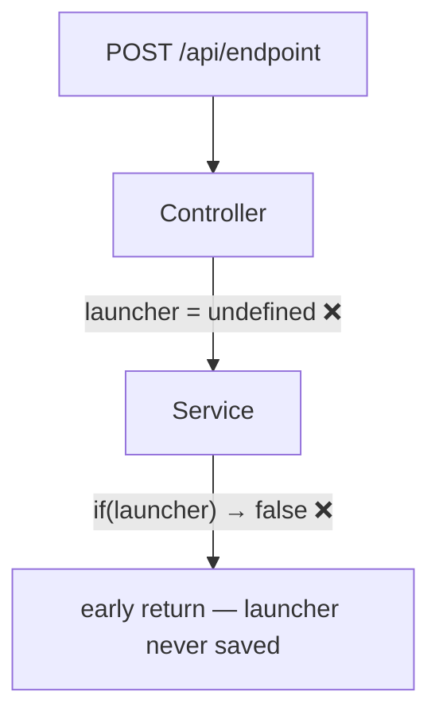

# Task: [TICKET-ID] — [Short title]

## Metadata

| Field  | Value                              |
|--------|------------------------------------|
| Ticket | [TICKET-ID]                        |
| Branch | `feature/[TICKET-ID]`              |
| Author | [name]                             |
| Created | [YYYY-MM-DD]                      |
| Status | `planned` / `in-progress` / `done` |

## Context and motivation

Why does this task exist? What problem does it solve?

## Scope

**In scope:**
- …

**Out of scope:**
- …

## Phases

| # | Phase name     | Status    |
|---|----------------|-----------|
| 1 | Investigation  | `pending` |
| 2 | Implementation | `pending` |
| 3 | Validation     | `pending` |

> Add or remove phases as needed. Never advance without explicit confirmation.

---

## Phase 1: Investigation

**Status:** `pending`

### Code flow

> Trace the affected path. Annotate with ❌ where bugs sit.

### Findings

What did you find? Be specific: file, line, what it does vs what it should do.

### Decisions and risks

| Decision | Reason | Risk |
|----------|--------|------|
|          |        |      |

---

## Phase 2: Implementation

**Status:** `pending`

### Files changed

| File | Change summary |
|------|---------------|
|      |               |

### Decisions made

### Problems found

<!--
> If the flow changed significantly, update the diagram here.
> Otherwise a note in "Decisions made" is enough.
-->

---

## Phase 3: Validation

**Status:** `pending`

### Steps

| # | Action | Result | Note |
|---|--------|--------|------|
| 1 | `npx tsc --noEmit` | ✅ / ❌ | |
| 2 | … | | |

### Remaining risks

---

<!--
## Phase N: Bug investigation — [short symptom]

Use this phase when a bug is found during validation or in production.
Copy, rename, and fill it in before writing any fix.

**Status:** `pending`

### Symptom

What the user or log observed. Be concrete.

### Flow traced

> Annotate the existing diagram with ❌ where the bug occurs.

### Bugs confirmed

**Bug #N — [short label]**

File: `src/…:line`

Expected: …
Actual: …

### Files implicated in the fix

| File | Change needed |
|------|--------------|
|      |              |

### Design decision for next phase

Options considered and which one was chosen, with rationale.
-->
