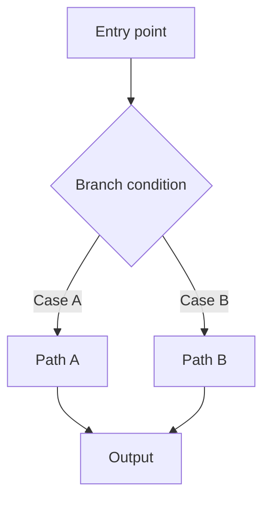
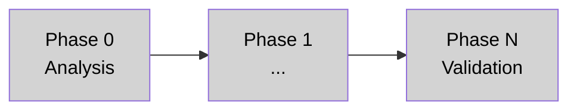

# Task: [Short name]

> Copy this file to `docs/ai/task-<short-name>.md` for each AI-assisted task.
> **After every phase:** update §8 phase status, add an entry to §10 implementation log, and update the Mermaid diagrams.

---

## 1. Metadata

| Field | Value |
|---|---|
| Task name | |
| Owner | |
| Created | YYYY-MM-DD |
| Last updated | YYYY-MM-DD |
| Status | Not started / In progress / Blocked / Done |
| Current phase | Phase 0 |
| Repository area | |
| Base branch | |
| Related ticket | |

---

## 2. Objective

Describe the desired outcome in one or two paragraphs.

---

## 3. Non-goals

List what must not change in this task.

- Do not change public API contracts unless explicitly documented.
- Do not remove legacy code until parity is validated.
- Do not introduce new dependencies unless approved.

---

## 4. Background

Summarize what the agent must understand before touching code:

- **Current behavior:** what happens today.
- **Target behavior:** what should happen after.
- **Why:** the reason this change is needed.
- **Constraints:** known technical or business limits.

---

## 5. Source of truth

| Type | Path | Why it matters |
|---|---|---|
| Controller | | |
| Service / helper | | |
| Model / schema | | |
| Test | | |
| Docs | | |

---

## 6. Scope

### In scope

-

### Out of scope

-

### Compatibility requirements

- Existing endpoint paths:
- Existing request/response shapes:
- Existing error codes:
- Existing frontend assumptions:

---

## 7. Architecture / strategy

Describe the intended approach and the key branching or delegation pattern.

### System flow

> Replace this diagram with the actual data or control flow relevant to the task.
> Add a before/after pair if the refactor changes the flow significantly.

---

## 8. Phases

| Phase | Name | Goal | Status |
|---|---|---|---|
| 0 | Analysis | Understand current state and map implementation | Not started |
| 1 | | | Not started |
| 2 | | | Not started |
| N | Validation | Run tests, manual checks, document results | Not started |

### Phase progress

> Update node styles after each phase:
> - `fill:#d3d3d3` — Not started (gray)
> - `fill:#ffd700` — In progress (yellow)
> - `fill:#90ee90` — Done (green)
> - `fill:#ff9999` — Blocked (red)

> **Do not advance to the next phase without explicit user confirmation.**

---

## 9. Decisions

| Date | Decision | Reason | Alternatives considered |
|---|---|---|---|
| YYYY-MM-DD | | | |

---

## 10. Implementation log

> Add one entry per completed phase. Keep it concise — code is the source of truth, not this log.

### YYYY-MM-DD — Phase N: Name

#### Summary

-

#### Files changed

-

#### Validation

- Command:
- Result:

#### Problems found

-

#### Next step

-

---

## 11. Final summary

Complete when the task is done.

| Field | Value |
|---|---|
| Final status | |
| Main changes | |
| Validation completed | |
| Known limitations | |
| Recommended next task | |
