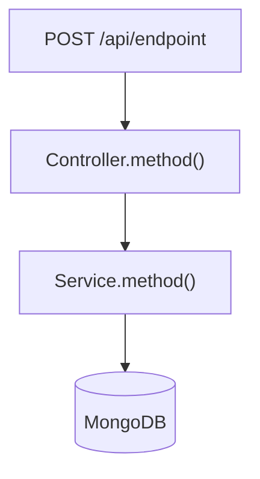
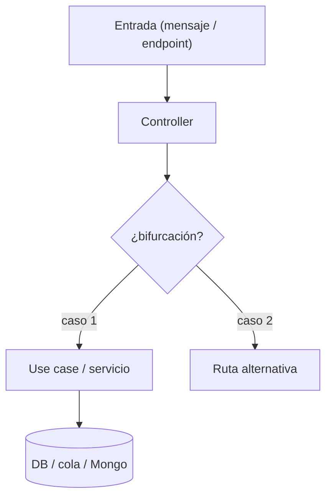
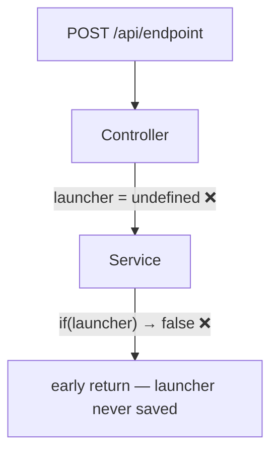

# Task: [TICKET-ID] — [Short title]

## Metadata

| Field  | Value                              |
|--------|------------------------------------|
| Ticket | [TICKET-ID]                        |
| Branch | `feature/[TICKET-ID]`              |
| Author | [name]                             |
| Created | [YYYY-MM-DD]                      |
| Status | `planned` / `in-progress` / `done` |

## Context and motivation

Why does this task exist? What problem does it solve?

## Scope

**In scope:**
- …

**Out of scope:**
- …

## ⚠️ Integridad de datos — fuente de verdad (NO negociable)

> Esta regla aplica a TODAS las tareas. Léela antes de tocar datos.

- **Nunca añadir, inventar ni parchear datos a mano** (Mongo, SQL, ficheros de config) para
  "hacer que funcione" una prueba. Un parche manual tapa el problema real y produce validaciones falsas.
- **Fuente de verdad de la configuración de un dispositivo:**
  1. La `devicedefinition` (colección `devicedefinitions`) — define `alarms.cloud`, `conf`, `analogInputs`, etc.
  2. El **esquema/documento real del device** en Mongo (colección `devices`) y cómo se puebla desde la definición.
  3. El código que propaga definición → device (akocloud-api / micros), no una inserción manual.
- Si en una prueba **falta un dato** (p.ej. `device.alarms.cloud` ausente), **NO se inyecta a mano**:
  primero hay que entender **qué mecanismo real lo debería poblar** y por qué no lo hizo
  (¿propagación de la definición? ¿endpoint de akocloud-api? ¿paso de provisión?). Ese hueco ES un hallazgo
  de la investigación, no un obstáculo a saltar.
- Si para una prueba local hace falta sembrar datos, debe hacerse **reproduciendo el mecanismo real**
  (mismo origen, mismo shape, idealmente el mismo código/endpoint), documentado y claramente marcado como
  "siembra de prueba", nunca como dato canónico.
- Antes de comparar nombres/valores, **verificar contra la definición y el esquema reales**, no contra
  suposiciones ni contra un documento de prueba editado a mano.

## Phases

| # | Phase name     | Status    |
|---|----------------|-----------|
| 1 | Investigation  | `pending` |
| 2 | Implementation | `pending` |
| 3 | Validation     | `pending` |

> Add or remove phases as needed. Never advance without explicit confirmation.

---

## Phase 1: Investigation

**Status:** `pending`

### Code flow

> Trace the affected path. Annotate with ❌ where bugs sit.

### Findings

What did you find? Be specific: file, line, what it does vs what it should do.

### Decisions and risks

| Decision | Reason | Risk |
|----------|--------|------|
|          |        |      |

---

## Phase 2: Implementation

**Status:** `pending`

### Files changed

| File | Change summary |
|------|---------------|
|      |               |

### Decisions made

### Problems found

<!--
> If the flow changed significantly, update the diagram here.
> Otherwise a note in "Decisions made" is enough.
-->

---

## Phase 3: Validation

**Status:** `pending`

### Steps

| # | Action | Result | Note |
|---|--------|--------|------|
| 1 | `npx tsc --noEmit` | ✅ / ❌ | |
| 2 | … | | |

### Remaining risks

---

## Flujo final del microservicio (Mermaid) — OBLIGATORIO

> **Toda tarea debe terminar con un diagrama Mermaid claro, actualizado e intuitivo** que explique
> el comportamiento del microservicio. Requisitos:
>
> - Debe poder entenderse **sin leer el código**: alguien externo debe poder explicárselo a otra persona.
> - Cuando la tarea **cambia el comportamiento**, incluir **dos** diagramas: **ANTES** y **DESPUÉS**,
>   y una frase que resuma la diferencia clave.
> - Trazar el camino completo (mensaje/endpoint → controller → servicio/use case → DB/colas/Mongo),
>   no solo el trozo modificado. Marcar las **bifurcaciones** y qué rama toma cada caso.
> - Mantenerlo sincronizado con el código real al cerrar cada fase (igual que el resto del doc).
> - Para bugs, anotar con ❌ dónde falla antes de escribir el fix.

---

<!--
## Phase N: Bug investigation — [short symptom]

Use this phase when a bug is found during validation or in production.
Copy, rename, and fill it in before writing any fix.

**Status:** `pending`

### Symptom

What the user or log observed. Be concrete.

### Flow traced

> Annotate the existing diagram with ❌ where the bug occurs.

### Bugs confirmed

**Bug #N — [short label]**

File: `src/…:line`

Expected: …
Actual: …

### Files implicated in the fix

| File | Change needed |
|------|--------------|
|      |              |

### Design decision for next phase

Options considered and which one was chosen, with rationale.
-->
