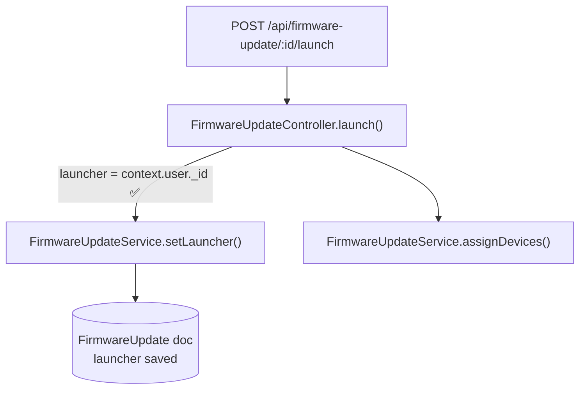
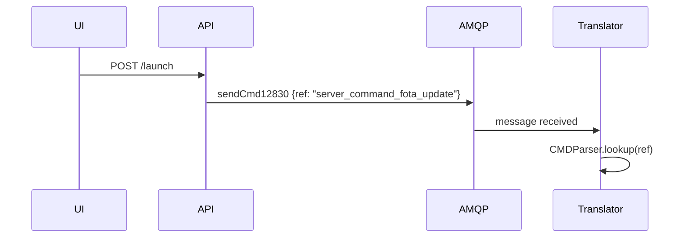

# Guía de escritura del documento de tarea

Esta guía explica cómo rellenar `task-template.md` para que agentes de IA y revisores humanos puedan retomar una tarea desde cero sin hacer preguntas.

## Cuándo crear un documento de tarea

Crea uno antes de tocar cualquier código si la tarea:
- abarca más de dos archivos,
- requiere entender un flujo existente antes de cambiarlo, o
- podría necesitar una fase de investigación de bug.

Copia `task-template.md`, renómbralo como `[TICKET-ID]-[slug].md` y colócalo dentro de `docs/ia/`.

## Estructura y orden del documento: leer primero

El template empieza con un bloque no negociable de **"Reglas de estructura y claridad"**. Sigue ese orden
estrictamente: el documento debe ser entendible para **alguien que no conoce la tarea**, sin leer
el código:

1. Objetivo → 2. Scope → 3. **Glosario** → 4. **Contexto funcional** → 5. **Flujo ANTES** →
   6. **Problema/limitación** → 7. **Implementación paso a paso** → 8. **Flujo DESPUÉS** →
   9. **Resultado y validación** → Apéndices.

Reglas clave al rellenar estas secciones:

- **No empieces con la arquitectura final.** Explica primero cómo funcionaba el sistema **antes** y qué estaba mal.
- **Glosario:** una fila por cada término interno que uses: micro, handler, sample, serie, umbral, job, aggregate,
  activación/desactivación, nombres de queues/collections, identificadores, etc. Si escribes "el micro guarda la
  serie", el lector debe poder consultar *qué* micro, qué es la *serie* y qué se guarda.
- **Contexto funcional:** para qué sirve el microservicio afectado y qué hace normalmente con su input.
- **Flujo ANTES vs DESPUÉS:** un diagrama Mermaid para cada uno cuando cambie el comportamiento; consulta "Diagramas de flujo de código".
- **Implementación paso a paso:** pasos numerados que indiquen qué cambió, qué se añadió, qué dejó de depender de
  otros procesos y qué bug se corrigió; debe ir *antes* de mostrar el diagrama final.
- **Resultado, validación end-to-end y bugs corregidos van al FINAL**, nunca en el objetivo.

`KNT-2307-cloud-alarm-temp-maxmin.md` es el ejemplo de referencia para esta estructura.

## Cómo rellenar cada sección

### Metadata — Campo Status

Usa solo estos valores:

| Valor         | Significado                                      |
|---------------|--------------------------------------------------|
| `planned`     | Documento creado, ninguna fase iniciada todavía |
| `in-progress` | Al menos una fase iniciada, tarea aún no enviada |
| `done`        | Todas las fases completas, branch lista para PR  |

Añade siempre un breve calificador después de `in-progress` cuando sea útil:
`in-progress — bug fix`, `in-progress — blocked on external service`.

### Diagramas de flujo de código

Añade un `flowchart` o `sequenceDiagram` de Mermaid en **"Flujo ANTES"** para trazar el recorrido tal como funcionaba antes
de la tarea, y un segundo diagrama en **"Flujo DESPUÉS"** para mostrar el comportamiento final. Termina con un resumen de una línea
sobre la diferencia clave. Si se encuentra un bug, anota el diagrama relevante con marcadores ❌ antes de escribir el fix.

El diagrama final debe ser **pedagógico, no solo correcto**; consulta el bloque del template "Flujo final — OBLIGATORIO":

- Etiqueta cada nodo con *lo que hace* en lenguaje claro, no solo con el nombre de la clase o columna.
- Añade una **leyenda** que explique qué representa cada microservicio y qué emoji/color marca caminos nuevos frente a caminos sin cambios, y agrupa nodos por microservicio con `subgraph`.
- Haz explícito qué datos entran, qué decisiones se toman —ramas y qué caso toma cada rama—, cuándo se activa una alarma/estado, cuándo se desactiva y qué procesos ya no son necesarios.

**Cuándo usar `flowchart`:**
Úsalo para flujos request → controller → service → DB y para mostrar dónde está un bug.



**Cuándo usar `sequenceDiagram`:**
Úsalo cuando importen el timing o el orden entre servicios, por ejemplo API → RabbitMQ → Translator.



**Reglas:**
- Mantén los diagramas enfocados. Un diagrama por flujo, no un diagrama para todo el sistema.
- Etiqueta los edges con la variable o condición clave, no con un "calls" genérico.
- Añade ❌ o ✅ para destacar el bug o el fix.
- No pegues código completo en los diagramas. Un nodo = una responsabilidad.

### Tabla de decisiones y riesgos

La tabla de la Fase 1 obliga a registrar el **porqué**, no solo el qué.
Si no puedes rellenar la columna "Reason", la decisión aún no está lista para tomarse.

### Fase de investigación de bug

Cuando la validación revele un bug, **no saltes directamente al fix**.
En su lugar:

1. Copia el bloque de investigación de bug del comentario del template al final.
2. Añádelo como una nueva fase: `Phase N: Bug investigation — [symptom]`.
3. Añade la fase a la tabla de fases con estado `pending`.
4. Traza el flujo y confirma cada bug con evidencia de archivo + línea.
5. Lista las opciones de fix, elige una y documenta por qué.
6. Solo entonces añade una fase `Phase N+1: Bug fix` y empieza a programar.

Esta disciplina evita corregir lo equivocado. La tarea KNT-2303 es un ejemplo de referencia:
la Fase 4 trazó tres bugs distintos antes de que la Fase 5 tocara código.

### Checklist de validación

Marca los ítems a medida que avanzas, no todos de golpe al final.
Añade ítems específicos de la tarea cuando los genéricos no cubran el caso:

```markdown
- [ ] `initDefinitions.js` re-run after JSON schema changes (see KNT-2303 pattern)
- [ ] Dependent service restarted after MongoDB update
- [ ] Log entry shows correct `launcherSnapshot.username`
```

### Problemas encontrados

Usa este campo en la Fase 2 con honestidad. Si encuentras un `console.log` de debug dejado en código de producción,
un fallback que descarta datos silenciosamente o un script relacionado que no sincroniza un campo,
déjalo registrado aquí. No lo corrijas silenciosamente si está fuera de scope; documéntalo como riesgo.

## Ciclo de vida de una fase

```text
planned
  └─► (agent reads task) ─► in-progress
        └─► (phase N done, user confirms) ─► phase N+1 starts
              └─► (all phases done) ─► done
```

**Nunca avances de fase sin confirmación explícita del usuario.**
El agente debe terminar cada respuesta de fase con la frase:
> "Phase N complete. Ready to start Phase N+1: [name] when you confirm."

## Qué no poner en un documento de tarea

- Bloques completos de código copiados desde archivos fuente. Referencia por `file:line`.
- Stack traces largos o volcados de logs en bruto. Resume la línea clave.
- Suposiciones obsoletas dejadas como si fueran hechos. Táchalas o elimínalas.
- Historial de Git, como quién cambió qué y cuándo. Eso vive en `git log`.
- Texto de descripción de PR. El documento de tarea es para el agente; la descripción de PR es para revisores.
