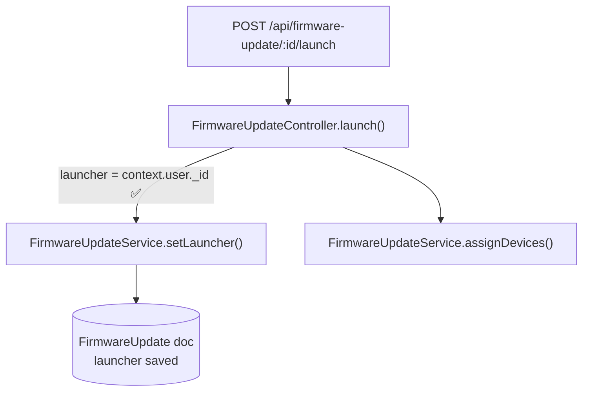
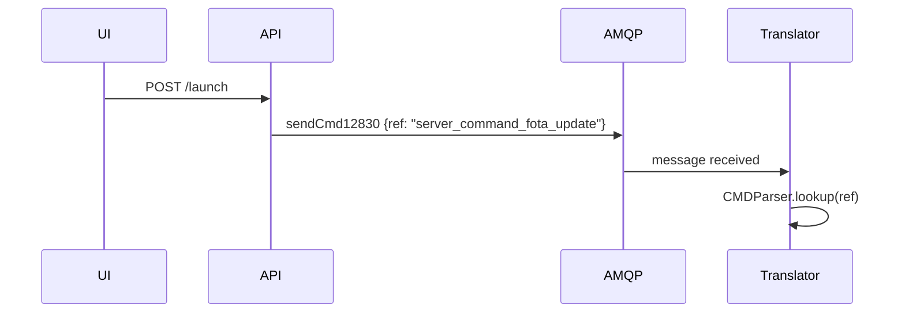

# Task document writing guide

This guide explains how to fill in `task-template.md` so that AI agents and human reviewers can pick up a task cold without asking questions.

## When to create a task document

Create one before touching any code if the task:
- spans more than two files,
- requires understanding an existing flow before changing it, or
- might need a bug investigation phase.

Copy `task-template.md`, rename it `[TICKET-ID]-[slug].md`, and place it under `docs/ai/`.

## Filling in each section

### Metadata — Status field

Use these values only:

| Value         | Meaning                                      |
|---------------|----------------------------------------------|
| `planned`     | Doc created, no phase started yet            |
| `in-progress` | At least one phase started, task not shipped |
| `done`        | All phases complete, branch ready for PR     |

Always append a short qualifier after `in-progress` when useful:
`in-progress — bug fix`, `in-progress — blocked on external service`.

### Code flow diagrams

Add a Mermaid `flowchart` or `sequenceDiagram` in **Phase 1** to trace the affected path.
Update it in **Phase 2** to show the new flow.
If a bug is found, annotate the Phase 1 diagram with ❌ markers before writing the fix.

**When to use `flowchart`:**
Use for request → controller → service → DB flows and for showing where a bug sits.



**When to use `sequenceDiagram`:**
Use when timing or ordering between services matters (e.g. API → RabbitMQ → Translator).



**Rules:**
- Keep diagrams focused. One diagram per flow, not one diagram for the whole system.
- Label edges with the key variable or condition, not generic "calls".
- Add ❌ or ✅ to highlight the bug or the fix.
- Do not paste full code into diagrams. One node = one responsibility.

### Decisions and risks table

The table in Phase 1 forces you to record the **why**, not just the what.
If you can't fill in the "Reason" column, the decision isn't ready to be made.

### Bug investigation phase

When validation reveals a bug, **do not jump straight to the fix**.
Instead:

1. Copy the bug investigation block from the template comment at the bottom.
2. Add it as a new phase (`Phase N: Bug investigation — [symptom]`).
3. Add the phase to the phases table with status `pending`.
4. Trace the flow, confirm each bug with file + line evidence.
5. List the fix options, pick one, and document why.
6. Only then add a `Phase N+1: Bug fix` phase and start coding.

This discipline prevents fixing the wrong thing. The KNT-2303 task is a reference
example: Phase 4 traced three distinct bugs before Phase 5 touched any code.

### Validation checklist

Check items off as you go, not all at once at the end.
Add task-specific items when the generic ones don't cover the case:

```markdown
- [ ] `initDefinitions.js` re-run after JSON schema changes (see KNT-2303 pattern)
- [ ] Dependent service restarted after MongoDB update
- [ ] Log entry shows correct `launcherSnapshot.username`
```

### Problems found

Use this field in Phase 2 honestly. If you found debug `console.log` left in production
code, a fallback that silently drops data, or a related script that doesn't sync a field —
record it here. Do not silently fix it if it's out of scope; document it as a risk instead.

## Phase lifecycle

```
planned
  └─► (agent reads task) ─► in-progress
        └─► (phase N done, user confirms) ─► phase N+1 starts
              └─► (all phases done) ─► done
```

**Never advance a phase without explicit user confirmation.**
The agent should end every phase response with the phrase:
> "Phase N complete. Ready to start Phase N+1: [name] when you confirm."

## What not to put in a task document

- Full code blocks copied from source files. Reference by `file:line` instead.
- Long stack traces or raw log dumps. Summarize the key line.
- Outdated assumptions left as if they were facts. Strike them or delete them.
- Git history (`who changed what when`). That lives in `git log`.
- PR description prose. The task doc is for the agent; the PR description is for reviewers.
