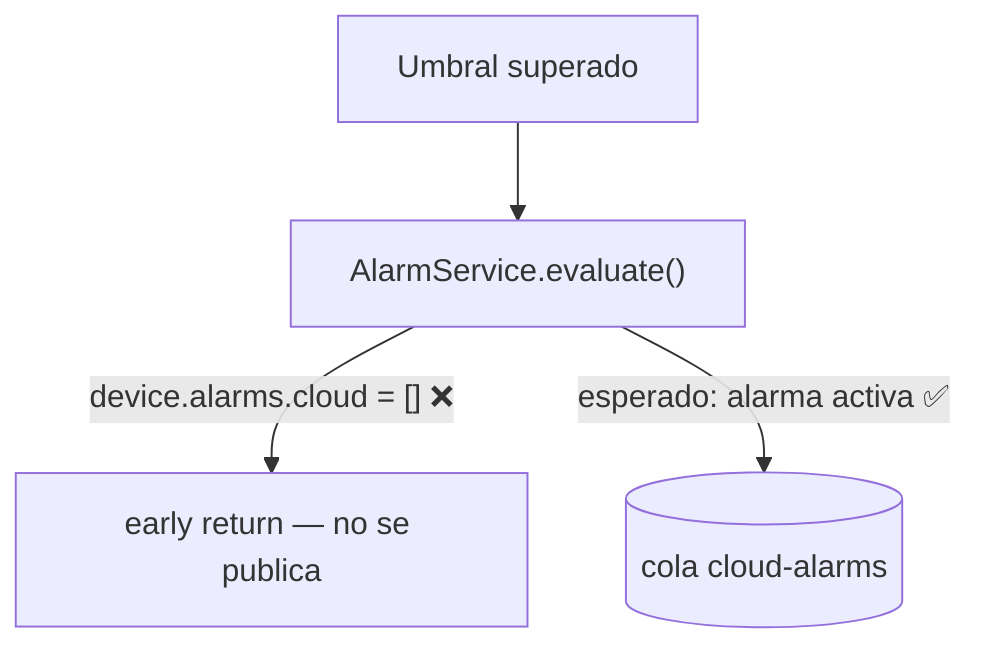
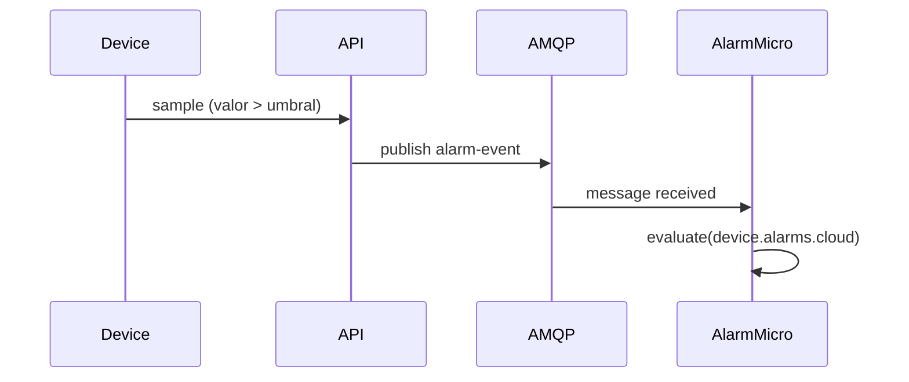

# Guía de escritura del documento de casuística

Esta guía explica cómo rellenar `casuistica-template.md` para que agentes de IA y revisores humanos puedan
retomar una investigación desde cero sin hacer preguntas: entender un flujo, verificar si una casuística
falla de verdad y trasladarla a otros equipos en lenguaje de negocio.

## Cuándo crear un documento de casuística

Crea uno antes de tocar nada si la casuística:
- abarca más de dos servicios o archivos,
- requiere entender un flujo existente antes de juzgar si está bien, o
- necesita comprobar si un error sospechado ocurre realmente.

Copia `casuistica-template.md`, renómbralo como `[TICKET-ID]-[slug].md` y colócalo dentro de `docs/ia/`.

## Estructura y orden del documento: leer primero

El template empieza con un bloque no negociable de **"Reglas de estructura y claridad"**. Sigue ese orden
estrictamente: el documento debe ser entendible para **alguien que no conoce la casuística**, sin leer el código:

1. Objetivo → 2. Scope → 3. **Glosario** → 4. **Contexto funcional** →
   5. **Flujo técnico** (activación · microservicios · endpoints) → 6. **Diagrama del flujo** →
   7. **Comportamiento esperado vs. observado** → 8. **Verificación** → 9. **Hallazgos** →
   10. **Documentación de negocio** → Apéndices.

Reglas clave al rellenar estas secciones:

- **No empieces por la conclusión.** Explica primero cómo funciona (o debería funcionar) el flujo y solo
  después qué se observa que falla. La frase "la casuística no funciona" va respaldada por la sección de
  **Verificación**, nunca antes.
- **Glosario:** una fila por cada término interno que uses: micro, handler, sample, serie, umbral, job,
  aggregate, activación/desactivación, nombres de queues/collections, endpoints, identificadores, etc.
  Si escribes "el micro guarda la serie", el lector debe poder consultar *qué* micro, qué es la *serie* y qué se guarda.
- **Contexto funcional:** para qué sirve cada microservicio que interviene y qué hace normalmente con su input.
- **Flujo ESPERADO vs OBSERVADO:** un diagrama Mermaid para cada uno cuando el comportamiento real diverja del
  esperado; marca con ❌ el punto exacto de divergencia. Consulta "Diagramas de flujo de código".
- **Verificación antes que conclusiones:** no afirmes que la casuística falla sin pasos reproducibles que lo
  demuestren. Respeta la regla de **Integridad de datos** (ver más abajo).
- **Documentación de negocio al FINAL**, escrita para alguien que no toca código y legible por sí sola.

## Cómo rellenar cada sección

### Metadata — Campo Status

Usa solo estos valores:

| Valor         | Significado                                       |
|---------------|---------------------------------------------------|
| `planned`     | Documento creado, ninguna fase iniciada todavía   |
| `in-progress` | Al menos una fase iniciada, investigación en curso |
| `done`        | Todas las fases completas (flujo + verificación + negocio) |

Añade siempre un breve calificador después de `in-progress` cuando sea útil:
`in-progress — verificando`, `in-progress — blocked on external service`.

### Diagramas de flujo de código

Añade un `flowchart` o `sequenceDiagram` de Mermaid en **"Flujo ESPERADO"** para trazar cómo *debería*
comportarse el flujo, y un segundo diagrama en **"Flujo OBSERVADO"** para mostrar cómo se comporta de verdad.
Termina con un resumen de una línea sobre la diferencia clave. Anota el diagrama OBSERVADO con marcadores ❌
en el punto donde el comportamiento real diverge del esperado.

El diagrama debe ser **pedagógico, no solo correcto**; consulta el bloque del template "Diagrama del flujo — OBLIGATORIO":

- Etiqueta cada nodo con *lo que hace* en lenguaje claro, no solo con el nombre de la clase o columna.
- Añade una **leyenda** que explique qué representa cada microservicio y qué emoji/color marca el punto de
  fallo, y agrupa nodos por microservicio con `subgraph`.
- Haz explícito qué datos entran, qué decisiones se toman —ramas y qué caso toma cada rama—, cuándo se activa
  un estado/alarma y cuándo se desactiva.

**Cuándo usar `flowchart`:**
Úsalo para flujos disparo → controller → service → DB y para mostrar dónde diverge el comportamiento.



**Cuándo usar `sequenceDiagram`:**
Úsalo cuando importen el timing o el orden entre servicios, por ejemplo API → RabbitMQ → Translator.



**Reglas:**
- Mantén los diagramas enfocados. Un diagrama por flujo, no uno para todo el sistema.
- Etiqueta los edges con la variable o condición clave, no con un "calls" genérico.
- Añade ❌ o ✅ para destacar la divergencia o el camino correcto.
- No pegues código completo en los diagramas. Un nodo = una responsabilidad.

### Tabla de decisiones y riesgos

La tabla de la Phase 1 obliga a registrar el **porqué**, no solo el qué.
Si no puedes rellenar la columna "Razón", la decisión aún no está lista para tomarse.

### Verificación de la casuística

Es el corazón del documento: aquí se demuestra (o se descarta) que el error ocurre. **No saltes a conclusiones
sin esta sección.**

1. **Hipótesis a comprobar:** una afirmación concreta y falsable. Ej.: "Al superar el umbral X, la alarma cloud
   debería publicarse en la cola Y, pero no llega."
2. **Precondiciones / entorno:** qué servicios deben estar levantados y qué datos hacen falta, indicando su
   **origen real** (definición / provisión / endpoint).
3. **Pasos de reproducción:** tabla con acción, cómo (endpoint/comando/evento), qué observar, esperado y observado.
4. **Evidencia:** la línea de log clave, el documento de Mongo, el mensaje en cola o la respuesta del endpoint.
   Referencia por `archivo:línea` o por id; **no** pegues volcados completos.
5. **Hallazgos:** en qué punto exacto diverge lo real de lo esperado. Marca ese punto con ❌ en el diagrama OBSERVADO.

**Respeta la integridad de datos.** Si para reproducir falta un dato, **no lo inyectes a mano**: averigua qué
mecanismo real debería poblarlo y por qué no lo hizo. Ese hueco es un hallazgo, no un obstáculo. Si necesitas
sembrar datos para una prueba local, hazlo reproduciendo el mecanismo real (mismo origen y shape) y márcalo como
"siembra de prueba", nunca como dato canónico.

### Documentación de negocio (no técnica)

Reescribe la casuística para producto, soporte u otro equipo que no toca código. Reglas:

- Sin jerga, o con la jerga explicada en una línea (no asumas que conocen "micro", "cola", "umbral"…).
- Responde, en este orden: qué es y para qué sirve · qué debería ocurrir · qué ocurre en realidad · impacto
  (a quién/qué afecta, si es bloqueante, frecuencia) · estado y próximos pasos.
- Debe **leerse de forma independiente** del resto del documento. Quien solo lea esta sección tiene que entender
  la casuística sin necesidad del flujo técnico.

### Si la casuística se confirma y hay que corregirla

No saltes directamente al fix. En su lugar:

1. Añade una fase `Phase N: Bug fix — [symptom]` a la tabla de fases con estado `pending`.
2. Confirma cada bug con evidencia de `archivo:línea` (expected vs actual).
3. Lista las opciones de fix, elige una y documenta por qué.
4. Tras implementar, convierte el diagrama OBSERVADO en el flujo DESPUÉS y añade la validación end-to-end
   (apéndices B y C del template).

Esta disciplina evita corregir lo equivocado: primero se confirma el fallo, luego se toca código.

### Checklist de validación (solo si hubo fix)

Marca los ítems a medida que avanzas, no todos de golpe al final. Añade ítems específicos cuando los genéricos
no cubran el caso:

```markdown
- [ ] `initDefinitions.js` re-run after JSON schema changes
- [ ] Dependent service restarted after MongoDB update
- [ ] Log entry shows correct `launcherSnapshot.username`
```

### Problemas colaterales encontrados

Si durante la investigación aparece un `console.log` de debug en producción, un fallback que descarta datos en
silencio o un script que no sincroniza un campo, déjalo registrado en el apéndice C como riesgo. No lo corrijas
en silencio si está fuera de scope; documéntalo.

## Ciclo de vida de una fase

```text
planned
  └─► (el agente lee el documento) ─► in-progress
        └─► (Phase 1 lista: flujo documentado, el usuario confirma) ─► Phase 2 (verificación)
              └─► (casuística verificada, el usuario confirma) ─► Phase 3 (negocio)
                    └─► (todas las fases hechas) ─► done
```

**Nunca avances de fase sin confirmación explícita del usuario.**
El agente debe terminar cada respuesta de fase con la frase:
> "Phase N complete. Ready to start Phase N+1: [name] when you confirm."

## Qué no poner en un documento de casuística

- Bloques completos de código copiados desde archivos fuente. Referencia por `file:line`.
- Stack traces largos o volcados de logs en bruto. Resume la línea clave.
- Suposiciones obsoletas dejadas como si fueran hechos. Táchalas o elimínalas.
- Datos inventados o parcheados a mano para "hacer que falle/funcione" una prueba (ver Integridad de datos).
- Historial de Git, como quién cambió qué y cuándo. Eso vive en `git log`.
- Conclusiones sobre el bug sin una sección de Verificación que las respalde.
