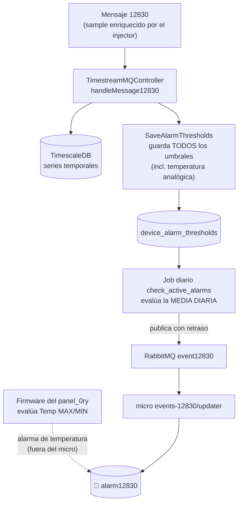
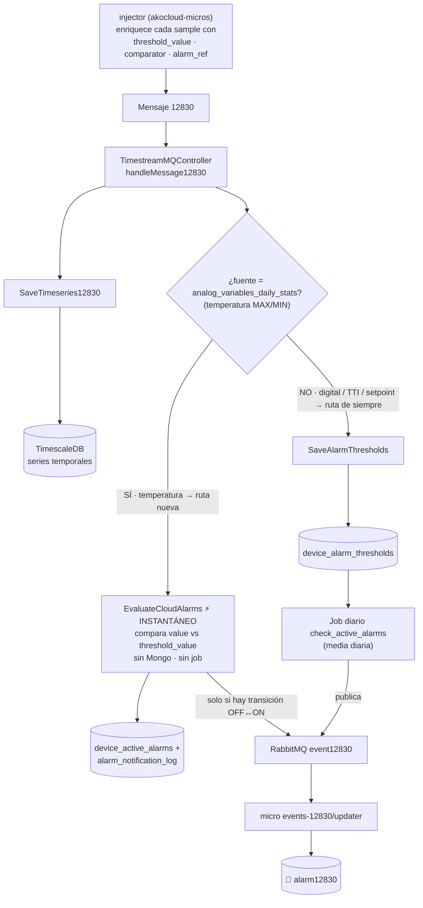

# KNT-2307 — Alarma de temperatura MAX/MIN gestionada por cloud (panel_0ry)

## Metadata

| Field   | Value                  |
|---------|------------------------|
| Ticket  | KNT-2307               |
| Branch  | `feature/KNT-2390`     |
| Author  | Dani                   |
| Created | 2026-06-15             |
| Status  | `done` (pendiente solo de commits) |

## Objetivo

Las alarmas de temperatura **MAX** (`alarm_cloud_error_1`) y **MIN** (`alarm_cloud_error_2`) del
`panel_0ry`, antes evaluadas por el firmware, las debe gestionar el microservicio `akocloud-timeseries`
en cloud. Requisito clave: deben saltar **casi al instante** al recibir el sample, no con la media diaria.

**Resultado:** implementado y validado end-to-end (2026-06-17). El sample cruza el umbral → se publica la
activación de inmediato → llega a Mongo (`alarm12830`). Sin media diaria, sin esperar el aggregate, sin el job.

---

## Arquitectura final

### Un único evaluador por tipo de alarma

| Tipo de alarma | Evaluador | Origen del umbral |
|---|---|---|
| **Temperatura analógica** (`error_1` / `error_2`) | **Ruta instantánea en el micro** (`EvaluateCloudAlarms`) | sample enriquecido por el injector (umbral resuelto desde definición + `conf`) |
| Digital / HACCP | Job diario `check_active_alarms` | injector → `saveAlarmThresholds` → `device_alarm_thresholds` |
| TTI / setpoint | Job diario `check_active_alarms` | injector → `saveAlarmThresholds` → `device_alarm_thresholds` |

La ruta instantánea es **dueña exclusiva** de las de temperatura: no se escriben en
`device_alarm_thresholds`, así que el job diario global ni las ve (cero impacto en otros dispositivos).

### Flujo del microservicio (antes vs. después)

> Lee primero estos dos diagramas: explican el comportamiento completo del micro sin mirar el código.
> Lo único que cambia es **cómo se evalúa la temperatura MAX/MIN**; el resto de alarmas no cambia.

#### ANTES de los cambios

La temperatura MAX/MIN la decidía el **firmware** del dispositivo. El micro solo guardaba la serie y
persistía **todos** los umbrales (incluida la temperatura analógica) en `device_alarm_thresholds`, y el
**job diario** los evaluaba con la **media diaria** → lento y con semántica equivocada para picos puntuales.



#### DESPUÉS de los cambios (estado actual)

El micro **bifurca por tipo de alarma** (`resolveCloudAlarmSource`): la **temperatura analógica** se evalúa
al instante dentro del micro (sin Mongo, sin job); **digital / TTI / setpoint** siguen igual por el job diario.
El umbral ya viene pegado al sample por el **injector** (`akocloud-micros`), así que el micro solo compara y publica.



**Diferencia en una frase:** antes la temperatura dependía del firmware o de la media diaria (lenta); ahora
salta al instante en el propio micro al cruzar el umbral, mientras el resto de alarmas no se ve afectado.

### Lógica de evaluación (por sample enriquecido)

El injector adjunta a cada sample: `threshold_ref`, `threshold_value`, `threshold_comparator`, `alarm_ref`
(emite una copia por alarma, p.ej. `reg_amv_analog_prb1` sale 2 veces: MAX y MIN).
1. Solo procesa samples con esos campos y cuya fuente sea `analog_variables_daily_stats`
   (`resolveCloudAlarmSource(code, alarm_ref)`) — el resto es del job diario.
2. `shouldBeActive = above ? value > threshold_value : value < threshold_value`.
3. Estado en `device_active_alarms`:
   - **OFF→ON:** upsert estado + `alarm_notification_log(activation)` `ON CONFLICT DO NOTHING`;
     si se insertó → `publishActivation()` + `markDelivered`.
   - **ON→OFF:** borra estado + `alarm_notification_log(deactivation, activation_day)`;
     si se insertó → `publishDeactivation()` + `markDelivered`.

Notas:
- El criterio de scope es el **mismo helper** `resolveCloudAlarmSource` que usa `saveAlarmThresholds` para
  **omitir** esas analógicas → garantiza un único evaluador por alarma, sin lógica duplicada.
- `day` se calcula en UTC desde `sample.timestamp`.
- No toca MongoDB ni usa `pg_notify`/listener; publica directo (de ahí la inmediatez). Reutiliza la garantía
  de reentrega: si el publish falla, la fila queda `delivered=false` y `AlarmEventService.pollUndelivered()`
  la reintenta al arrancar.

### Quién escribe la alarma en Mongo

El micro **no** escribe en Mongo: publica a RabbitMQ `event12830`. Lo consume el micro
**`events-12830/updater`** (`akocloud-micros`, handler `handlerCloudEvent`, topic `12830.input.cloudevent`),
que persiste en la colección **`alarm12830`** (y actualiza contadores en `devices`).

---

## Fuentes de verdad (confirmadas con IA-API)

| Dato | Vive en | Cómo llega |
|---|---|---|
| Estructura `alarms.cloud` (`ref`, `threshold`, `valueRef`, `compareType`) | `devicedefinitions` | se resuelve vía `device.deviceDefinition`. **Nunca** se denormaliza en el device |
| Valores del umbral (`conf[threshold]`, p.ej. 25/18) | `device.conf` | denormalizado en provisión por akocloud-api |
| Umbral resuelto en cada sample | el **injector** (`akocloud-micros`) | lee definición + `conf` y **enriquece el sample** con `threshold_ref`/`threshold_value`/`threshold_comparator`/`alarm_ref` |

El micro **no resuelve** la definición ni `conf`: consume el sample ya enriquecido por el injector (lo mismo
que ya hacía `saveAlarmThresholds`). Esquema real de un objeto `alarms.cloud` en la definición:
```json
{ "ref": "alarm_cloud_error_1", "description": "Alarma MAX Sonda S1",
  "priority": "param_c_ag1_max_s1", "threshold": "param_A1_alarm_prb1_max",
  "valueRef": "reg_amv_analog_prb1", "compareType": "above" }
```
No existe el campo `sampleRef`. `valueRef` es el nombre completo de la variable (= `sample.code`).

---

## Cambios de código — `akocloud-timeseries`

| Archivo | Tipo | Resumen |
|---|---|---|
| [evaluate-cloud-alarms.ts](domains/src/alarms/Application/evaluate-cloud-alarms.ts) | NUEVO | Use case instantáneo. **Lee el umbral del sample enriquecido por el injector** (sin Mongo); solo procesa los analógicos de temperatura; publica activación/desactivación |
| [cloud-alarm-source.ts](domains/src/alarms/Application/cloud-alarm-source.ts) | NUEVO | Helper `resolveCloudAlarmSource(code, alarmRef)` compartido por `saveAlarmThresholds` (omite) y `evaluate` (gestiona) → un único evaluador por alarma |
| [cloud-alarm-state.repository.ts](domains/src/alarms/Domain/cloud-alarm-state.repository.ts) | NUEVO | Contrato del estado/dedup (`isActive`/`activate`/`deactivate`/`markDelivered`) |
| [cloud-alarm-state.timescaledb.repository.ts](domains/src/alarms/Infrastructure/cloud-alarm-state.timescaledb.repository.ts) | NUEVO | Implementación PG transaccional sobre `device_active_alarms` + `alarm_notification_log` |
| [save-alarm-thresholds.ts](domains/src/alarms/Application/save-alarm-thresholds.ts) | MOD | **Omite** los samples cuya fuente sea `analog_variables_daily_stats` (temperatura → ruta instantánea), usando `resolveCloudAlarmSource`. Digital/TTI siguen al job |
| [timestream.mq.controller.ts](micros/timeseries/src/app/timestream/controllers/timestream.mq.controller.ts) | MOD | Handlers 12830 llaman `evaluateCloudAlarms.execute()` |
| [timestream.mq.module.ts](micros/timeseries/src/app/timestream/timestream.mq.module.ts) | MOD | Providers `CloudAlarmStateRepository` + `EvaluateCloudAlarms`. **Sin MongooseModule** (el flujo de alarmas ya no usa Mongo) |
| [domains/src/alarms/index.ts](domains/src/alarms/index.ts) | MOD | Exports de los nuevos módulos |
| [timeseries.timescaledb.12830.repository.ts](domains/src/timeseries/Infrastructure/timeseries.timescaledb.12830.repository.ts) | MOD | Columna `timezone` → `local_time` (ver colaterales) |
| [client-perte.js](client-perte.js) · [client-perte-message-factory.js](client-perte-message-factory.js) | NUEVO | Cliente de simulación para pruebas |

Build: `nx run domains:build` ✅ · `nx run timeseries:build` ✅

---

## Cambios colaterales coordinados con IA-API

Ambos descubiertos durante esta tarea, independientes del flujo de alarmas pero en estos repos:

1. **Columna `local_time` (no `timezone`).** El commit `44ec0d9` había renombrado a `timezone` en los
   repos de escritura del micro, pero la columna real (en `init.sql`, vistas y BD) es `local_time`.
   Revertido en [timeseries.timescaledb.12830.repository.ts](domains/src/timeseries/Infrastructure/timeseries.timescaledb.12830.repository.ts)
   y [timeseries.timescaledb.digital.repository.ts](domains/src/timeseries/Infrastructure/timeseries.timescaledb.digital.repository.ts).
   Análisis: [BUGFIX-digital-local_time.md](BUGFIX-digital-local_time.md).
2. **Cast de tipos en el job (`timeseries-sqls`).** `check_active_alarms` fallaba (`numeric` vs
   `double precision`) cuando coexisten fuentes analógicas y TTI. Fix: `d.%1$I::double precision` en
   `cloud-alarms/active_alarms.sql` (líneas 164 y 274). Pendiente de commit por el equipo `timeseries-sqls`.

---

## Validación end-to-end (2026-06-17)

Device `6a02f7f89669739498a9d799` (`panel_0ry_7302`), sample `prb1 = 50 ºC` (umbral MAX = 25):

| Comprobación | Resultado |
|---|---|
| Log del micro | `Published activation event for alarm: alarm_cloud_error_1` con `eventValue:50` ✅ |
| `device_alarm_thresholds` | solo `setpoint`; `error_1/error_2` **no aparecen** (no van al job) ✅ |
| `device_active_alarms` | `error_1` con `last_value=50` (instantánea, no media diaria) ✅ |
| `alarm_notification_log` | `error_1` / `activation` / `delivered=true`, día actual ✅ |
| Mongo `alarm12830` | **un único** doc `active:true`, `value:"50"` ✅ |
| Job diario | intacto para digital/HACCP/TTI; sin interferencia en temperatura ✅ |

### Cómo reproducir

1. Infra local: TimescaleDB, MongoDB (`akocloud`), RabbitMQ, micro `timeseries` y micro `events-12830/updater`.
2. Requisitos de datos (por su mecanismo real, sin tocar a mano): la `devicedefinition` del device tiene
   `alarms.cloud`, y `device.conf` tiene los umbrales numéricos (denormalizados en provisión).
3. Enviar: `node client-perte.js 974130023 sample -v` (el factory manda `prb1=50 ºC`).
4. Verificar la tabla de arriba.

> Si se reenvía el mismo estado el mismo día, el gate `isActive` evita re-publicar. Para re-probar una
> activación, primero provoca la desactivación (sample por debajo del umbral).

---

## Decisiones clave

1. Temperatura del `panel_0ry` se evalúa **instantáneamente en el micro**, no por el job diario.
2. Esas alarmas **no** se escriben en `device_alarm_thresholds` → el job global no las toca.
3. El micro **no resuelve** la definición/`conf`: reutiliza el umbral que el **injector** ya pega al sample. La fuente de verdad sigue siendo `devicedefinitions` (estructura) + `device.conf` (valores), resuelta por el injector.
4. Esquema canónico: `threshold` + `valueRef` (no existe `sampleRef`).
5. Columna de hora local: `local_time` en ambos repos de escritura.
6. **No se inyectan datos a mano** para pruebas; se usa el mecanismo real (ver regla en `task-template.md`).

---

## Enfoque inicial descartado (por qué)

El primer diseño (Phases 1–3) reutilizaba el job diario para temperatura:
- Se creó `SyncCloudAlarmThresholds` para persistir el umbral leyendo Mongo en cada sample.
- El job evaluaba la **media diaria** (`analog_variables_daily_stats.avg_value`).

Se descartó porque:
- **Demasiado lento / semántica errónea:** media diaria + `end_offset` de 1 h → la alarma podía tardar
  ~1 h y un pico puntual podía no dispararla nunca. El ticket pide inmediatez.
- **`SyncCloudAlarmThresholds` resultó redundante:** el **injector** de `akocloud-micros` ya enriquece el
  sample con el umbral y `saveAlarmThresholds` ya lo persiste. Se **eliminó** el sync.
- Leer `device.alarms.cloud` era incorrecto: ese campo no existe en el device (vive en la definición).

---

## Pendiente

- **Commits** (nada commiteado aún en `akocloud-timeseries` ni `timeseries-sqls`).
- (Colateral) commit del cast de tipos en `timeseries-sqls/cloud-alarms/active_alarms.sql` por su equipo.

> Nota: el micro **depende** del enriquecido del injector (lo reutiliza), así que el injector **debe seguir**
> enriqueciendo las analógicas de temperatura. Ya no hay lógica duplicada en el micro.
