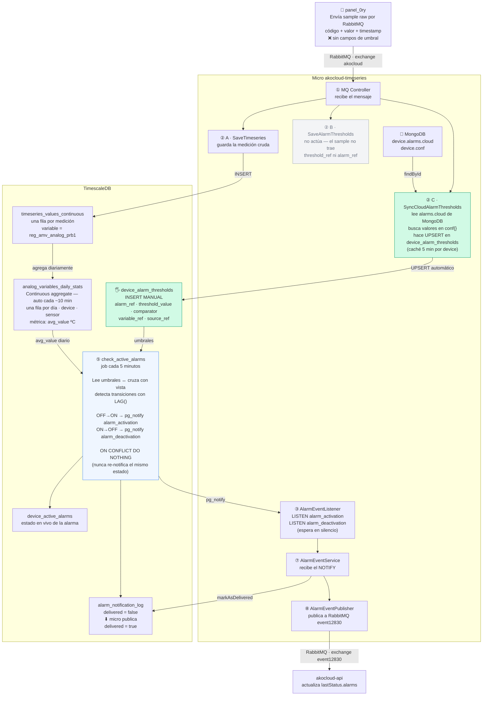
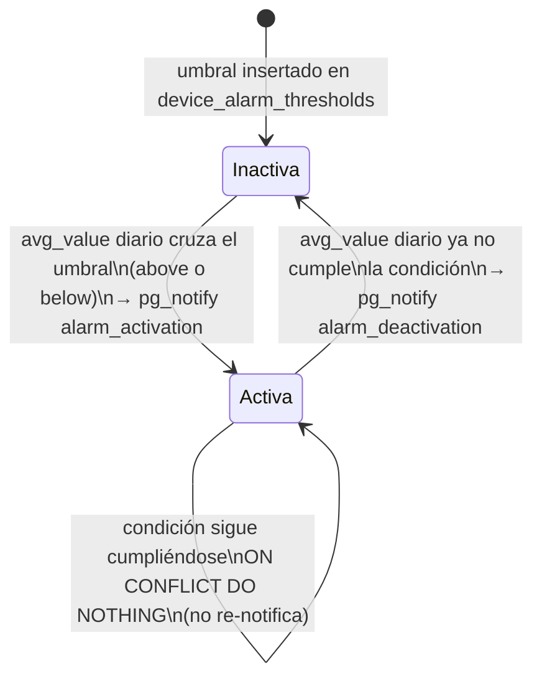

# KNT-2307 — Alarma de temperatura MAX/MIN gestionada por cloud (panel_0ry)

## Metadata

| Field   | Value                |
|---------|----------------------|
| Ticket  | KNT-2307             |
| Branch  | `matias`             |
| Author  | Dani                 |
| Created | 2026-06-15           |
| Status  | `in-progress`        |

## Contexto y motivación

Las alarmas de temperatura máxima y mínima del panel_0ry ya están definidas en el schema del
dispositivo (`alarms.cloud[3]` y `alarms.cloud[4]`). Antes las evaluaba el firmware del
dispositivo. Ahora deben ser evaluadas y gestionadas por el microservicio de timeseries en cloud.

El microservicio ya tiene infraestructura para otras alarmas de cloud (HACCP, setpoint TTI).
Esta tarea extiende ese mecanismo a las nuevas alarmas de temperatura.

El dispositivo envía mediciones en binario raw — NO incluye campos de umbral en el mensaje.
Por tanto los umbrales se insertan directamente en la tabla SQL `device_alarm_thresholds`.

---

## Phases

| # | Nombre         | Estado    |
|---|----------------|-----------|
| 1 | Investigación  | `done`    |
| 2 | Implementación | `pending` |
| 3 | Validación     | `pending` |

---

## Phase 1: Investigación

**Status:** `done`

---

### Flujo completo — de sample a alarma



#### Qué hace cada paso

| Paso | Componente | Qué ocurre |
|------|-----------|------------|
| ① | MQ Controller | Recibe el mensaje RabbitMQ del device |
| ② A | SaveTimeseries | Guarda cada medición en `timeseries_values_continuous` (una fila por sample) |
| ② B | SaveAlarmThresholds | Para alarmas de temp no actúa — el device no manda campos de umbral |
| **② C** | **SyncCloudAlarmThresholds** | **Consulta MongoDB (caché 5 min). Lee `alarms.cloud[]`, busca valores en `conf{}`, hace UPSERT en `device_alarm_thresholds` automáticamente** |
| ③ | AlarmEventListener | Mantiene conexión permanente a PG esperando `pg_notify` |
| ④ | Continuous aggregate | TimescaleDB agrupa automáticamente las filas crudas en `analog_variables_daily_stats` (una fila/día) |
| ⑤ | check_active_alarms | Job PG cada 5 min: cruza umbrales con la vista diaria, detecta cambios de estado con LAG() |
| ⑥ | pg_notify | Solo dispara en transición (OFF→ON o ON→OFF). Mismo estado = silencio |
| ⑦ | AlarmEventService | Recibe el NOTIFY, publica a RabbitMQ, marca `delivered=true` |
| ⑧ | AlarmEventPublisher | Envía el evento al exchange `event12830` |

---

### Las tres vistas de alarmas — cuál le corresponde a temperatura

El job `check_active_alarms` soporta tres tipos de alarma. Cada una usa una vista distinta:

| Vista | Se nutre de | Columna de match | Métrica evaluada | Tipo de alarma |
|---|---|---|---|---|
| `analog_variables_daily_stats` | `timeseries_values_continuous` WHERE `variable LIKE 'reg_amv_analog%'` | `variable` (nombre completo) | `avg_value` — media diaria ºC | **Temperatura** ← esta tarea |
| `digital_inputs_daily_stats_exact` | `timeseries_values_digital` | `variable` (nombre completo) | `active_time_percent` — % tiempo activo | HACCP / digital |
| `tti_daily_percentages` | `timeseries_values_continuous` WHERE `variable LIKE '%tti%'` | `probe` (nombre corto: `prb1`) | `percentage_in` | Setpoint TTI |

El JOIN que hace el job es:

```sql
JOIN device_alarm_thresholds t
  ON  t.device_id    = d.device_id
  AND t.variable_ref = d.variable   -- debe coincidir EXACTAMENTE
  AND t.source_ref   = 'analog_variables_daily_stats'
```

Por eso `variable_ref` en la inserción manual debe ser el nombre completo: `"reg_amv_analog_prb1"`.

---

### Qué hay que insertar en `device_alarm_thresholds`

La tabla tiene esta estructura (PK: `device_id + threshold_ref`):

| Columna | Descripción |
|---|---|
| `device_id` | ID del dispositivo en MongoDB |
| `threshold_ref` | Ref del parámetro de umbral (de `conf[]` en el schema) |
| `threshold_value` | Valor numérico del umbral (ºC) |
| `alarm_ref` | Ref de la alarma (de `alarms.cloud[].ref` en el schema) |
| `variable_ref` | Nombre de la variable en la vista — debe coincidir EXACTAMENTE |
| `source_ref` | Nombre de la vista donde buscar la métrica |
| `comparator` | `"above"` (MAX) o `"below"` (MIN) |

**SQL de inserción manual** (reemplaza `'ID_DEL_DEVICE'` con el ObjectId real):

```sql
INSERT INTO device_alarm_thresholds
  (device_id, threshold_ref, threshold_value, alarm_ref, variable_ref, source_ref, comparator)
VALUES
  -- Alarma MAX temperatura S1
  ('ID_DEL_DEVICE', 'param_A1_alarm_prb1_max', 8.0, 'alarm_cloud_error_1',
   'reg_amv_analog_prb1', 'analog_variables_daily_stats', 'above'),
  -- Alarma MIN temperatura S1
  ('ID_DEL_DEVICE', 'param_A2_alarm_prb1_min', 2.0, 'alarm_cloud_error_2',
   'reg_amv_analog_prb1', 'analog_variables_daily_stats', 'below')
ON CONFLICT (device_id, threshold_ref) DO UPDATE SET
  threshold_value = EXCLUDED.threshold_value,
  alarm_ref       = EXCLUDED.alarm_ref,
  variable_ref    = EXCLUDED.variable_ref,
  source_ref      = EXCLUDED.source_ref,
  comparator      = EXCLUDED.comparator;
```

> Los valores de umbral (`8.0`, `2.0`) son ejemplos. Usar los valores reales configurados
> por el instalador. El campo `threshold_value` se actualizará si se vuelve a ejecutar el INSERT.

---

### Diagrama de estados de la alarma



Garantía de entrega:
- Si el micro está caído cuando ocurre la transición, `alarm_notification_log.delivered = false`.
- Al arrancar, `pollUndelivered()` recupera esas filas y las publica.

---

### Schema del dispositivo — qué está ya definido

Las dos alarmas ya existen en `alarms.cloud` del panel_0ry:

```
alarms.cloud[3]  →  alarm_cloud_error_1  →  MAX S1  →  above  →  param_A1_alarm_prb1_max
alarms.cloud[4]  →  alarm_cloud_error_2  →  MIN S1  →  below  →  param_A2_alarm_prb1_min
```

Esquema de un objeto `alarms.cloud`:

```json
{
  "ref":         "alarm_cloud_error_1",
  "description": "Alarma MAX Sonda S1",
  "priority":    "param_c_ag1_max_s1",
  "threshold":   "param_A1_alarm_prb1_max",
  "valueRef":    "reg_amv_analog_prb1",
  "compareType": "above"
}
```

| Atributo | Origen | Descripción |
|---|---|---|
| `ref` | — | ID único de la alarma. Debe coincidir con `alarm_ref` en `device_alarm_thresholds` |
| `threshold` | `conf[].ref` donde `code` termina en `A1` / `A2` | Parámetro de umbral configurable por el instalador |
| `priority` | `conf[].ref` donde `code` contiene `c_AG1` / `c_AG2` | Severidad del grupo de alarma (elige el usuario) |
| `valueRef` | `analogInputs.device[].ref` | Sensor a vigilar. El micro divide el valor raw ÷ `convert` para obtener ºC |
| `compareType` | `"above"` / `"below"` | `above` → alarma si valor > umbral; `below` → alarma si valor < umbral |

---

### Archivos relevantes

| Archivo | Qué hace en este flujo |
|---|---|
| [timestream.mq.controller.ts](micros/timeseries/src/app/timestream/controllers/timestream.mq.controller.ts) | Recibe el mensaje RabbitMQ y llama a SaveTimeseries + SaveAlarmThresholds |
| [save-alarm-thresholds.ts](domains/src/alarms/Application/save-alarm-thresholds.ts) | Persiste umbrales desde el mensaje. Tiene un bug para temperatura (no afecta al flujo manual) |
| [alarm-event-listener.service.ts](domains/src/alarms/Infrastructure/alarm-event-listener.service.ts) | Conexión permanente a PG, LISTEN alarm_activation / alarm_deactivation |
| [alarm-event.service.ts](micros/timeseries/src/app/timestream/services/alarm-event.service.ts) | Handler del NOTIFY: publica, marca delivered, reintenta al arrancar |
| [alarm-event-publisher.service.ts](domains/src/alarms/Infrastructure/alarm-event-publisher.service.ts) | Publica al exchange event12830 vía RabbitMQ |
| `timeseries-sqls/cloud-alarms/active_alarms.sql` | Job check_active_alarms — ya soporta analog, NO necesita cambios |
| `timeseries-sqls/views-calendar/analog_views.sql` | Define analog_variables_daily_stats — ya existe y se auto-refresca |

---

### Bug conocido en `save-alarm-thresholds.ts` (no bloquea esta tarea)

Si en el futuro el translator empezara a enviar campos de umbral para temperatura, el código
actual los guardaría mal:

| Campo | Valor guardado (actual) | Valor correcto |
|---|---|---|
| `variable_ref` | `"prb1"` (recorta el prefijo) | `"reg_amv_analog_prb1"` (nombre completo) |
| `source_ref` | `"digital_inputs_daily_stats_exact"` | `"analog_variables_daily_stats"` |

La fix requiere añadir un tercer caso en las dos funciones privadas:

```
CASO 1 — TTI / setpoint:   alarm_ref contiene "setpoint"  →  source=tti_daily_percentages,  variable=nombre corto
CASO 2 — Temperatura (NEW): code empieza "reg_amv_analog_" Y alarm_ref NO "setpoint"  →  source=analog_variables_daily_stats, variable=nombre completo
CASO 3 — Digital:          todo lo demás  →  source=digital_inputs_daily_stats_exact, variable=nombre completo
```

No se implementa ahora porque el flujo manual ya hace correctamente lo que haría esta fix.

---

## Phase 2: Implementación

**Status:** `done`

### Prerequisitos verificados (2026-06-15)

| Condición | Estado |
|---|---|
| Job `check_active_alarms` corre cada 5 minutos | ✅ confirmado |
| El CASE del job tiene el caso `analog_variables_daily_stats → avg_value` | ✅ confirmado |
| `device_alarm_thresholds` tiene todas las columnas necesarias | ✅ confirmado |
| INSERT manual en `device_alarm_thresholds` ejecutado para device `6a02f7f89669739498a9d799` | ✅ confirmado — MAX=10.0, MIN=30.0 |
| MongoDB (`devices` collection) tiene `alarms.cloud` con `alarm_cloud_error_1` y `alarm_cloud_error_2` | ✅ confirmado |
| `device.conf` en MongoDB tiene `param_A1_alarm_prb1_max` y `param_A2_alarm_prb1_min` | ✅ confirmado |

### Cambios implementados

#### 1. Fix en `save-alarm-thresholds.ts` (2026-06-15)

**Archivo:** [save-alarm-thresholds.ts](domains/src/alarms/Application/save-alarm-thresholds.ts)

Las dos funciones privadas ahora distinguen tres casos (antes solo dos):

| Caso | Condición | `source_ref` | `variable_ref` |
|---|---|---|---|
| TTI / setpoint | `alarm_ref` contiene `"setpoint"` | `tti_daily_percentages` | nombre corto (`prb1`) |
| **Temperatura analógica** ← nuevo | `code` empieza `reg_amv_analog_` Y NO setpoint | `analog_variables_daily_stats` | nombre completo (`reg_amv_analog_prb1`) |
| Digital / HACCP | todo lo demás | `digital_inputs_daily_stats_exact` | nombre completo |

#### 2. MongoDB cableado — `SyncCloudAlarmThresholds` (2026-06-15)

**Archivos modificados:**

| Archivo | Cambio |
|---|---|
| [sync-cloud-alarm-thresholds.ts](domains/src/alarms/Application/sync-cloud-alarm-thresholds.ts) | **NUEVO** — use case que inicializa umbrales automáticamente |
| [domains/src/alarms/index.ts](domains/src/alarms/index.ts) | Exporta el nuevo use case |
| [timestream.mq.module.ts](micros/timeseries/src/app/timestream/timestream.mq.module.ts) | MongooseModule + DeviceRepository + SyncCloudAlarmThresholds providers |
| [timestream.mq.controller.ts](micros/timeseries/src/app/timestream/controllers/timestream.mq.controller.ts) | Inyecta y llama `syncCloudAlarmThresholds.execute()` en los tres handlers 12830 |

**Lógica de `SyncCloudAlarmThresholds.execute(deviceId)`:**

1. Busca el device en MongoDB (caché en memoria de 5 min por deviceId)
2. Lee `device.alarms.cloud[]` — array de definiciones de alarma cloud
3. Para cada entrada con `ref`, `compareType` (`above`/`below`), `valueRef` y `sampleRef`:
   - Lee `device.conf[valueRef]` — valor numérico configurado por el instalador
   - Si es un número finito válido: hace UPSERT en `device_alarm_thresholds`
   - Si no es número (REVIEW missing value, null, etc.): lo omite silenciosamente
4. Usa `source_ref = 'analog_variables_daily_stats'` hardcodeado (correcto para alarmas de temperatura analógica)

**Configuración MongoDB** (`MongooseModule.forRootAsync`):
- URI construida desde `config.database.host/port/name` (`.env.local`: `localhost:27017/akocloud`)
- Schema `strict: false` — permite acceder a todos los campos del documento sin tipado estricto
- Colección: `devices`

**Build check:**

```
yarn tsc -p micros/timeseries/tsconfig.json --noEmit  →  Done (0 errores)
yarn tsc -p domains/tsconfig.json --noEmit            →  Done (0 errores)
```

### Qué NO cambia

| Repo | Estado |
|---|---|
| `timeseries-sqls` | Sin cambios — el job ya soporta `analog_variables_daily_stats` |
| `akocloud-api` | Sin cambios — solo lee `lastStatus.alarms` |
| Translator / connection layer | Sin cambios — restricción explícita del ticket |

---

## Phase 3: Validación

**Status:** `pending`

### Pasos

| # | Acción | Resultado esperado |
|---|--------|--------------------|
| 1 | `SELECT * FROM device_alarm_thresholds WHERE device_id = 'ID_DEL_DEVICE'` | 2 filas con `source_ref='analog_variables_daily_stats'` y `variable_ref='reg_amv_analog_prb1'` |
| 2 | `SELECT day, avg_value FROM analog_variables_daily_stats WHERE device_id='ID_DEL_DEVICE' AND variable='reg_amv_analog_prb1' ORDER BY day DESC LIMIT 5` | Filas con mediciones diarias — confirma que el aggregate tiene datos |
| 3 | Esperar ejecución del job (máx 5 min) o lanzarlo manualmente si hay acceso | `SELECT * FROM device_active_alarms WHERE device_id='ID_DEL_DEVICE'` muestra las alarmas si el umbral se supera |
| 4 | Revisar `alarm_notification_log WHERE device_id='ID_DEL_DEVICE'` | Filas con `delivered=true` si el micro está corriendo y RabbitMQ accesible |
| 5 | Revisar logs del micro | Sin errores de AlarmEventListener ni AlarmEventPublisher |
