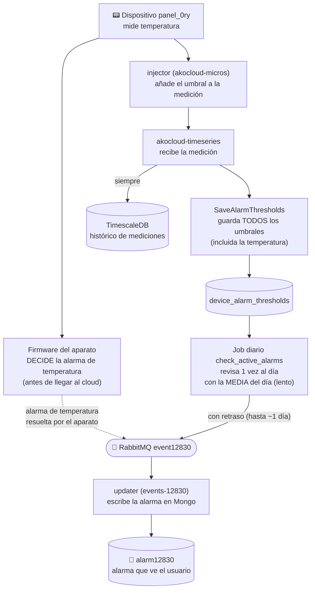
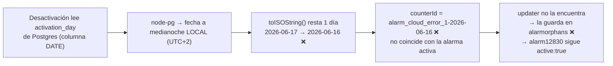
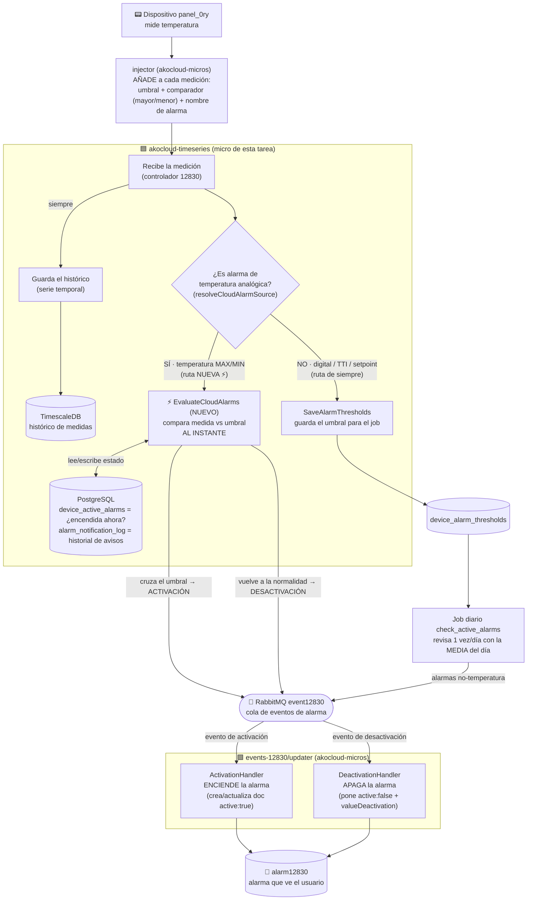

# KNT-2307 — Alarma de temperatura MAX/MIN gestionada por cloud (panel_0ry)

## Metadata

| Field   | Value                  |
|---------|------------------------|
| Ticket  | KNT-2307               |
| Branch  | `feature/KNT-2390`     |
| Author  | Dani                   |
| Created | 2026-06-15             |
| Status  | `done` — implementado y validado end-to-end (2026-06-18); pendiente solo de commits |

> **Cómo leer este documento:** está ordenado para alguien que **no conoce la tarea**. Primero el
> objetivo y el glosario, luego cómo funcionaba el sistema **antes**, qué problema tenía, qué se
> **implementó** y cómo quedó el flujo **después**. El resultado y la validación están **al final**.

---

## 1. Objetivo

El equipo de frío AKO instala paneles `panel_0ry` que miden temperatura. Hasta ahora, las alarmas de
temperatura **máxima** (`alarm_cloud_error_1`) y **mínima** (`alarm_cloud_error_2`) las decidía el
**firmware** del propio aparato. El ticket pide que esas dos alarmas las gestione **el cloud**
(microservicio `akocloud-timeseries`), con un requisito clave:

> Deben dispararse **casi al instante** en cuanto llega una medición que cruza el límite, **no** esperando
> a una media del día.

---

## 2. Scope / alcance

**Dentro del alcance:**
- Evaluar en cloud, al instante, las alarmas de **temperatura analógica MAX/MIN** del `panel_0ry`.
- Encender y apagar (activación / desactivación) esas alarmas según cada medición.

**Fuera del alcance:**
- El resto de alarmas (digitales, HACCP, TTI/setpoint): **siguen exactamente igual** que antes.
- Resolver el umbral desde la configuración del dispositivo: eso ya lo hace otro componente (el `injector`).
- Escribir la alarma final en la base de datos del usuario: lo hace otro microservicio (el `updater`).

---

## 3. Glosario (leer antes que nada)

| Término                                                                                         | Qué significa **en esta tarea**                                                                                                                                                                      |
| ----------------------------------------------------------------------------------------------- | ---------------------------------------------------------------------------------------------------------------------------------------------------------------------------------------------------- |
| **Microservicio / micro**                                                                       | Un programa independiente que arranca como proceso propio y se comunica con los demás por colas de mensajes (RabbitMQ).                                                                              |
| **`akocloud-timeseries`**                                                                       | El micro **de esta tarea**. Recibe las mediciones, guarda el histórico y (ahora) evalúa las alarmas de temperatura.                                                                                  |
| **`akocloud-micros`**                                                                           | Otro repositorio con varios micros auxiliares; aquí intervienen el **injector** y el **updater**.                                                                                                    |
| **Medición / `sample`**                                                                         | Un dato que envía el aparato: variable + valor + unidad + marca de tiempo. P.ej. `prb1 = 50 ºC`.                                                                                                     |
| **`injector`**                                                                                  | Micro (en `akocloud-micros`) que, antes de pasar la medición, le **añade el umbral** de la alarma (lo calcula leyendo la configuración del dispositivo).                                             |
| **Umbral / `threshold`**                                                                        | El límite que dispara la alarma (p.ej. MAX = 25 ºC). Viene **adjunto a la medición** junto con el **comparador** (`above` = salta si el valor es mayor; `below` = si es menor).                      |
| **Serie temporal / "guardar la serie"**                                                         | El **histórico de mediciones** a lo largo del tiempo. Se guarda en **TimescaleDB** (PostgreSQL para series temporales). No tiene nada que ver con las alarmas: es solo el registro de valores.       |
| **Activación**                                                                                  | La alarma pasa de apagada a **encendida** (el valor cruza el umbral).                                                                                                                                |
| **Desactivación**                                                                               | La alarma pasa de encendida a **apagada** (el valor vuelve a la normalidad).                                                                                                                         |
| **`job` diario (`check_active_alarms`)**                                                        | Un proceso programado que se ejecuta **una vez al día** y revisa alarmas usando la **media del día**. Es el mecanismo "lento".                                                                       |
| **Media diaria / `aggregate`**                                                                  | Promedio de los valores del día (vista `analog_variables_daily_stats`). El `job` lo usa para decidir; por eso un pico puntual podía no detectarse.                                                   |
| **`handler`**                                                                                   | Función que **maneja un tipo concreto de mensaje**. Aquí: `ActivationHandler` (enciende la alarma en Mongo) y `DeactivationHandler` (la apaga).                                                      |
| **`event12830`**                                                                                | Cola de RabbitMQ por donde viajan los eventos de alarma (encender/apagar) hacia el `updater`.                                                                                                        |
| **`updater` (`events-12830/updater`)**                                                          | Micro (en `akocloud-micros`) que **escucha `event12830`** y escribe la alarma final en MongoDB.                                                                                                      |
| **`alarm12830`**                                                                                | Colección de **MongoDB** con las alarmas tal y como las ve el usuario final (`active: true/false`, valor, fechas…).                                                                                  |
| **`alarmorphans`**                                                                              | Colección de Mongo donde el `updater` guarda eventos "huérfanos": desactivaciones que **no encontraron** su alarma activa para apagar. Aparecer aquí es señal de un desajuste.                       |
| **`counterId`**                                                                                 | Identificador que **empareja** una activación con su desactivación: `nombreAlarma-fechaActivación` (p.ej. `alarm_cloud_error_1-2026-06-17`). Si no coincide, el `updater` no sabe qué alarma apagar. |
| **`device_active_alarms`** (PostgreSQL)                                                         | Tabla del micro que recuerda **qué alarmas están encendidas ahora** (para no avisar dos veces).                                                                                                      |
| **`alarm_notification_log`** (PostgreSQL)                                                       | Tabla del micro con el **historial de avisos** enviados (activación/desactivación, entregado sí/no).                                                                                                 |
| **`device_alarm_thresholds`** (PostgreSQL)                                                      | Tabla donde se guardan los umbrales que consume el **`job` diario**. Las alarmas de temperatura **ya no** se escriben aquí.                                                                          |
| **`resolveCloudAlarmSource(...)`**                                                              | Función auxiliar que, dada una alarma, dice si es de **temperatura analógica** (ruta instantánea nueva) o de otro tipo (ruta del `job`).                                                             |
| TTI es **Time Temperature Indicator** — un indicador de la industria del frío/alimentación.<br> | <br>En vez de preguntar "¿la temperatura superó X?", pregunta: **"¿qué porcentaje del día estuvo la temperatura dentro/fuera del rango de setpoint?"**                                               |

---

## 4. Contexto funcional del microservicio

`akocloud-timeseries` es el micro que recibe **todas las mediciones** de los dispositivos (protocolo
"12830") por RabbitMQ. Por cada mensaje hace dos cosas básicas:

1. **Guardar la serie temporal**: mete los valores en TimescaleDB (el histórico).
2. **Gestionar umbrales de alarma**: si la medición trae umbrales (los añade el `injector`), los guarda
   para que **otro proceso** (el `job` diario) decida si hay alarma.

Es decir, históricamente **este micro no decidía alarmas**: solo almacenaba datos y dejaba la decisión al
`job` diario (para alarmas digitales/TTI) o al **firmware** del aparato (para la temperatura). Esta tarea
le añade, **solo para la temperatura**, la capacidad de decidir la alarma **al instante**.

---

## 5. Flujo ANTES de la tarea

La temperatura MAX/MIN la decidía el **firmware** del aparato y la mandaba ya resuelta. El micro, por su
parte, guardaba la serie y persistía **todos** los umbrales en `device_alarm_thresholds`; el **`job`
diario** los revisaba con la **media del día**.



---

## 6. Problema / limitación del flujo anterior

1. **Demasiado lento para temperatura.** El `job` solo corre una vez al día y usa la **media diaria**
   (con `end_offset` de 1 h). Una subida puntual de temperatura podía tardar ~1 h en verse, o **no
   dispararse nunca** si la media del día no cruzaba el umbral. El ticket pide inmediatez.
2. **La decisión estaba en el firmware**, no en el cloud: difícil de cambiar, auditar y unificar.
3. Conclusión: para la temperatura MAX/MIN hace falta una ruta que evalúe **cada medición al instante**,
   sin esperar al `job` ni a la media.

---

## 7. Implementación paso a paso

### Paso 1 — Decidir, por cada medición, quién evalúa cada alarma

Se añade el helper `resolveCloudAlarmSource(code, alarm_ref)` 

>[!important] `alarm_ref`
>Es el `injector` el que enriqueze el mensaje tipo `sample` con el `alarm_ref` definid


([cloud-alarm-source.ts](domains/src/alarms/Application/cloud-alarm-source.ts), NUEVO): dice si una alarma
es de **temperatura analógica** o no.

- Es **temperatura analógica** → **ruta instantánea nueva** (este micro la evalúa).
- Cualquier otra (digital / HACCP / TTI / setpoint) → **ruta de siempre** (el `job` diario).

### Paso 2 — Sacar la temperatura de la ruta del `job`

`SaveAlarmThresholds` ([save-alarm-thresholds.ts](domains/src/alarms/Application/save-alarm-thresholds.ts),
MOD) ahora **omite** los umbrales de temperatura analógica: ya **no** se escriben en
`device_alarm_thresholds`. Así el `job` diario **ni los ve** → un único evaluador por alarma, sin riesgo de
que salten dos veces. Las demás alarmas se siguen guardando igual.

### Paso 3 — Evaluar la temperatura al instante

Nuevo caso de uso `EvaluateCloudAlarms`
([evaluate-cloud-alarms.ts](domains/src/alarms/Application/evaluate-cloud-alarms.ts), NUEVO). Por cada
medición de temperatura ya enriquecida con su umbral por el `injector`:

1. Compara el valor con el umbral: `above ? valor > umbral : valor < umbral`.
2. Mira en `device_active_alarms` si la alarma ya estaba encendida.
3. Decide la **transición** y solo actúa si hay cambio:
   - **Apagada → encendida (activación):** guarda el estado, registra el aviso y **publica** la activación.
   - **Encendida → apagada (desactivación):** borra el estado, registra el aviso y **publica** la desactivación.
4. **No toca MongoDB**: solo publica a `event12830`. La inmediatez viene de no esperar a nada.

El estado y el control de duplicados viven en PostgreSQL
([cloud-alarm-state.timescaledb.repository.ts](domains/src/alarms/Infrastructure/cloud-alarm-state.timescaledb.repository.ts),
NUEVO) sobre las tablas `device_active_alarms` y `alarm_notification_log`.

### Paso 4 — Conectar el caso de uso al micro

- El controlador de mensajes 12830 llama al nuevo caso de uso
  ([timestream.mq.controller.ts](micros/timeseries/src/app/timestream/controllers/timestream.mq.controller.ts), MOD).
- Se registran los providers y se quita `MongooseModule` del flujo de alarmas
  ([timestream.mq.module.ts](micros/timeseries/src/app/timestream/timestream.mq.module.ts), MOD): el micro
  ya **no** necesita Mongo para las alarmas.

### Paso 5 — Qué deja de ser necesario

- El **firmware** ya no decide la alarma de temperatura del `panel_0ry`.
- La **media diaria** y el **`job`** dejan de intervenir **para la temperatura** (siguen para el resto).
- Se descartó un primer enfoque (`SyncCloudAlarmThresholds`) por redundante (ver apéndice).

### Paso 6 — Bug corregido durante la validación: la desactivación no apagaba la alarma

**Síntoma:** al bajar la temperatura, PostgreSQL registraba la desactivación (`delivered=true`), pero en
Mongo la alarma seguía `active:true`. El evento aparecía en `alarmorphans` con un `counterId` de **un día
antes** (`...-2026-06-16` en vez de `...-2026-06-17`).

**Causa:** la fecha de activación (`activation_day`) se leía de una columna `DATE` de PostgreSQL.
`node-pg` la convierte a una fecha JS a **medianoche local**; al pasarla a texto con `toISOString()` (que
usa UTC), en zona **UTC+2** retrocedía un día. Ese `counterId` desplazado ya no coincidía con la alarma
activa, así que el `DeactivationHandler` no la encontraba y la guardaba como huérfana → la alarma nunca se
apagaba. (La **activación** no se veía afectada porque su `counterId` se construye con la marca de tiempo de
la medición, no con esa columna `DATE`.)



**Fix** ([cloud-alarm-state.timescaledb.repository.ts](domains/src/alarms/Infrastructure/cloud-alarm-state.timescaledb.repository.ts)):
- `deactivate()`: `SELECT to_char(day, 'YYYY-MM-DD') AS day` → Postgres devuelve **texto**, sin parseo a fecha.
- `toDateString()`: reforzado para formatear desde componentes **locales** si llegara un `Date` (defensa).

---

## 8. Flujo DESPUÉS de la tarea (estado actual)

El micro ahora **bifurca por tipo de alarma**: la temperatura se evalúa al instante; el resto sigue por el
`job`. Las dos rutas terminan publicando en `event12830`, y el `updater` enciende o apaga la alarma en Mongo.

> **Leyenda:** 🟦 = micro de esta tarea (`akocloud-timeseries`) · 🟩 = micro que escribe en Mongo
> (`updater`) · ⚡ = ruta **nueva** e instantánea · líneas con "ruta de siempre" = comportamiento sin cambios.



**En una frase:** antes la temperatura dependía del firmware o de una media diaria lenta; ahora
`akocloud-timeseries` la evalúa al instante en cuanto llega la medición, y el `updater` enciende/apaga la
alarma en Mongo — sin afectar al resto de alarmas.

---

## 9. Resultado final y validación

**Resultado:** implementado y validado end-to-end. La **activación** (2026-06-17) y la **desactivación**
(2026-06-18, tras corregir el bug de fecha) funcionan: la medición cruza el umbral → se publica la
activación de inmediato → `alarm12830` queda `active:true`; al volver a la normalidad → se publica la
desactivación → el mismo documento pasa a `active:false` con `valueDeactivation`, **sin huérfanos**. Sin
media diaria, sin esperar al `job`.

### Validación de activación (2026-06-17)

Device `6a02f7f89669739498a9d799` (`panel_0ry_7302`), medición `prb1 = 50 ºC` (umbral MAX = 25):

| Comprobación | Resultado |
|---|---|
| Log del micro | `Published activation event for alarm: alarm_cloud_error_1` con `eventValue:50` ✅ |
| `device_alarm_thresholds` | solo `setpoint`; `error_1/error_2` **no aparecen** (no van al job) ✅ |
| `device_active_alarms` | `error_1` con `last_value=50` (instantánea, no media diaria) ✅ |
| `alarm_notification_log` | `error_1` / `activation` / `delivered=true`, día actual ✅ |
| Mongo `alarm12830` | **un único** doc `active:true`, `value:"50"` ✅ |
| Job diario | intacto para digital/HACCP/TTI; sin interferencia en temperatura ✅ |

### Validación de desactivación (2026-06-18, tras el fix)

1. Rebuild de `domains` + `timeseries`, restart del micro y reset del estado de prueba (PostgreSQL + Mongo).
2. Ciclo activación (`prb1 = 50`) → desactivación (`prb1 = 20`) el mismo día.
3. Confirmado: `counterId` **idéntico** en activación y desactivación, y el doc de `alarm12830` pasa a
   `active:false` con `valueDeactivation`/`dateDeactivation`, **sin huérfano nuevo** en `alarmorphans` ✅.

Build: `nx run domains:build` ✅ · `nx run timeseries:build` ✅

### Cómo reproducir

1. Infra local: TimescaleDB, MongoDB (`akocloud`), RabbitMQ, micro `timeseries` y micro `events-12830/updater`.
2. Requisitos de datos (por su mecanismo real, sin tocar a mano): la `devicedefinition` del device tiene
   `alarms.cloud`, y `device.conf` tiene los umbrales numéricos (denormalizados en provisión).
3. Activar: `node client-perte.js 974130023 sample -v` con `prb1 = 50` → desactivar con `prb1 = 20`.
4. Verificar las tablas de arriba.

> El gate `isActive` evita re-publicar el mismo estado el mismo día. Para re-probar una activación,
> provoca antes la desactivación (medición por debajo del umbral).

---

## Apéndices

### A. Fuentes de verdad (confirmadas con IA-API)

| Dato | Vive en | Cómo llega |
|---|---|---|
| Estructura `alarms.cloud` (`ref`, `threshold`, `valueRef`, `compareType`) | `devicedefinitions` | se resuelve vía `device.deviceDefinition`. **Nunca** se denormaliza en el device |
| Valores del umbral (`conf[threshold]`, p.ej. 25/18) | `device.conf` | denormalizado en provisión por akocloud-api |
| Umbral resuelto en cada medición | el **injector** (`akocloud-micros`) | lee definición + `conf` y **enriquece la medición** con `threshold_ref`/`threshold_value`/`threshold_comparator`/`alarm_ref` |

El micro **no resuelve** la definición ni `conf`: consume la medición ya enriquecida por el injector.
Esquema real de un objeto `alarms.cloud` en la definición:
```json
{ "ref": "alarm_cloud_error_1", "description": "Alarma MAX Sonda S1",
  "priority": "param_c_ag1_max_s1", "threshold": "param_A1_alarm_prb1_max",
  "valueRef": "reg_amv_analog_prb1", "compareType": "above" }
```
No existe el campo `sampleRef`. `valueRef` es el nombre completo de la variable (= `sample.code`).

### B. Tabla de cambios de código — `akocloud-timeseries`

| Archivo | Tipo | Resumen |
|---|---|---|
| [evaluate-cloud-alarms.ts](domains/src/alarms/Application/evaluate-cloud-alarms.ts) | NUEVO | Caso de uso instantáneo. Lee el umbral de la medición enriquecida (sin Mongo); solo temperatura analógica; publica activación/desactivación |
| [cloud-alarm-source.ts](domains/src/alarms/Application/cloud-alarm-source.ts) | NUEVO | Helper `resolveCloudAlarmSource` compartido por `saveAlarmThresholds` (omite) y `evaluate` (gestiona) |
| [cloud-alarm-state.repository.ts](domains/src/alarms/Domain/cloud-alarm-state.repository.ts) | NUEVO | Contrato del estado/dedup (`isActive`/`activate`/`deactivate`/`markDelivered`) |
| [cloud-alarm-state.timescaledb.repository.ts](domains/src/alarms/Infrastructure/cloud-alarm-state.timescaledb.repository.ts) | NUEVO | Implementación PG transaccional sobre `device_active_alarms` + `alarm_notification_log`. Incluye el fix de fecha (`to_char`) |
| [save-alarm-thresholds.ts](domains/src/alarms/Application/save-alarm-thresholds.ts) | MOD | **Omite** la temperatura analógica (va a la ruta instantánea). Digital/TTI siguen al job |
| [timestream.mq.controller.ts](micros/timeseries/src/app/timestream/controllers/timestream.mq.controller.ts) | MOD | Handlers 12830 llaman `evaluateCloudAlarms.execute()` |
| [timestream.mq.module.ts](micros/timeseries/src/app/timestream/timestream.mq.module.ts) | MOD | Providers `CloudAlarmStateRepository` + `EvaluateCloudAlarms`. **Sin MongooseModule** |
| [domains/src/alarms/index.ts](domains/src/alarms/index.ts) | MOD | Exports de los nuevos módulos |
| [timeseries.timescaledb.12830.repository.ts](domains/src/timeseries/Infrastructure/timeseries.timescaledb.12830.repository.ts) | MOD | Columna `timezone` → `local_time` (ver colaterales) |
| [client-perte.js](client-perte.js) · [client-perte-message-factory.js](client-perte-message-factory.js) | NUEVO | Cliente de simulación para pruebas |

### C. Decisiones clave

1. La temperatura del `panel_0ry` se evalúa **instantáneamente en el micro**, no por el job diario.
2. Esas alarmas **no** se escriben en `device_alarm_thresholds` → el job global no las toca.
3. El micro **no resuelve** la definición/`conf`: reutiliza el umbral que el **injector** ya pega a la medición.
4. Esquema canónico: `threshold` + `valueRef` (no existe `sampleRef`).
5. Columna de hora local: `local_time` en ambos repos de escritura.
6. Fechas leídas de columnas `DATE` de Postgres: devolver siempre **texto** (`to_char`) para evitar el
   desfase de zona horaria (ver Paso 6).
7. **No se inyectan datos a mano** para pruebas; se usa el mecanismo real (ver regla en `task-template.md`).

### D. Enfoque inicial descartado (por qué)

El primer diseño reutilizaba el job diario para temperatura:
- Se creó `SyncCloudAlarmThresholds` para persistir el umbral leyendo Mongo en cada medición.
- El job evaluaba la **media diaria** (`analog_variables_daily_stats.avg_value`).

Se descartó porque:
- **Demasiado lento / semántica errónea:** media diaria + `end_offset` de 1 h → la alarma podía tardar
  ~1 h, y un pico puntual podía no dispararla nunca. El ticket pide inmediatez.
- **`SyncCloudAlarmThresholds` era redundante:** el **injector** ya enriquece la medición y
  `saveAlarmThresholds` ya la persiste. Se **eliminó** el sync.
- Leer `device.alarms.cloud` era incorrecto: ese campo no existe en el device (vive en la definición).

### E. Cambios colaterales coordinados con IA-API

1. **Columna `local_time` (no `timezone`).** El commit `44ec0d9` había renombrado a `timezone`, pero la
   columna real (en `init.sql`, vistas y BD) es `local_time`. Revertido en
   [timeseries.timescaledb.12830.repository.ts](domains/src/timeseries/Infrastructure/timeseries.timescaledb.12830.repository.ts)
   y [timeseries.timescaledb.digital.repository.ts](domains/src/timeseries/Infrastructure/timeseries.timescaledb.digital.repository.ts).
   Análisis: [BUGFIX-digital-local_time.md](BUGFIX-digital-local_time.md).
2. **Cast de tipos en el job (`timeseries-sqls`).** `check_active_alarms` fallaba (`numeric` vs
   `double precision`) cuando coexisten fuentes analógicas y TTI. Fix: `d.%1$I::double precision` en
   `cloud-alarms/active_alarms.sql` (líneas 164 y 274). Pendiente de commit por el equipo `timeseries-sqls`.

### F. Pendiente

- **Commits** (nada commiteado aún en `akocloud-timeseries` ni `timeseries-sqls`); incluir el fix de fecha
  en `cloud-alarm-state.timescaledb.repository.ts`.
- (Colateral) commit del cast de tipos en `timeseries-sqls/cloud-alarms/active_alarms.sql` por su equipo.

> Nota: el micro **depende** del enriquecido del injector (lo reutiliza), así que el injector **debe seguir**
> enriqueciendo las analógicas de temperatura. Ya no hay lógica duplicada en el micro.
