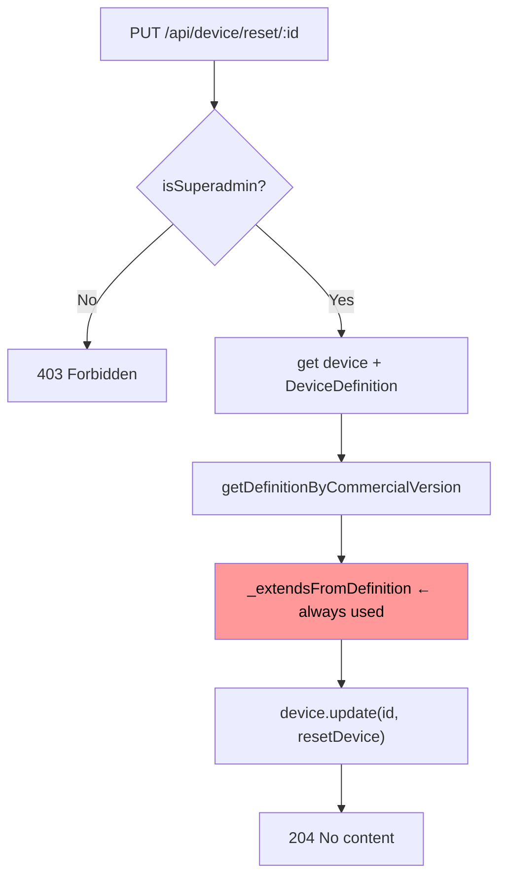
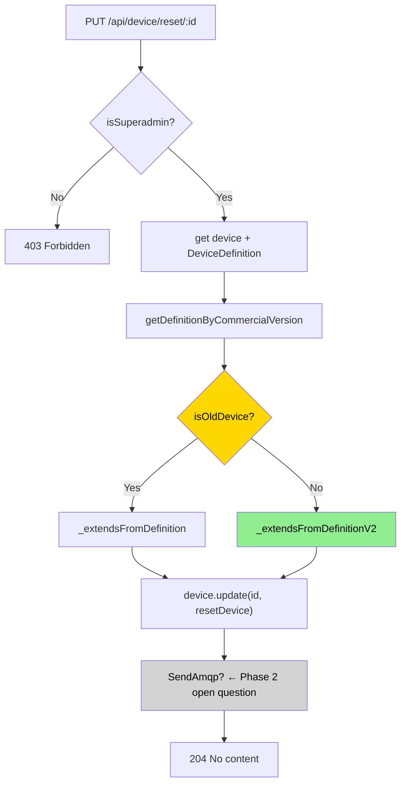
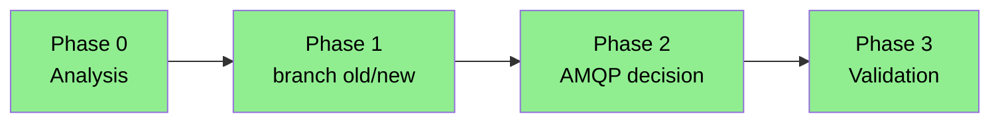

# Task: Reset Configuration for New Device Models

> Task document for AI-assisted work. Follow AGENTS.md workflow.
> **After every phase:** update §8 phase status, add an entry to §10 implementation log, and update the Mermaid diagrams.

---

## 1. Metadata

| Field | Value |
|---|---|
| Task name | Reset configuration for new device models |
| Owner | Dani |
| Created | 2026-06-01 |
| Last updated | 2026-06-01 |
| Status | In progress |
| Current phase | Phase 1 — Fix implemented, pending validation |
| Repository area | `src/controllers/api/device.ts` |
| Base branch | develop |
| Related ticket | TBD |

---

## 2. Objective

Fix `PUT /api/device/reset/:id` (`resetConfiguration`) so that it works correctly for new device models (`panel_4ry`, `panel_1ry`, `panel_2ry`, `panel_3ry`, `panel_0ry`, `panel_0ry_h`, etc.).

Currently the method always uses the old `_extendsFromDefinition` helper, which produces incorrect `conf` data for new devices. New devices require `_extendsFromDefinitionV2`, which resolves parameter dependencies and default values correctly.

A second open question (Phase 2) is whether the reset should also send an AMQP message to notify the physical device.

---

## 3. Non-goals

- Do not change the reset behavior for old device models (AD series, CAMREGIS, DARWIN, etc.) — they continue using `_extendsFromDefinition`.
- Do not change the endpoint path or response shape.
- Do not change the SUPERADMIN access control unless explicitly requested.
- Do not touch `_extendsFromDefinition` or `_extendsFromDefinitionV2` internals.

---

## 4. Background

- **Current behavior:** `resetConfiguration` calls `this._extendsFromDefinition(data.device, definition)` unconditionally. For new devices this produces a `conf` built from a flat array iteration that does not match the dependency-resolved structure that `_extendsFromDefinitionV2` produces. The reset result is either wrong or empty for new devices.
- **Target behavior:** For new devices use `_extendsFromDefinitionV2`; for old devices keep `_extendsFromDefinition`. Same branching pattern already used at device creation (line 1590 of `device.ts`).
- **Why:** The "Reset configuration" button in the frontend Advanced Edit dialog calls this endpoint. Clicking it on a `panel_4ry` leaves the device with a broken or empty `conf`.
- **Constraints:**
  - The branching helper `isOldDevice` is already imported in `device.ts`.
  - The fix is one line — must not change surrounding logic.
  - AMQP behavior after reset is an open question (see §8 Phase 2).

---

## 5. Source of truth

| Type | Path | Why it matters |
|---|---|---|
| Controller | [src/controllers/api/device.ts](../../src/controllers/api/device.ts) | `resetConfiguration` (line ~2173), `_extendsFromDefinition` (line ~3394), `_extendsFromDefinitionV2` (line ~3227) |
| Helper | [src/lib/helpers/device-classifier.ts](../../src/lib/helpers/device-classifier.ts) | `isOldDevice`, `isNewDevice` — model classification |
| Reference | [src/controllers/api/device.ts:1590](../../src/controllers/api/device.ts) | Correct branching pattern already used at device creation |
| AMQP | `src/controllers/api/configuration/send-amqp.ts` | `sendParam`, `sendConfig` — AMQP dispatch options |

---

## 6. Scope

### In scope

- `resetConfiguration`: branch between `_extendsFromDefinition` and `_extendsFromDefinitionV2` based on `isOldDevice(device.model)`.
- (Phase 2, pending confirmation) Send AMQP after reset.

### Out of scope

- Changes to `_extendsFromDefinition` or `_extendsFromDefinitionV2`.
- Access control changes (SUPERADMIN guard stays).
- Any other endpoint or method in `device.ts`.

### Compatibility requirements

- Existing endpoint path: `PUT /api/device/reset/:id` — unchanged.
- Existing request/response shapes: unchanged (no body, returns 204 on success).
- Existing error codes: 400, 401, 403 — unchanged.
- Frontend assumptions: "Reset configuration" button continues to work; result improves for new devices.

---

## 7. Architecture / strategy

The fix mirrors the pattern already established for device creation.

### Current flow (broken for new devices)



### Target flow (after fix)



### Reference: creation branching (line 1590, already correct)

```ts
const newDevice = isOldDevice(device.model)
  ? this._extendsFromDefinition(device, definitionByVersion)
  : this._extendsFromDefinitionV2(device, definitionByVersion);
```

---

## 8. Phases

| Phase | Name | Goal | Status |
|---|---|---|---|
| 0 | Analysis | Map current code, identify both bugs | Done |
| 1 | Fix: branch old/new in resetConfiguration | Use `_extendsFromDefinitionV2` for new devices | Done |
| 1b | Fix: pass empty conf to `_extendsFromDefinitionV2` | Ensure reset uses definition defaults, not existing conf values | Done |
| 2 | AMQP decision | No AMQP needed — device syncs on next transmission after SW update | Done (no action needed) |
| 3 | Validation | Postman + browser test | Done |

### Phase progress



> **Do not advance to Phase 3 without user validation in browser/Postman.**

---

## 9. Decisions

| Date | Decision | Reason | Alternatives considered |
|---|---|---|---|
| 2026-06-01 | Use `isOldDevice` to branch (not `isNewDevice`) | Consistent with line 1590; `isOldDevice` is the existing guard used throughout `device.ts` | Use `isNewDevice` |
| 2026-06-01 | No AMQP after reset | Reset is a DB-only operation. The device receives a firmware SW update that changes its params; on next transmission it pushes the new values to the cloud automatically. | Send AMQP `sendParam` after reset |
| 2026-06-02 | Pass `{ conf: {} }` to `_extendsFromDefinitionV2` instead of the device as-is | `_extendsFromDefinitionV2` was designed for device creation: step 2 of `resolveValue` returns existing `device.conf[refKey]` if defined, skipping `defaultValue`. For a reset, existing conf must be invisible so defaults are applied. Alternative: add a `forceDefaults` flag to the function — rejected to avoid touching internals. | Add `forceDefaults` flag to `_extendsFromDefinitionV2` |

---

## 10. Implementation log

### 2026-06-01 — Phase 1: Branch old/new in resetConfiguration

#### Summary

Replaced unconditional `_extendsFromDefinition` call with a branch identical to the one at device creation (line 1593):
- Old devices (`isOldDevice`) → `_extendsFromDefinition` (unchanged)
- New devices (`panel_4ry`, `panel_1ry`, `panel_0ry`, etc.) → `_extendsFromDefinitionV2` (correct default-value resolution with parameter dependencies)

No AMQP call added — by design. Reset is DB-only; device syncs conf on next transmission after a firmware SW update.

#### Files changed

- [src/controllers/api/device.ts](../../src/controllers/api/device.ts) — `resetConfiguration` method (~line 2213)

#### Validation

- `npx tsc --noEmit` → no errors
- Manual Postman test: pending (see §Validation plan below)

#### Problems found

- None introduced.

#### Next step

- Validate with Postman against a `panel_4ry` device.
- Check DB before/after reset: `conf` should match definition defaults.

---

### 2026-06-02 — Phase 1b: Pass empty conf to `_extendsFromDefinitionV2`

#### Summary

During Postman validation (Phase 3), the reset returned 200 OK with the full device but the `conf` in DB did not change.

Root cause: `_extendsFromDefinitionV2` is designed for device creation — its internal `resolveValue` function (step 2) returns the existing `device.conf[refKey]` if it is defined, skipping the `defaultValue` entirely. When called for a reset with the real device, all parameters already have a conf value, so the function returned the same data that was already in DB.

Fix: create a copy of the device with `conf: {}` before passing it to `_extendsFromDefinitionV2`. This makes step 2 of `resolveValue` find nothing and fall through to step 3 (`defaultValue`), producing a true reset to definition defaults.

Old devices use `_extendsFromDefinition` which iterates the definition array directly and does not consult existing conf values — no change needed for that path.

#### Files changed

- [src/controllers/api/device.ts](../../src/controllers/api/device.ts) — `resetConfiguration` method (~line 2213)

#### Validation

- `npx tsc --noEmit` → no errors
- Postman `PUT /api/device/reset/:id` with `panel_4ry` → 200 OK, `conf` in DB set to definition defaults (all 0) ✅
- Regression with old device: pending confirmation

---

## Validation plan (Phase 3) — Postman

### Prerequisitos

1. `npm start` — servidor en `http://localhost:3001`
2. Token de sesión de un usuario **superadmin** (el endpoint requiere `isSuperadmin`)
3. Tener el ObjectId de un device `panel_4ry` de prueba (p.ej. `69ef76c1ea77e80017122ef9`)

### Test 1 — Reset de un new device (el caso arreglado)

**Antes del reset:** anota el valor actual de algún campo de `conf` en Mongo Compass para comparar después.

**Postman:**
- Method: `PUT`
- URL: `http://localhost:3001/api/device/reset/69ef76c1ea77e80017122ef9`
- Headers: `x-authtoken: <token_superadmin>`
- Body: *(vacío)*

**Esperado:** `204 No Content`

**Verificación en Mongo:**
```
db.getCollection("devices").find({ _id: ObjectId("69ef76c1ea77e80017122ef9") })
```
El campo `conf` debe tener los valores por defecto definidos en `panel_4ry_6201.json` correctamente resueltos (no vacío, no incorrecto).

### Test 2 — Reset de un old device (regresión)

Mismo proceso con un device AD20 o similar.
**Esperado:** `204` y `conf` con los valores por defecto del modelo antiguo — igual que antes del fix.

### Test 3 — Usuario no superadmin debe obtener 403

**Postman:** mismo request con token de usuario normal.
**Esperado:** `403 Forbidden`.

---

## 11. Final summary

Complete when the task is done.

| Field | Value |
|---|---|
| Final status | Done (pending old-device regression confirmation) |
| Main changes | `resetConfiguration`: branch old/new; pass `conf:{}` copy to `_extendsFromDefinitionV2` |
| Validation completed | Postman `panel_4ry` reset → conf set to defaults ✅; old device regression pending |
| Known limitations | None identified |
| Recommended next task | Confirm old device regression, then merge to develop |
