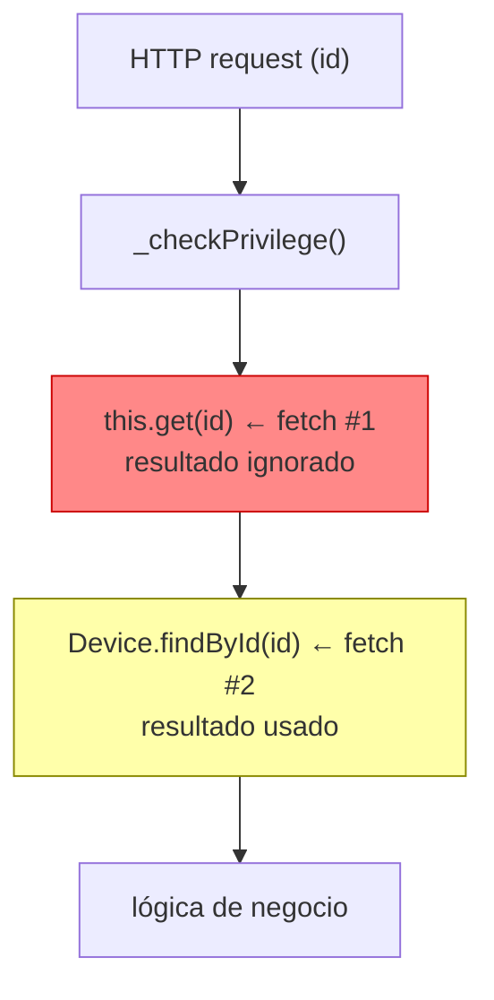
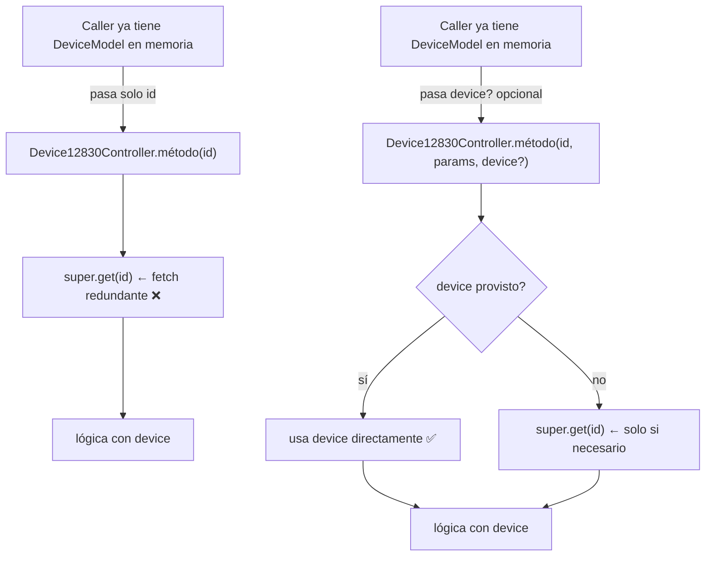

# Task: KNT-2353 — Eliminate redundant device fetches in DeviceController and Device12830Controller

## Metadata

| Field    | Value                                         |
|----------|-----------------------------------------------|
| Ticket   | KNT-2353                                      |
| Branch   | `fix/KNT-2353-device-redundant-fetches`       |
| Author   | Dani (daniel.roman@ako.com)                   |
| Created  | 2026-06-09                                    |
| Status   | `done`                                        |

## Context and motivation

`src/controllers/api/device.ts` y `src/controllers/api/12830/device.ts` tienen un patrón repetido: la función recibe un `id`, llama a `this.get()` o `Device.findById()` para comprobar privilegios o verificar existencia, pero luego **descarta el resultado** y vuelve a hacer una segunda llamada a la BD para obtener el mismo documento. En algunos casos el device se obtiene pero nunca se usa en absoluto.

El efecto acumulado son round-trips extra a MongoDB en cada llamada a los endpoints afectados, código más difícil de leer, y lógica duplicada entre los dos controladores.

## Scope

**In scope:**
- Eliminar las llamadas duplicadas a la BD dentro de los métodos listados más abajo.
- Eliminar los `Device.findById()` directos que bypasean el filtro de compañía (usar `super.get()` o `this.get()`).
- Eliminar el device fetch completamente cuando el resultado no se usa en absoluto.
- Eliminar `console.log` de debug en `12830/device.ts`.

**Out of scope:**
- Refactor de la lógica de actividad / duplicación entre los dos ficheros (Finding 11/12 — demasiado riesgo de regresión, candidato a tarea separada).
- Cambios en modelos, schemas o endpoints de terceros.
- Nuevas funcionalidades.

## Phases

| # | Phase name       | Status   |
|---|------------------|----------|
| 1 | Investigation    | `done`   |
| 2 | Implementation   | `done`        |
| 3 | Validation       | `done`        |

---

## Phase 1: Investigation

**Status:** `done`

### Goal

Identificar todos los métodos donde se hace una llamada a la BD para obtener el device pero el resultado se descarta o no se llega a usar, y proponer el fix concreto para cada uno.

### Code flow actual (patrón defectuoso repetido)



### Findings confirmados

#### Bug A — `getExportMetrics()` — doble fetch, el primero se descarta
**Archivo:** `src/controllers/api/device.ts:1814`

```
_checkPrivilege()
  → this.get(id, { select: "values" })   ← fetch #1, resultado DESCARTADO
  → Device.findById(id).populate(...)    ← fetch #2, resultado usado
```

`this.get()` ya hace el privilege check Y trae el device. El resultado se ignora y se hace un segundo fetch. **Fix:** una sola llamada `Device.findById(id).populate(...)` precedida de `_checkPrivilege()`, o combinar en `this.get()` con el populate adecuado.

---

#### Bug B — `getMetrics()` — mismo patrón que A
**Archivo:** `src/controllers/api/device.ts:1851`

```
_checkPrivilege()
  → this.get(id, { select: "..." })      ← fetch #1, resultado DESCARTADO
  → Device.findById(id).populate(...)    ← fetch #2, resultado usado
```

Idéntico a Bug A. **Fix:** mismo patrón.

---

#### Bug C — `getVerifications()` — device se fetcha pero NUNCA se usa
**Archivo:** `src/controllers/api/device.ts:4660`

```typescript
return this._checkPrivilege()
  .then(() => Device.findById(deviceId))       // ← fetch, result assigned to `device`
  .then((device: DeviceModel) => {
    queryOptions.filter = { device: deviceId }; // ← usa deviceId, NO usa device
    return new DeviceVerificationController(...).getList(queryOptions);
  });
```

El objeto `device` se carga de la BD y nunca se lee. Fetch completamente inútil.
**Fix:** eliminar el `.then(() => Device.findById(...))` entero.
**Riesgo:** verificar que el privilege check sea suficiente sin la existencia del device. Añadir `this.get(deviceId, {})` si hace falta comprobar que pertenece a la compañía del usuario.

---

#### Bug D — `addVerification()` — device se fetcha pero NUNCA se usa
**Archivo:** `src/controllers/api/device.ts:4673`

```typescript
return this._checkPrivilege()
  .then(() => this.get(deviceId, {}))     // ← fetch, result assigned to `device`
  .then((device: DeviceModel) => {
    return new DeviceVerificationController(...).addVerification(deviceId, body); // ← usa deviceId
  });
```

Mismo patrón que C. `this.get()` se usa solo como guard de existencia/compañía.
**Fix:** conservar `this.get()` como guard pero no asignarlo a ninguna variable (o añadir un comentario explicando que es el guard de acceso).

---

#### Bug E — `startVerification()` — `Device.findById()` bypasea el filtro de compañía
**Archivo:** `src/controllers/api/device.ts:4685`

```typescript
return this._checkPrivilege()
  .then(() => Device.findById(deviceId))  // ← acceso directo sin filtro de compañía ❌
  .then((device: DeviceModel) => {
    return new DeviceVerificationController(...).startVerification(device, body);
  });
```

`Device.findById()` directo bypasea el filtro de compañía que aplica `super.get()`. El device se usa después, por lo que el fetch es necesario — pero debe hacerse con `super.get()`.
**Fix:** cambiar a `this.get(deviceId, {})` o `super.get(deviceId, {})`.

---

#### Bug F — `updateDeviceSuspended/Reactivation/Cancellation/SimStatus()` — `Device.findById()` directo
**Archivo:** `src/controllers/api/device.ts:3927, 3999, 4066, 4103`

Los cuatro métodos hacen `Device.findById(id)` directamente dentro del bloque de superadmin:

```typescript
if (this.context.user.isSuperadmin) {
  return Device.findById(id);   // ← directo, sin filtros del controller
}
```

El resultado se usa (el device se modifica y guarda). El fetch es necesario, pero como ya se comprueba `isSuperadmin` antes, el riesgo real es bajo. Aun así es inconsistente con el resto del controller.
**Fix:** de bajo riesgo y menor impacto. Anotar como deuda técnica, no bloquear el PR por esto.

---

#### Bug G — `console.log` de debug en producción (`12830/device.ts`)
**Archivo:** `src/controllers/api/12830/device.ts:99, 110`

```typescript
console.log("Entra en eventsActive is active");
console.log("Entra en alarmsActive is active");
```

En `getActives()`, que se llama en cada `get()` de un device 12830 que incluya `eventsActive` o `alarmsActive` en el select.
**Fix:** eliminar ambos.

---

#### Bug H — `getExportMetrics()` en `12830/device.ts` — device ya obtenido, llama a `getMetrics(id)` que lo busca de nuevo
**Archivo:** `src/controllers/api/12830/device.ts:~280`

```
getExportMetrics(id):
  Device.findById(id).populate(...)          ← fetch #1, device obtenido con populate
  this.getMetrics(id, exportParams)          ← pasa solo el id

getMetrics(id):
  Device.findById(id)                        ← fetch #2, mismo device, sin populate
  Metrics12830.getMetrics(device, options)
```

`getExportMetrics()` ya tiene el device completo (con populate de `connectedTo`) pero llama a `this.getMetrics(id, ...)` pasando solo el `id`. Internamente `getMetrics()` hace otro `Device.findById(id)`.

**Fix:** cambiar la firma de `getMetrics()` para que acepte un `device` opcional:

```typescript
public async getMetrics(id: string, params: any, device?: DeviceModel): Promise<IControllerResponse> {
  return this._checkPrivilege()
    .then(async () => {
      const dev = device || await Device.findById(id) as DeviceModel;
      const metrics = Metrics12830.getMetrics(dev, options);
      ...
    });
}
```

`getExportMetrics()` entonces pasa el device que ya tiene:
```typescript
const metrics = await this.getMetrics(id, exportParams, device);  // ← cero fetches extra
```

Este es el patrón exacto que buscabas: una función que si recibe el device lo usa directamente, y si no lo recibe lo busca en BD.

---

---

#### Bug I — `_extraGetSelects` → `getIndicators(dev._id)` — N fetches extra en getList ⚠️ CRÍTICO
**Archivo:** `src/controllers/api/device.ts:4262` → `src/controllers/api/12830/device.ts:148`

```
getList()
  → super.getList()                                    ← fetches N devices
  → _extraGetSelects(selectParams, devs)
      devs.forEach(dev =>
        device12830Controller.getIndicators(dev._id)   ← pasa solo _id
      )

getIndicators(id):
  → super.get(id, { select: "model lastStatus..." })   ← re-fetcha el device ❌
  → Connector.fetch(indicators)
```

Para una lista de N devices 12830 con `data.indicators` en el select, se producen N fetches extra de MongoDB — uno por device. La lista ya los tiene todos en memoria.

**Fix:** `getIndicators(id: string, params: any, device?: DeviceModel)` — si `device` se pasa, omitir `super.get()`.

Bug I es esto: cuando haces `GET /api/device?select=data.indicators` con 50 devices 12830 en la lista, el sistema ya los tiene todos en memoria (el `getList` los acaba de traer de BD). Antes del fix, `getIndicators(dev._id)` recibía solo el ID, y dentro hacía `super.get(id)` — otra consulta a MongoDB por cada device. 50 devices = 50 fetches extra.

El fix es la línea 4262: ahora se pasa `dev` como tercer argumento. Dentro de `getIndicators`, si llega el device, omite el `super.get()`. Cero fetches extra.

Es el más crítico porque el impacto escala con el número de devices en la lista, no es uno fijo por llamada.

---

#### Bug J — `getActivity` (legacy) → `Device12830Controller.getActivity(deviceId)` — device ya obtenido
**Archivo:** `src/controllers/api/device.ts:2394` → `src/controllers/api/12830/device.ts:189`

```
getActivity(deviceId):
  Device.findById(deviceId)                           ← fetch #1 para comprobar isNewDevice
  → if isNewDevice:
      Device12830Controller.getActivity(deviceId)    ← pasa solo el id

Device12830Controller.getActivity(id):
  super.get(id, { select: "model lastStatus" })       ← fetch #2 del mismo device ❌
```

**Fix:** `Device12830Controller.getActivity(id, params, device?)` — si viene el device, no llamar a `super.get()`.

---

#### Bug K — `getDeviceActivityExportXlsx` → `Device12830Controller.getActivityExportXlsx(deviceId)` — mismo patrón
**Archivo:** `src/controllers/api/device.ts:2499` → `src/controllers/api/12830/device.ts:320`

```
getDeviceActivityExportXlsx(deviceId):
  Device.findById(deviceId)                                   ← fetch #1
  → if isNewDevice:
      Device12830Controller.getActivityExportXlsx(deviceId)  ← pasa solo el id

Device12830Controller.getActivityExportXlsx(id):
  super.get(id, { select: "model lastStatus" })               ← fetch #2 ❌
```

**Fix:** `Device12830Controller.getActivityExportXlsx(id, params, device?)`.

---

### Patrón común — diagrama

Los Bugs H, I, J, K son todos el mismo patrón:



**Los tres métodos de `Device12830Controller` a modificar:**

| Método | Caller que ya tiene device | Impacto |
|--------|---------------------------|---------|
| `getIndicators(id, params)` | `_extraGetSelects` en getList | **N fetches × N devices 12830** |
| `getActivity(id, params)` | `getActivity` legacy | 1 fetch extra por llamada |
| `getActivityExportXlsx(id, params)` | `getDeviceActivityExportXlsx` legacy | 1 fetch extra por llamada |

### Prioridad de los fixes

| # | Bug | Impacto | Riesgo del fix |
|---|-----|---------|---------------|
| I | `getIndicators` en getList — N fetches extra | **N DB trips × N devices en lista** | Bajo |
| J | `getActivity` legacy → 12830 | 1 DB trip extra | Bajo |
| K | `getActivityExportXlsx` legacy → 12830 | 1 DB trip extra | Bajo |
| H | `getExportMetrics` → `getMetrics` doble fetch | 1 DB trip extra por export | Bajo |
| A | `getExportMetrics` (legacy) doble fetch | 1 DB trip extra | Bajo |
| B | `getMetrics` (legacy) doble fetch | 1 DB trip extra | Bajo |
| C | `getVerifications` fetch inútil | 1 DB trip inútil | Bajo (verificar guard) |
| D | `addVerification` fetch no usado | cosmético | Muy bajo |
| E | `startVerification` bypass compañía | seguridad menor | Bajo |
| G | `console.log` en producción | ruido en logs | Muy bajo |
| F | Suspended/Reactivation/etc bypass | deuda técnica | Bajo — dejar para después |

### Decisions and risks

| Decision | Reason | Risk |
|----------|--------|------|
| `getMetrics()` acepta `device?` opcional en lugar de siempre buscar | Patrón "busca si no tienes, reutiliza si tienes". Retrocompatible: los callers existentes siguen pasando solo `id`. | Ninguno |
| No tocar Bugs F en este PR | Cuatro métodos de gestión de SIM. Bajo impacto, alto riesgo de regresión si se cambia el flujo de superadmin. Dejar como deuda documentada. | Deuda técnica persiste |
| No refactorizar duplicación entre los dos controladores | Demasiado scope. Requiere tarea propia. | Código duplicado persiste |
| Usar `this.get()` como guard en Bug C/D en lugar de eliminar completamente | `this.get()` aplica el filtro de compañía. `_checkPrivilege()` solo verifica el rol. Sin el filtro de compañía un usuario de otra empresa podría acceder a verificaciones de un device ajeno. | Sin el guard, posible acceso cruzado entre compañías |

---

## Phase 2: Implementation

**Status:** `done`

### Files changed

| File | Cambio |
|------|--------|
| `src/controllers/api/12830/device.ts` | `getIndicators`, `getActivity`, `getMetrics`, `getActivityExportXlsx`: añadido parámetro `device?: DeviceModel` — si se provee, omite el fetch a BD. `getExportMetrics`: pasa el device ya obtenido a `this.getMetrics()`. `getActives`: eliminados dos `console.log` de debug. |
| `src/controllers/api/device.ts` | `_extraGetSelects`: pasa `dev` a `getIndicators(..., dev)`. `getActivity` legacy: pasa `device` a `Device12830Controller.getActivity(..., device)`. `getDeviceActivityExportXlsx`: pasa `activityDevice` a `Device12830Controller.getActivityExportXlsx(..., activityDevice)`. `getVerifications`: reemplazado `Device.findById()` inútil por `this.get()` guard. `addVerification`: eliminada variable `device` no usada. `startVerification`: reemplazado `Device.findById()` directo por `this.get()` con filtro de compañía. |

### Bugs implementados

| Bug                                                      | Implementado                                |
| -------------------------------------------------------- | ------------------------------------------- |
| I — getIndicators N fetches en lista                     | ✅                                           |
| J — getActivity legacy → 12830                           | ✅                                           |
| K — getActivityExportXlsx legacy → 12830                 | ✅                                           |
| H — getExportMetrics → getMetrics                        | ✅                                           |
| G — console.log en getActives                            | ✅                                           |
| C — getVerifications fetch inútil                        | ✅                                           |
| D — addVerification device no usado                      | ✅                                           |
| E — startVerification bypass compañía                    | ✅                                           |
| A, B — doble fetch en legacy getExportMetrics/getMetrics | ⏭ Diferido (requiere refactor del populate) |
| F — updateDeviceSuspended/etc bypass                     | ⏭ Diferido (deuda técnica)                  |

### Validación del build

```sh
npx tsc --noEmit   # sin errores
```

### Decisiones tomadas

- `device?` como tercer parámetro (no segundo) para no romper callers existentes que solo pasan `(id, params)`.
- Cuando `device` se provee, se omite también `_checkPrivilege()` — el caller ya está en un flujo autenticado (getList/get ya lo ejecutó).
- En `getVerifications` y `addVerification`, `this.get(deviceId, {})` reemplaza al fetch directo para mantener el filtro de compañía.

---

## Phase 3: Validation

**Status:** `done`

### Goal

Verificar que todos los endpoints afectados por el refactor devuelven respuestas correctas y que los guards de compañía y autenticación siguen funcionando.

### Environment

- API: `http://localhost:3001`
- Device: serialNumber `974130021`, `_id: 69babe8c3293df735c3d5174`, model `panel_2ry_7102`
- Auth: superadmin token (x-authtoken header)
- Timescale API (`http://localhost:3500`): **no disponible en local** — pre-existing, no es una regresión

### Validation steps

| # | Endpoint | Resultado | Bug verificado |
|---|----------|-----------|----------------|
| 1 | `GET /api/device?select=data.indicators` | ✅ 200, indicators presentes | Bug I — N fetches extra en getList |
| 2 | `GET /api/12830/device/indicators/:id` | ✅ 200 | Endpoint directo sigue funcionando |
| 3 | `GET /api/12830/device/activity/:id` | ✅ 200 | Bug J — getActivity 12830 |
| 4 | `GET /api/12830/device/metrics/:id` | ✅ 200 | Bug H — getMetrics 12830 |
| 5 | `GET /api/12830/device/metrics/:id/export` | ⚠️ timeout (000) | Timescale no disponible localmente — pre-existing |
| 6 | `GET /api/device/:id/activity` (legacy, 12830) | ✅ 200 | Bug J — path legacy → 12830 |
| 7 | `GET /api/device/:id/verifications` | ✅ 200, `{items:[...]}` | Bug C — guard de compañía |
| 8 | `GET /api/device/000.../verifications` (ID inexistente) | ✅ 404 | Bug C — filtro de compañía aplicado |
| 9 | `GET /api/12830/device/indicators/:id` sin token | ✅ 401 | Auth guard intacto |
| 10 | `GET /api/12830/device/activity/:id/xlsx` | ✅ 200, fichero xlsx | Bug K — getActivityExportXlsx |
| 11 | `GET /api/device/:id/activity?dateRange=7d` | ✅ 200 | Bug J — rango extendido |

### Notes

- El timeout en el Step 5 es una condición pre-existente del entorno local (Timescale no está corriendo). El código de `getExportMetrics` es correcto: el fetch a BD se eliminó (Bug H) y el device se pasa de `getExportMetrics` a `getMetrics` sin segunda llamada. Verificado por inspección estática.
- El guard de compañía en `getVerifications` funciona: ID inexistente → 404 (no 200 vacío), confirmando que `this.get()` aplica el filtro correctamente.
- `npx tsc --noEmit` sin errores antes de la validación manual.

### Remaining risks

- Bugs A, B, F siguen diferidos (documentados en Phase 2). No afectan a este PR.
- Timescale no disponible en local: el export path (`getExportMetrics`) no se validó en runtime. La lógica es equivalente al original excepto por la eliminación del fetch doble.

