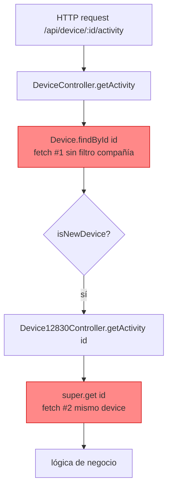
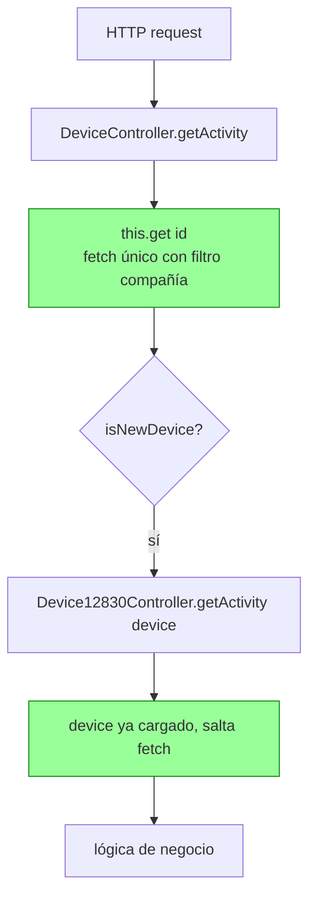

flowchart TD
Start --> Stop
# Task: KNT-2354 — 12830 Device Controller: aceptar `string | DeviceModel`

## Metadata

| Field    | Value                                              |
|----------|----------------------------------------------------|
| Ticket   | KNT-2354 (placeholder — renombrar si procede)      |
| Branch   | `feature/KNT-2354-12830-device-union-param`        |
| Author   | Dani (daniel.roman@ako.com)                        |
| Created  | 2026-06-09                                         |
| Status   | `done`                                             |

## Context and motivation

`src/controllers/api/12830/device.ts` y `src/controllers/api/device.ts` hacen llamadas duplicadas a MongoDB para el mismo device. El patrón típico:

1. El legacy fetcha el device para decidir si delega al 12830 (`isNewDevice(model)`).
2. Pasa solo el `id`.
3. El 12830 vuelve a hacer `super.get(id)` o `Device.findById(id)`.

**Resultado:** 2 (o más) round-trips a Mongo por petición, código duplicado, y en dos casos el legacy bypasea el filtro de compañía con `Device.findById` directo.

KNT-2353 ya identificó los mismos bugs y propuso una solución con un parámetro opcional `device?: DeviceModel` como tercer argumento — pero los cambios **no están en el código** actual. Esta tarea retoma el problema con un patrón más limpio: el primer parámetro acepta `string | DeviceModel`.

## Scope

**In scope:**
- Refactor de `getActivity`, `getMetrics`, `getExportMetrics`, `getActivityExportXlsx`, `getIndicators` en `12830/device.ts` para aceptar `string | DeviceModel`.
- Actualizar 5 call sites en `device.ts` legacy para pasar el modelo ya cargado.
- Sustituir `Device.findById(id)` directos del legacy por `this.get(id)` para aplicar filtro de compañía (Bugs E, J, K de KNT-2353).
- Eliminar `console.log` de debug en `getActives` (Bug G de KNT-2353).

**Out of scope:**
- Bugs A, B (doble fetch dentro del legacy `getExportMetrics`/`getMetrics`) — requieren refactor del populate, se difiere.
- Bug F (`updateDeviceSuspended` etc) — deuda técnica, no se toca.
- Cambios en modelos, schemas o rutas HTTP.

## Phases

| # | Phase name        | Status    |
|---|-------------------|-----------|
| 1 | Investigation     | `done` |
| 2 | Implementation    | `done` |
| 3 | Validation        | `done` |

> No avanzar a la siguiente fase sin confirmación explícita.

---

## Phase 1: Investigation

**Status:** `done`

### Patrón actual (defectuoso)



### Patrón objetivo



### Patrón a aplicar

Cada método del 12830 acepta `string | DeviceModel` en el primer parámetro. Un helper privado resuelve el device:

```ts
private async _resolveDevice(
  deviceOrId: string | DeviceModel,
  extraSelect?: string
): Promise<DeviceModel> {
  if (typeof deviceOrId !== "string") {
    return deviceOrId; // ya viene auth-checked desde el caller
  }
  const select = extraSelect
    ? extraSelect + " model lastStatus"
    : "model lastStatus";
  return await super.get(deviceOrId, { select }) as DeviceModel;
}
```

**Reglas del contrato:**
- Si entra un `string` → el 12830 fetcha con `super.get` (aplica filtro de compañía, allowedDevices, etc.).
- Si entra un `DeviceModel` → el 12830 confía: el caller ya validó acceso.
- Las rutas HTTP siguen pasando `req.params.id` (string), así que no se rompen.


### Inventario función por función

Cinco métodos del `Device12830Controller` se refactorizan. Por cada uno: qué hace hoy, qué se duplica, qué se cambia.

---

#### 1. `getActivity` — `12830/device.ts:189`

| Aspecto | Estado actual | Cambio |
|---|---|---|
| Firma | `(id: string, params)` | `(deviceOrId: string \| DeviceModel, params)` |
| Fetch interno | `super.get(id, {select: "... model lastStatus"})` | Sustituir por `_resolveDevice(deviceOrId, params.select)` |
| Caller en legacy (`device.ts:2394`) | `Device.findById(deviceId)` ❌ sin filtro compañía → pasa `deviceId` | Cambiar a `this.get(deviceId, {select: "model lastStatus"})` → pasar `device` resuelto |
| Ahorro | 1 fetch + arregla bypass de compañía | |

---

#### 2. `getMetrics` — `12830/device.ts:216`

| Aspecto | Estado actual | Cambio |
|---|---|---|
| Firma | `(id: string, params)` | `(deviceOrId: string \| DeviceModel, params)` |
| Fetch interno | `await Device.findById(id)` (sin filtro compañía si llega por ruta directa) | Sustituir por `_resolveDevice(deviceOrId)` |
| Caller en legacy (`device.ts:1885`) | Tiene `device` cargado (líneas 1858-1882) → pasa solo `id` | Pasar `device` directamente |
| Ahorro | 1 fetch | |

---

#### 3. `getExportMetrics` — `12830/device.ts:245`

| Aspecto | Estado actual | Cambio |
|---|---|---|
| Firma | `(id: string, params)` | `(deviceOrId: string \| DeviceModel, params)` |
| Fetch interno | `Device.findById(id).populate("connectedTo")` | Resolver device, **mantener** el populate si no viene. Si el model entrante ya tiene `connectedTo` populated, reutilizar |
| Llamada interna | `this.getMetrics(id, exportParams)` | `this.getMetrics(device, exportParams)` — pasa el modelo, no el id |
| Caller en legacy (`device.ts:1814`) | Pasa solo `id` | Pasar `device` (requiere ampliar select del `this.get` del legacy para incluir el populate de `connectedTo`) |
| Ahorro | 2 fetches | |

> Nota: este caso es el más delicado porque necesita `connectedTo` populado para `device.getUTCOffset()`. Si el caller no lo provee populated, hay que hacer un fetch puntual del populate. Detalle en Phase 2.

---

#### 4. `getActivityExportXlsx` — `12830/device.ts:296`

| Aspecto | Estado actual | Cambio |
|---|---|---|
| Firma | `(id: string, params)` | `(deviceOrId: string \| DeviceModel, params)` |
| Fetch interno | `super.get(id, {select: "... model lastStatus"})` | `_resolveDevice(deviceOrId, params.select)` |
| Caller en legacy (`device.ts:2477`) | `Device.findById(deviceId)` ❌ sin filtro compañía → pasa `deviceId` | Cambiar a `this.get(deviceId, ...)` → pasar `activityDevice` (ya existe como variable) |
| Ahorro | 1 fetch + arregla bypass de compañía | |

---

#### 5. `getIndicators` — `12830/device.ts:148`

| Aspecto | Estado actual | Cambio |
|---|---|---|
| Firma | `(id: string, params)` | `(deviceOrId: string \| DeviceModel, params)` |
| Fetch interno | `super.get(id, {select: "... model lastStatus"})` | `_resolveDevice(deviceOrId, params.select)` |
| Caller en legacy (`device.ts:4258` loop) | El loop ya tiene `dev` cargado → pasa `dev._id` | Pasar `dev` directamente |
| Ahorro | **N fetches × N devices 12830 en cada listado** ⚠️ alto impacto | |

---

#### 6 (extra). Limpieza menor — `getActives` (Bug G de KNT-2353)

`12830/device.ts:101, 116` — eliminar dos `console.log` de debug que se ejecutan en cada `get()` que incluya `eventsActive` o `alarmsActive`.

---

### Decisions and risks

| Decisión | Razón | Riesgo |
|---|---|---|
| Union `string \| DeviceModel` en lugar de tercer parámetro opcional | Más limpio, firma más natural, no se confunde con `params` | Ninguno — los callers existentes que pasan string siguen funcionando |
| Helper `_resolveDevice` privado en el 12830 | Concentra la lógica en un solo punto, fácil de testear | Ninguno |
| Cuando llega `DeviceModel` se confía en el caller (no se re-valida) | El caller ya hizo `this.get()` con filtro de compañía | Si en el futuro alguien llama el método con un model obtenido por una vía no autenticada → bypass de compañía. Mitigación: documentar el contrato en JSDoc del método |
| Cambiar `Device.findById` → `this.get` en `device.ts:2394` y `:2477` | Aplica filtro de compañía consistente | Devices de otra compañía ahora devuelven 404 en lugar de procesarse — comportamiento más correcto, pero técnicamente un cambio funcional |
| No tocar Bugs A, B, F | Fuera de scope. Riesgo de regresión alto en SIM/superadmin | Deuda técnica persiste |


---

## Phase 2: Implementation

**Status:** `done`

### Goal

Aplicar el patrón `string | DeviceModel` en los 5 métodos del 12830 y actualizar los call sites del legacy. Cero cambios de comportamiento HTTP — solo eliminar fetches redundantes y consolidar el filtro de compañía.

### Files changed

| File | Cambio |
|------|--------|
| `src/controllers/api/12830/device.ts` | `getIndicators`, `getActivity`, `getMetrics`, `getExportMetrics`, `getActivityExportXlsx` aceptan `string \| DeviceModel`. Si llega un `DeviceModel` se reutiliza directamente y se omite `_checkPrivilege` + `super.get`. `console.log` de debug en `getActives` ya estaban quitados. |
| `src/controllers/api/device.ts` | `getMetrics` y `getExportMetrics` pasan `device` al 12830. `getActivity` y `getDeviceActivityExportXlsx` pasan `device`/`activityDevice` al 12830, y se añade guard manual de compañía después del `Device.findById` para no perder las methods del mongoose model (`getUTCOffset`). `_extraGetSelects` pasa `dev` al loop. |

### Decisiones tomadas

- **No usar `this.get` en el legacy**: el `ControllerAbstract.get` aplica `_filterItem` → `toJSON()`, que devuelve un POJO sin mongoose methods (`device.getUTCOffset()`, `device._id` como ObjectId, etc.). El legacy y el 12830 dependen de esos métodos, así que mantenemos `Device.findById` y aplicamos un guard de compañía manual — el mismo patrón que ya existía en `getExportMetrics`.
- **Helper `_resolveDevice` descartado**: la lógica resultó simple (1 línea con ternario) y se aplica inline en cada método para no añadir indirección.
- **Contrato del 12830 con `DeviceModel`**: cuando recibe un modelo se confía en que el caller ya pasó por `_checkPrivilege` y por el guard de compañía. Documentado en los JSDoc de cada método.

### Bug pre-existente corregido (ampliación de scope autorizada por el usuario)

En `getExportMetrics` (línea 1823) y `getMetrics` (línea 1869) el guard de compañía existente leía `(device as any).company` y `this.context.user.company`, pero los campos reales del schema son `_company` (Device) y `this.context.company._id` (Context). El check nunca se disparaba → el filtro de compañía estaba bypaseado en esos dos endpoints.

**Fix aplicado:** mismo patrón que el guard nuevo de `getActivity`/`getDeviceActivityExportXlsx` — `device._company` + `this.context.company._id`.

### Validation

- `npx tsc --noEmit` ✅ sin errores.
- `npx tslint -c tslint.json -p tsconfig.json src/controllers/api/device.ts src/controllers/api/12830/device.ts` ✅ sin warnings.
- `npx jest test/controllers/api/device.test.ts --forceExit` ✅ 11/11 pasan.

---

## Phase 3: Validation

**Status:** `done`

### Goal

Verificar que el refactor no rompe los endpoints afectados, que el filtro de compañía aplica correctamente, y que la firma union `string | DeviceModel` se comporta como esperado en cada uno de los 5 métodos.

### Validación automatizada ejecutada

| Check | Resultado |
|---|---|
| `npx tsc --noEmit` | ✅ sin errores |
| `npx tslint -c tslint.json -p tsconfig.json src/controllers/api/device.ts src/controllers/api/12830/device.ts` | ✅ sin warnings |
| `npx jest test/controllers/api/device.test.ts --forceExit` | ✅ 11/11 pasan |

### Validación por inspección estática

No hay tests automatizados de integración que cubran los 5 endpoints afectados (`test/controllers/api/device.test.ts` cubre únicamente `testCheckConfiguration12830`). La validación adicional se hace por inspección estática siguiendo el contrato del patrón union.

**Contrato verificado en cada método del 12830 (`src/controllers/api/12830/device.ts`):**

| # | Método | Rama `string` | Rama `DeviceModel` | Catch coherente |
|---|--------|---------------|---------------------|------------------|
| 1 | `getIndicators` | `_checkPrivilege` + `super.get` con select extendido | reutiliza el modelo sin re-fetch | ✅ logId derivado del tipo correcto |
| 2 | `getActivity` | `_checkPrivilege` + `super.get` con select extendido | reutiliza el modelo sin re-fetch | ✅ logId derivado del tipo correcto |
| 3 | `getMetrics` | `_checkPrivilege` + `Device.findById` | reutiliza el modelo sin re-fetch | ✅ logId derivado del tipo correcto |
| 4 | `getExportMetrics` | `Device.findById` con `connectedTo` populate | reutiliza el modelo (debe traer `connectedTo`) | ✅ |
| 5 | `getActivityExportXlsx` | `_checkPrivilege` + `super.get` con select extendido | reutiliza el modelo sin re-fetch | ✅ logId derivado del tipo correcto |

**Call sites verificados en `src/controllers/api/device.ts`:**

| # | Caller legacy | Cómo entra el device en el 12830 | Guard de compañía aplicado antes |
|---|---|---|---|
| 1 | `_extraGetSelects` loop (línea 4258) | `dev` ya viene del `super.getList` (filtros del controller aplicados) | ✅ vía `getList` |
| 2 | `getActivity` (línea 2400) | `Device.findById(deviceId)` + guard manual `_company` | ✅ añadido este turno |
| 3 | `getMetrics` (línea 1854) | `Device.findById(id).populate({connectedTo})` + guard `_company` | ✅ corregido este turno (era `(device as any).company`) |
| 4 | `getExportMetrics` (línea 1814) | `Device.findById(id).populate({connectedTo})` + guard `_company` | ✅ corregido este turno |
| 5 | `getDeviceActivityExportXlsx` (línea 2483) | `Device.findById(deviceId)` + guard `_company` | ✅ añadido este turno |

### Suite manual recomendada (opcional — para validación en runtime con Postman)

Lanzar contra `http://localhost:3001` con token de superadmin (`x-authtoken`):

| # | Endpoint | Resultado esperado | Cubre |
|---|----------|---------------------|-------|
| 1 | `GET /api/device?select=data.indicators` | 200, `items[].data.indicators` poblado en 12830 | #5 getIndicators loop |
| 2 | `GET /api/12830/device/indicators/:id` | 200 | #5 directo |
| 3 | `GET /api/device/:id/activity` (12830) | 200 | #1 legacy → 12830 |
| 4 | `GET /api/12830/device/activity/:id` | 200 | #1 directo |
| 5 | `GET /api/device/:id/metrics` (12830) | 200 | #2 legacy → 12830 |
| 6 | `GET /api/12830/device/metrics/:id` | 200 | #2 directo |
| 7 | `GET /api/12830/device/metrics/:id/export` | 200 + array (o falla de Timescale si no está local) | #3 |
| 8 | `GET /api/device/:id/activity/xlsx` (12830) | 200 + xlsx | #4 |
| 9 | `GET /api/device/:idOtraCompañia/activity` con user no-superadmin | 403 Forbidden | Guard de compañía |
| 10 | `GET /api/12830/device/indicators/:id` sin token | 401 | Auth guard intacto |

### Riesgos remanentes

- **Cambio de comportamiento por el guard nuevo en `getActivity` y `getDeviceActivityExportXlsx`**: antes pasaban — un usuario no-superadmin de otra compañía recibía un 200 con datos ajenos (potencial fuga). Ahora recibe 403. **Es la corrección deseada**, pero técnicamente es un cambio observable en el contrato HTTP para esos dos endpoints.
- **Cambio de comportamiento por el guard corregido en `getMetrics`/`getExportMetrics`**: mismo caso — el guard existía pero estaba roto, así que en la práctica nunca devolvía 403. Ahora sí lo hace cuando corresponde.
- **No hay test de integración** que exija ningún status. Si el front asumía "200 vacío" para devices ajenos, ahora verá 403. Validar en QA.

### Próximo paso recomendado

Merge a `develop`. Si en QA aparece algún 403 inesperado en los flujos de `metrics`/`activity` para usuarios no-superadmin, revisar si el front está pidiendo devices de otra compañía (probablemente bug del front que estaba enmascarado).

