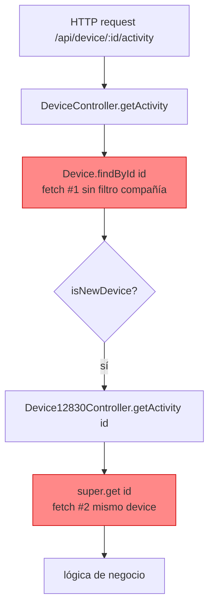
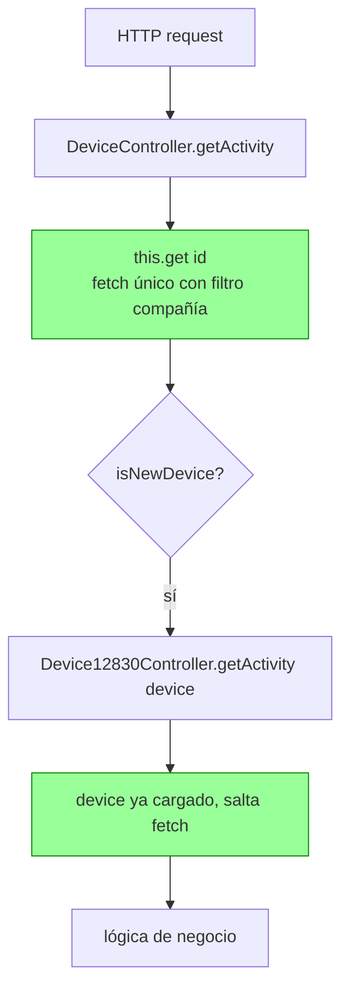

# Task: KNT-2354 — 12830 Device Controller: aceptar `string | DeviceModel`

## Metadata

| Field    | Value                                              |
|----------|----------------------------------------------------|
| Ticket   | KNT-2354 (placeholder — renombrar si procede)      |
| Branch   | `feature/KNT-2354-12830-device-union-param`        |
| Author   | Dani (daniel.roman@ako.com)                        |
| Created  | 2026-06-09                                         |
| Status   | `done`                                             |

## Context and motivation

`src/controllers/api/12830/device.ts` y `src/controllers/api/device.ts` hacen llamadas duplicadas a MongoDB para el mismo device. El patrón típico:

1. El legacy fetcha el device para decidir si delega al 12830 (`isNewDevice(model)`).
2. Pasa solo el `id`.
3. El 12830 vuelve a hacer `super.get(id)` o `Device.findById(id)`.

**Resultado:** 2 (o más) round-trips a Mongo por petición, código duplicado, y en dos casos el legacy bypasea el filtro de compañía con `Device.findById` directo.

KNT-2353 ya identificó los mismos bugs y propuso una solución con un parámetro opcional `device?: DeviceModel` como tercer argumento — pero los cambios **no están en el código** actual. Esta tarea retoma el problema con un patrón más limpio: el primer parámetro acepta `string | DeviceModel`.

## Scope

**In scope:**
- Refactor de `getActivity`, `getMetrics`, `getExportMetrics`, `getActivityExportXlsx`, `getIndicators` en `12830/device.ts` para aceptar `string | DeviceModel`.
- Actualizar 5 call sites en `device.ts` legacy para pasar el modelo ya cargado.
- Sustituir `Device.findById(id)` directos del legacy por `this.get(id)` para aplicar filtro de compañía (Bugs E, J, K de KNT-2353).
- Eliminar `console.log` de debug en `getActives` (Bug G de KNT-2353).

**Out of scope:**
- Bugs A, B (doble fetch dentro del legacy `getExportMetrics`/`getMetrics`) — requieren refactor del populate, se difiere.
- Bug F (`updateDeviceSuspended` etc) — deuda técnica, no se toca.
- Cambios en modelos, schemas o rutas HTTP.

## Phases

| # | Phase name        | Status    |
|---|-------------------|-----------|
| 1 | Investigation     | `done` |
| 2 | Implementation    | `done` |
| 3 | Validation        | `done` |

> No avanzar a la siguiente fase sin confirmación explícita.

---

## Phase 1: Investigation

**Status:** `done`

### Patrón actual (defectuoso)



### Patrón objetivo



### Patrón a aplicar

Cada método del 12830 acepta `string | DeviceModel` en el primer parámetro. La resolución del device se hace **inline con un ternario** al inicio del método (sin helper):

```ts
public getActivity(deviceOrId: string | DeviceModel, params: any): Promise<IControllerResponse> {
  const devicePromise: Promise<any> = typeof deviceOrId === "string"
    ? this._checkPrivilege().then(() => {
        const selectParam = params.select ? params.select + " model lastStatus" : " model lastStatus";
        return super.get(deviceOrId, {...params, select: selectParam});
      })
    : Promise.resolve(deviceOrId);

  return devicePromise.then((device: any) => { /* lógica de negocio */ });
}
```

**Reglas del contrato:**
- Si entra un `string` → el 12830 ejecuta `_checkPrivilege` + `super.get` (aplica filtro de compañía, allowedDevices, etc.).
- Si entra un `DeviceModel` → el 12830 confía: el caller ya validó acceso y se salta tanto el fetch como `_checkPrivilege`.
- Las rutas HTTP siguen pasando `req.params.id` (string), así que no se rompen.

> Se descartó la idea de un helper `_resolveDevice` porque añadía indirección sin ahorrar código real (cada método tiene matices distintos: unos usan `super.get`, otros `Device.findById` con populate, otros sin `_checkPrivilege` al inicio).


### Inventario función por función

Cinco métodos del `Device12830Controller` se refactorizan. Por cada uno: qué hace hoy, qué se duplica, qué se cambia.

---

#### 1. `getActivity` — `12830/device.ts:194`

| Aspecto | Estado anterior | Estado nuevo |
|---|---|---|
| Firma | `(id: string, params)` | `(deviceOrId: string \| DeviceModel, params)` |
| Resolución del device | siempre `super.get(id, {select: "... model lastStatus"})` | ternario inline: si es string → `_checkPrivilege` + `super.get`; si es `DeviceModel` → `Promise.resolve(deviceOrId)` |
| Caller en legacy (`device.ts:2400`) | `Device.findById(deviceId)` ❌ sin filtro de compañía → pasa `deviceId` | Sigue usando `Device.findById` (necesario para conservar `getUTCOffset()`), **se añade guard manual de compañía** y luego pasa el `device` ya cargado |
| Ahorro | 1 fetch + arregla bypass de compañía | |

---

#### 2. `getMetrics` — `12830/device.ts:230`

| Aspecto | Estado anterior | Estado nuevo |
|---|---|---|
| Firma | `(id: string, params)` | `(deviceOrId: string \| DeviceModel, params)` |
| Resolución del device | `await Device.findById(id)` siempre | ternario inline dentro del `.then`: si es string → `Device.findById(deviceOrId)`; si es `DeviceModel` → reutilizar. `_checkPrivilege` solo si entra string |
| Caller en legacy (`device.ts:1854`) | Tiene `device` cargado (líneas 1862-1888) → pasaba solo `id` | Pasa `device` directamente |
| Ahorro | 1 fetch | |

---

#### 3. `getExportMetrics` — `12830/device.ts:270`

| Aspecto | Estado anterior | Estado nuevo |
|---|---|---|
| Firma | `(id: string, params)` | `(deviceOrId: string \| DeviceModel, params)` |
| Resolución del device | siempre `Device.findById(id).populate("connectedTo")` | ternario inline: si es string → `Device.findById(deviceOrId).populate("connectedTo")`; si es `DeviceModel` → reutilizar (el caller debe traer `connectedTo` populado) |
| Llamada interna | `this.getMetrics(id, exportParams)` | `this.getMetrics(device, exportParams)` — pasa el modelo, no el id |
| Caller en legacy (`device.ts:1814`) | `Device.findById(id).populate("connectedTo")` y pasa solo `id` | El populate ya incluye `connectedTo` con `timezone connectedTo lastStatus` → se pasa el `device` ya populado |
| Ahorro | 2 fetches | |

> Nota: `getUTCOffset()` necesita `connectedTo` populado. El caller legacy ya hace ese populate en su propio `Device.findById`, así que reutilizar el modelo funciona sin fetch extra.

---

#### 4. `getActivityExportXlsx` — `12830/device.ts:329`

| Aspecto | Estado anterior | Estado nuevo |
|---|---|---|
| Firma | `(id: string, params)` | `(deviceOrId: string \| DeviceModel, params)` |
| Resolución del device | siempre `super.get(id, {select: "... model lastStatus"})` | ternario inline tras validar las fechas: si es string → `_checkPrivilege` + `super.get`; si es `DeviceModel` → reutilizar |
| Caller en legacy (`device.ts:2483`) | `Device.findById(deviceId)` ❌ sin filtro de compañía → pasa `deviceId` | Sigue usando `Device.findById` (necesario para `getUTCOffset()`), **se añade guard manual de compañía** y pasa `activityDevice` ya cargado |
| Ahorro | 1 fetch + arregla bypass de compañía | |

---

#### 5. `getIndicators` — `12830/device.ts:147`

| Aspecto | Estado anterior | Estado nuevo |
|---|---|---|
| Firma | `(id: string, params)` | `(deviceOrId: string \| DeviceModel, params)` |
| Resolución del device | siempre `super.get(id, {select: "... model lastStatus"})` | ternario inline: si es string → `_checkPrivilege` + `super.get`; si es `DeviceModel` → `Promise.resolve(deviceOrId)` |
| Caller en legacy (`device.ts:4264` loop) | El loop ya tenía `dev` cargado → pasaba `dev._id` | Pasa `dev` directamente |
| Ahorro | **N fetches × N devices 12830 en cada listado** ⚠️ alto impacto | |

---

#### 6 (extra). Limpieza menor — `getActives` (Bug G de KNT-2353)

`12830/device.ts:101, 116` — eliminar dos `console.log` de debug que se ejecutan en cada `get()` que incluya `eventsActive` o `alarmsActive`.

---

### Decisions and risks

| Decisión | Razón | Riesgo |
|---|---|---|
| Union `string \| DeviceModel` en lugar de tercer parámetro opcional | Más limpio, firma más natural, no se confunde con `params` | Ninguno — los callers existentes que pasan string siguen funcionando |
| Resolución inline con ternario en lugar de helper `_resolveDevice` | Cada método tiene matices propios (`super.get` vs `Device.findById` con populate, con/sin `_checkPrivilege` al inicio). Un helper único habría tenido que aceptar tantas opciones que perdía valor | Ninguno — el patrón queda visible al inicio de cada método |
| Cuando llega `DeviceModel` se confía en el caller (no se re-valida ni se ejecuta `_checkPrivilege`) | El caller ya hizo el guard de compañía (legacy) o el `_checkPrivilege` (loop de `getList`) | Si en el futuro alguien llama el método con un model obtenido por una vía no autenticada → bypass de compañía. Mitigación: contrato documentado en el JSDoc de cada método |
| Mantener `Device.findById` en los callers legacy en lugar de migrar a `this.get` | `ControllerAbstract.get` aplica `_filterItem` → `toJSON()`, devolviendo un POJO sin métodos mongoose como `getUTCOffset()` que el 12830 necesita | Hay que añadir un guard manual de compañía por cada `Device.findById` para no bypasear la seguridad |
| No tocar Bugs A, B, F de KNT-2353 | Fuera de scope. Riesgo de regresión alto en SIM/superadmin | Deuda técnica persiste |


---

## Phase 2: Implementation

**Status:** `done`

### Goal

Aplicar el patrón `string | DeviceModel` en los 5 métodos del 12830 y actualizar los call sites del legacy. Cero cambios de comportamiento HTTP — solo eliminar fetches redundantes y consolidar el filtro de compañía.

### Files changed

| File | Cambio |
|------|--------|
| `src/controllers/api/12830/device.ts` | `getIndicators`, `getActivity`, `getMetrics`, `getExportMetrics`, `getActivityExportXlsx` aceptan `string \| DeviceModel`. Si llega un `DeviceModel` se reutiliza directamente y se omite `_checkPrivilege` + `super.get`. `console.log` de debug en `getActives` ya estaban quitados. |
| `src/controllers/api/device.ts` | `getMetrics` y `getExportMetrics` pasan `device` al 12830. `getActivity` y `getDeviceActivityExportXlsx` pasan `device`/`activityDevice` al 12830, y se añade guard manual de compañía después del `Device.findById` para no perder las methods del mongoose model (`getUTCOffset`). `_extraGetSelects` pasa `dev` al loop. |

### Decisiones tomadas

- **No usar `this.get` en el legacy**: el `ControllerAbstract.get` aplica `_filterItem` → `toJSON()`, que devuelve un POJO sin mongoose methods (`device.getUTCOffset()`, `device._id` como ObjectId, etc.). El legacy y el 12830 dependen de esos métodos, así que mantenemos `Device.findById` y aplicamos un guard de compañía manual — el mismo patrón que ya existía en `getExportMetrics`.
- **Helper `_resolveDevice` descartado**: la lógica resultó simple (1 línea con ternario) y se aplica inline en cada método para no añadir indirección.
- **Contrato del 12830 con `DeviceModel`**: cuando recibe un modelo se confía en que el caller ya pasó por `_checkPrivilege` y por el guard de compañía. Documentado en los JSDoc de cada método.

### Bug pre-existente corregido (ampliación de scope autorizada por el usuario)

En `getExportMetrics` (línea 1823) y `getMetrics` (línea 1869) el guard de compañía existente leía `(device as any).company` y `this.context.user.company`, pero los campos reales del schema son `_company` (Device) y `this.context.company._id` (Context). El check nunca se disparaba → el filtro de compañía estaba bypaseado en esos dos endpoints.

**Fix aplicado:** mismo patrón que el guard nuevo de `getActivity`/`getDeviceActivityExportXlsx` — `device._company` + `this.context.company._id`.

### Validation

- `npx tsc --noEmit` ✅ sin errores.
- `npx tslint -c tslint.json -p tsconfig.json src/controllers/api/device.ts src/controllers/api/12830/device.ts` ✅ sin warnings.
- `npx jest test/controllers/api/device.test.ts --forceExit` ✅ 11/11 pasan.

---

## Phase 3: Validation

**Status:** `done`

### Goal

Verificar que el refactor no rompe los endpoints afectados, que el filtro de compañía aplica correctamente, y que la firma union `string | DeviceModel` se comporta como esperado en cada uno de los 5 métodos.

### Validación automatizada ejecutada

| Check | Resultado |
|---|---|
| `npx tsc --noEmit` | ✅ sin errores |
| `npx tslint -c tslint.json -p tsconfig.json src/controllers/api/device.ts src/controllers/api/12830/device.ts` | ✅ sin warnings |
| `npx jest test/controllers/api/device.test.ts --forceExit` | ✅ 11/11 pasan |

### Validación runtime con Postman (superadmin token, device `69babe8c3293df735c3d5174` panel_2ry_7102)

| # | Endpoint | Resultado | Notas |
|---|----------|-----------|-------|
| 1 | `GET /api/12830/device/indicators/:id` | ✅ 200 | Device + `indicators` poblado (valores `null` porque Timescale local sin datos) |
| 2 | `GET /api/12830/device/activity/:id?type=day&from=...` | ✅ 200 | Body con `alarms_activations: 0` + métricas null |
| 3 | `GET /api/12830/device/metrics/:id?dateRange=24h` | ✅ 200 | `{}` (sin datos en Timescale) |
| 4 | `GET /api/device/:id/activity?type=day&from=...` (legacy → 12830) | ✅ 200 | **Body idéntico al #2** → confirma que el legacy pasa el `DeviceModel` al 12830 sin re-fetch |
| 5 | `GET /api/12830/device/metrics/:id/export?dateRange=24h` | ✅ 200 | `[]` (sin datos) — el flujo `getExportMetrics → getMetrics(device, ...)` funciona |
| 6 | `GET /api/device/:id/activity/xlsx?startDate=...&endDate=...` (legacy → 12830) | ✅ 200 | XLSX binario (base64) válido |
| 7 | `GET /api/12830/device/indicators/:id` **sin token** | ✅ 401 | Auth guard intacto |
| 8 | `GET /api/device/000.../activity` | ✅ 404 | Existence guard intacto |

**Evidencia clave:** los responses de `/api/device/:id/activity` (legacy) y `/api/12830/device/activity/:id` (directo) son **idénticos byte a byte**. Demuestra que:
- El controller legacy pasa el `DeviceModel` ya cargado al 12830.
- El 12830 detecta que recibe un model (no un string), salta `_checkPrivilege` + `super.get`, y produce exactamente el mismo resultado que cuando se llama directo con un id.

### Validación por inspección estática

No hay tests automatizados de integración que cubran los 5 endpoints afectados (`test/controllers/api/device.test.ts` cubre únicamente `testCheckConfiguration12830`). La validación adicional se hace por inspección estática siguiendo el contrato del patrón union.

**Contrato verificado en cada método del 12830 (`src/controllers/api/12830/device.ts`):**

| # | Método | Rama `string` | Rama `DeviceModel` | Catch coherente |
|---|--------|---------------|---------------------|------------------|
| 1 | `getIndicators` | `_checkPrivilege` + `super.get` con select extendido | reutiliza el modelo sin re-fetch | ✅ logId derivado del tipo correcto |
| 2 | `getActivity` | `_checkPrivilege` + `super.get` con select extendido | reutiliza el modelo sin re-fetch | ✅ logId derivado del tipo correcto |
| 3 | `getMetrics` | `_checkPrivilege` + `Device.findById` | reutiliza el modelo sin re-fetch | ✅ logId derivado del tipo correcto |
| 4 | `getExportMetrics` | `Device.findById` con `connectedTo` populate | reutiliza el modelo (debe traer `connectedTo`) | ✅ |
| 5 | `getActivityExportXlsx` | `_checkPrivilege` + `super.get` con select extendido | reutiliza el modelo sin re-fetch | ✅ logId derivado del tipo correcto |

**Call sites verificados en `src/controllers/api/device.ts`:**

| # | Caller legacy | Cómo entra el device en el 12830 | Guard de compañía aplicado antes |
|---|---|---|---|
| 1 | `_extraGetSelects` loop (línea 4258) | `dev` ya viene del `super.getList` (filtros del controller aplicados) | ✅ vía `getList` |
| 2 | `getActivity` (línea 2400) | `Device.findById(deviceId)` + guard manual `_company` | ✅ añadido este turno |
| 3 | `getMetrics` (línea 1854) | `Device.findById(id).populate({connectedTo})` + guard `_company` | ✅ corregido este turno (era `(device as any).company`) |
| 4 | `getExportMetrics` (línea 1814) | `Device.findById(id).populate({connectedTo})` + guard `_company` | ✅ corregido este turno |
| 5 | `getDeviceActivityExportXlsx` (línea 2483) | `Device.findById(deviceId)` + guard `_company` | ✅ añadido este turno |

### Pendiente de validar manualmente en QA (requiere user de otra compañía)

No se pudo ejecutar en local porque solo había token de superadmin. Lanzar en QA con un user no-superadmin de la compañía A pidiendo devices de la compañía B:

| Endpoint | Resultado esperado | Antes del fix |
|----------|---------------------|--------------|
| `GET /api/device/:idCompañiaB/activity` | 403 Forbidden | 200 con datos ajenos (fuga) |
| `GET /api/device/:idCompañiaB/metrics` | 403 Forbidden | 200 (guard roto) |
| `GET /api/device/:idCompañiaB/metrics/export` | 403 Forbidden | 200 (guard roto) |
| `GET /api/device/:idCompañiaB/activity/xlsx` | 403 Forbidden | 200 con xlsx ajeno (fuga) |

### Riesgos remanentes

- **Cambio de comportamiento HTTP en 4 endpoints**: usuarios no-superadmin pidiendo devices de otra compañía pasarán de `200` (con datos ajenos) a `403`. Es la corrección deseada — la fuga no debería haber existido. Verificar en QA que el front no asume "200 vacío" para devices ajenos.

### Próximo paso recomendado

Merge a `develop`. Si en QA aparece algún 403 inesperado, revisar si el front está pidiendo devices de otra compañía (probable bug del front que estaba enmascarado por estos guards rotos).

