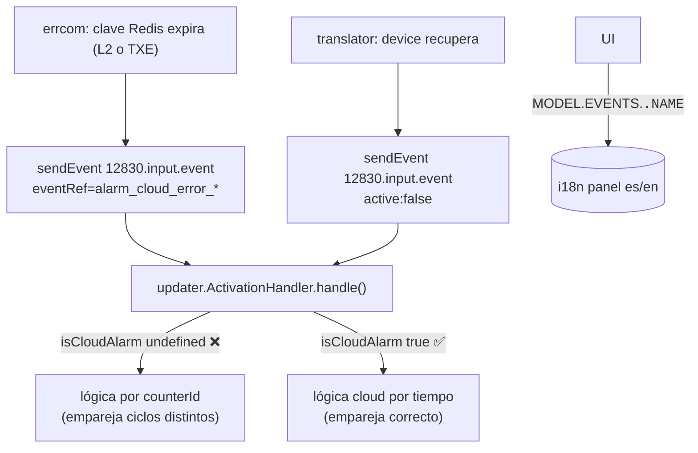

# Task: ERRCOM-CLOUD — Alarmas de comunicación: tiempos correctos y nombres en la UI

## Metadata

| Field   | Value                              |
|---------|------------------------------------|
| Ticket  | KNT-2248                           |
| Branch  | `feature/KNT-2248`                 |
| Author  | daniel.roman                       |
| Created | 2026-06-16                         |
| Status  | `done`                             |

## Context and motivation

Las alarmas cloud de comunicación se veían mal de dos formas:

1. **Tiempos imposibles:** la fecha de "desactivada" salía antes que la de
   "activada" (duraciones negativas).
2. **Nombre incorrecto en la UI:** no se distinguía la alarma **L2** (datalogger,
   ventana corta) de la **TXE** (comunicación final, ventana larga); salía un
   nombre genérico o el código técnico crudo.

Estas alarmas las generan dos micros: `errcom` (activaciones) y `translator`
(desactivaciones cuando el dispositivo se recupera).

## Scope

**In scope:**
- Marcar las alarmas cloud con `isCloudAlarm: true` en emisor (errcom + translator).
- Alinear los nombres mostrados (i18n `panel` es/en) con los `ref` que emite el código.
- Tests que verifiquen el flag en las emisiones.

**Out of scope:**
- Tocar los schemas (`PANEL.json`) — son lógica de negocio, no se modifican.
- Asignar prioridad a estas alarmas (sigue `unassigned`, comportamiento previo).

## Phases

| # | Phase name     | Status |
|---|----------------|--------|
| 1 | Investigation  | `done` |
| 2 | Implementation | `done` |
| 3 | Validation     | `done` |

---

## Phase 1: Investigation

**Status:** `done`

### Code flow



### Findings

- **Bug #1 (tiempos):** `ActivationHandler` (`updater`) solo usa la lógica cloud
  correcta si `eventMessage.parsedData.isCloudAlarm === true`. Los emisores no
  ponían el flag → se iba por la lógica de `counterId` y emparejaba activaciones y
  desactivaciones de ciclos distintos. El tipo `EventPayload` ya declaraba
  `isCloudAlarm?: boolean`; solo faltaba rellenarlo.
- **Bug #2 (nombres):** el nombre de la UI sale de
  `TranslationService.instant(MODEL.EVENTS.<code>.NAME)` donde `<code>` es el
  `eventRef` emitido. El i18n de `panel` tenía `alarm_cloud_comm_error_com`
  (nadie lo emite) y **no** tenía la L2. El código emite `alarm_cloud_error_com`
  y `alarm_cloud_error_l2_datalogger`. Desajuste → sin traducción.

### Decisions and risks

| Decision | Reason | Risk |
|----------|--------|------|
| No tocar schema | Es lógica de negocio | Prioridad sigue `unassigned` |
| Arreglar nombres solo en i18n | El nombre depende del code, no del schema | Ninguno |

---

## Phase 2: Implementation

**Status:** `done`

### Files changed

| File | Change summary |
|------|---------------|
| `cloudevents-12830/errcom/microservice.ts` | `isCloudAlarm: true` en activaciones TXE y L2 |
| `translator-12830/tl-lib/services/DeviceService.ts` | `isCloudAlarm: true` en desactivaciones (2 métodos) |
| `lib/i18n/devices/panel/es.json` | `alarm_cloud_error_com` + `alarm_cloud_error_l2_datalogger` (bloques 7101/7102) |
| `lib/i18n/devices/panel/en.json` | idem en inglés |
| `tests/.../errcom/microservice.test.ts` | 2 tests de activación con flag |
| `tests/.../DeviceService.test.ts` | 3 tests de desactivación con flag |
| `tests/.../events-12830/updater/handlers/ActivationHandler.test.ts` | 4 tests de la rama `isCloudAlarm` (latebackfill, gating, dedup) |
| `bin/examples/client-errcom-mock.js` | mock para reproducir las ventanas y ver el nombre |

### Decisions made

- Nombres diferenciados: TXE = "Error de comunicación (TXE)", L2 = "Error de
  comunicación L2 (datalogger)".
- Se elimina el `ref` muerto `alarm_cloud_comm_error_com` del i18n.

### Problems found

- El schema `PANEL.json` no define `alarm_cloud_error_com` ni la L2 → la prioridad
  queda `unassigned`. Documentado como riesgo, no corregido (fuera de scope).

---

## Phase 3: Validation

**Status:** `done`

### Steps

| # | Action | Result | Note |
|---|--------|--------|------|
| 1 | `JSON.parse` de los 3 JSON tocados | ✅ | `JSON OK` |
| 2 | Diagnostics TS en los 2 `.ts` | ✅ | sin issues nuevos |
| 3 | `npx jest` errcom + DeviceService | ✅ | 26/26 passed |
| 4 | Mock `window` (flujo real) | ✅ | `deact` +30 min posterior a `date` |
| 5 | Mock `latebackfill` `--cloud false` | ✅ | reproduce el bug: vieja `active=true deact=null` colgada |
| 6 | Mock `latebackfill` (con flag) | ✅ | 2 ventanas encadenadas, ambas `deact > date`; log `Storing as completed` + `notify.orphan.paired` |
| 7 | `npx jest` `ActivationHandler.test.ts` | ✅ | 4/4: rama `isCloudAlarm`→`storeCompletedActivationEvent`, gating por flag y dedup |

### Reproducción manual (mock)

`bin/examples/client-errcom-mock.js` publica eventos directamente en la cola del
`updater` (exchange `akocloud`, routingKey `12830.input.event`) con las fechas que
tú decides. Así se reproducen las "ventanas cruzadas" que con el flujo real no se
pueden forzar (el flujo real usa `now`). Solo hace falta el `updater` corriendo:

```bash
npm run dev:micro -- events-12830 updater
```

El mock resuelve el `_id`/`model`/`_company` del device leyendo Mongo por
`serialNumber` (necesita `dist/` compilado para `dist/models/device`). Flags:
`-sn` (serial, obligatorio), `--ref`, `--scenario`, `--start`/`--mid`/`--end`
(minutos atrás de cada evento; `--mid` solo lo usa `latebackfill`), `--cloud
true|false` (pone o no el flag
`isCloudAlarm`), `--cleanup` (borra alarmas/orphans previos de ese `device+code`
antes de publicar, para un run limpio), `--check` (consulta `alarm12830` y resuelve
el nombre i18n).

| Escenario (`--scenario`) | Qué publica | Para qué |
|--------------------------|-------------|----------|
| `window` (def.) | activación (vieja) + desactivación (nueva) | flujo real: ventana positiva |
| `latebackfill` | ventana cerrada `[mid,end]` + activación vieja tardía | **contraste real del flag** |
| `outoforder` | activación **nueva** y luego **vieja** | dedup (NO contrasta, ver nota) |
| `activate` / `deactivate` | un solo evento | pruebas sueltas |

> **Criterio de éxito = `dateDeactivation > date`** (ventana positiva), **no**
> `secondsActive`. El `updater` de 12830 **no** rellena `secondsActive` (solo lo
> hacen los updaters legacy AD1/Abstract/AD1A/DARWIN), así que `secs=undefined` es
> normal y ajeno a esta task. Usa siempre `--cleanup` para no arrastrar estado.

> **Sobre `outoforder`:** NO sirve para contrastar el flag. `ActivationHandler`
> ejecuta `validateDuplication` antes de la rama `isCloudAlarm`: si ya hay una
> alarma activa más reciente, descarta la vieja (log *"Existing active alarm has a
> more recent timestamp, ignoring incoming"*) tanto con `--cloud true` como `false`.
> La rama cloud solo actúa cuando el evento más nuevo ya está **cerrado** y llega
> una activación vieja con retraso → para eso está `latebackfill`.

Contraste bug vs fix (con `latebackfill`):

```bash
# ANTES (sin flag): la activación vieja se guarda ACTIVA colgada en el pasado (deact=null)
node bin/examples/client-errcom-mock.js -sn <serial> --scenario latebackfill --cloud false --cleanup --check
# DESPUÉS (con flag, por defecto): se guarda como ventana histórica cerrada (deact > date)
node bin/examples/client-errcom-mock.js -sn <serial> --scenario latebackfill --cleanup --check
```

Verificación de nombres (`--check` imprime el `code` y el nombre i18n):

```bash
node bin/examples/client-errcom-mock.js -sn <serial> --ref alarm_cloud_error_com --cleanup --check
node bin/examples/client-errcom-mock.js -sn <serial> --ref alarm_cloud_error_l2_datalogger --cleanup --check
```

Esperado: `Error de comunicación (TXE)` y `Error de comunicación L2 (datalogger)`;
si saliera `(no i18n match)` sería el bug #2 sin corregir.

### Remaining risks

- Prioridad `unassigned` para estas alarmas hasta que negocio añada los `ref` al schema.
- Cambios de i18n aplicados solo a `panel`; otros modelos no tienen estas alarmas cloud.
