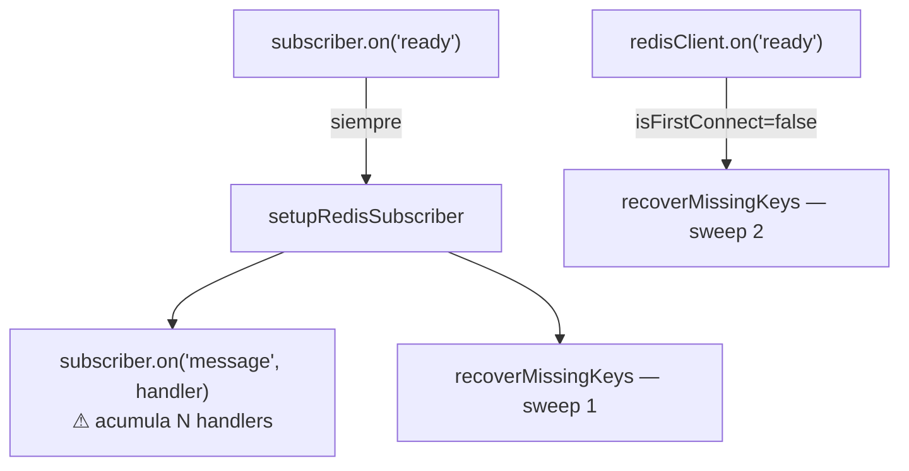
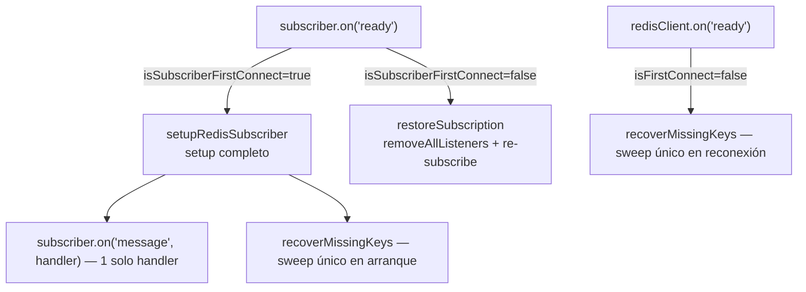
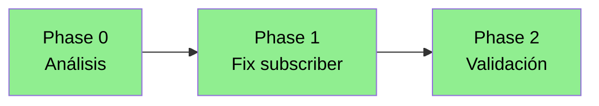

# Task: KNT-2248 — errcom-12830: subscriber reconnect loop

> Después de cada fase: actualizar §8 estado de fases, añadir entrada en §10 log de implementación y actualizar los diagramas Mermaid.

---

## 1. Metadata

| Campo | Valor |
|---|---|
| Nombre | KNT-2248 — errcom-12830: fix subscriber reconnect loop |
| Responsable | Dani |
| Creado | 2026-06-02 |
| Última actualización | 2026-06-02 |
| Estado | Done |
| Fase actual | Phase 2 — Validación completada |
| Área del repositorio | `src/micros/cloudevents-12830/errcom/` |
| Rama base | master |
| Rama de trabajo | feature/KNT-2248 |
| Ticket relacionado | KNT-2248 |

---

## 2. Objetivo

Corregir el comportamiento de `subscriber.on('ready')` en `errcom-12830` para que:

1. En **arranque inicial**: se ejecute el setup completo (config keyspace + suscripción + sweep). Sin cambios.
2. En **reconexión**: solo se restaure la suscripción al canal de keyevents, sin acumular listeners `message` y sin lanzar un sweep adicional al que ya hace `redisClient.on('ready')`.

---

## 3. Non-goals

- No cambiar la lógica del sweep (`recoverMissingKeys`) ni los locks NX EX.
- No modificar el comportamiento en arranque inicial.
- No tocar `status-12830`, `events-12830` ni `mongooseCache`.
- No añadir tests de integración con Redis real.

---

## 4. Background

### Problema

`subscriber.on('ready')` siempre llamaba a `setupRedisSubscriber()`, que internamente hace:
1. Configura keyspace notifications en Redis.
2. Se suscribe a `__keyevent@0__:expired`.
3. Registra `subscriber.on('message', handler)`.
4. Lanza `recoverMissingKeys()` (sweep).

En **reconexión** esto provoca dos efectos adversos:

- **Acumulación de handlers**: cada reconexión registra un nuevo listener `message` sin eliminar el anterior. Tras N reconexiones, cada clave expirada en Redis se procesa N veces. El lock `NX EX 30` evita doble escritura por device, pero el coste de N llamadas a `handleDeviceExpired`/`handleL2Expired` es real.
- **Doble sweep**: en reconexión, tanto `subscriber.on('ready')` como `redisClient.on('ready')` (que ya tiene el guard `isFirstConnect` para reconexiones) lanzan `recoverMissingKeys()` en paralelo — consulta MongoDB de todos los devices online dos veces.

El **arranque inicial** funciona correctamente: el subscriber dispara el sweep y el redisClient lo salta via `isFirstConnect`.

**Causa raíz:** `isFirstConnect` guarda solo `redisClient`, no `subscriber`. No hay cleanup de listeners.

### Commits anteriores relevantes en esta rama

| Commit | Descripción |
|---|---|
| `01b8ccd6` | `fix(errcom-12830)`: corrige `conf.param_tx_interval` y race condition en recovery inactive→online |
| `83a25154` | `feat(errcom-12830)`: añade microservicio y configuración supervisor |

---

## 5. Source of truth

| Tipo | Ruta | Relevancia |
|---|---|---|
| Microservicio | `src/micros/cloudevents-12830/errcom/microservice.ts` | Toda la lógica: subscriber, redisClient, sweep, locks |

---

## 6. Scope

### En scope

- Añadir flag `isSubscriberFirstConnect` para distinguir primera conexión de reconexión en el subscriber.
- Extraer `restoreSubscription()`: limpia el listener anterior y re-suscribe sin sweep.
- El sweep en reconexión sigue siendo responsabilidad de `redisClient.on('ready')`.

### Fuera de scope

- Lógica del sweep, locks, handlers de expiración.
- Cualquier otro microservicio.

### Requisitos de compatibilidad

- Comportamiento en arranque inicial: sin cambios visibles.
- Mensajes de log en reconexión: se añade mensaje de warning indicando restauración.
- API pública del microservicio: sin cambios.

---

## 7. Estrategia / arquitectura

### Estado anterior (reconexión)



### Estado actual (tras el fix)



---

## 8. Fases

| Fase | Nombre | Objetivo | Estado |
|---|---|---|---|
| 0 | Análisis | Entender el estado actual y mapear la implementación | Done |
| 1 | Fix subscriber reconnect | Añadir guard + `restoreSubscription()` | Done |
| 2 | Validación | Build, revisión de logs en entorno, verificación manual | Done |

### Progreso



> **No avanzar a la siguiente fase sin confirmación explícita.**

---

## 9. Decisiones

| Fecha | Decisión | Motivo | Alternativas |
|---|---|---|---|
| 2026-06-02 | Añadir `isSubscriberFirstConnect` en lugar de refactorizar `subscriber.on` con `.once()` | Cambio mínimo, legible, simétrico con `isFirstConnect` ya existente | `.once()` para setup inicial + `on` para reconexión — más complejo de mantener |
| 2026-06-02 | `restoreSubscription()` llama `removeAllListeners("message")` antes de re-registrar | Elimina la acumulación de handlers de reconexiones anteriores de forma explícita | Flag para trackear si el handler está registrado — más estado interno |
| 2026-06-02 | El sweep en reconexión queda exclusivamente en `redisClient.on('ready')` | `redisClient` ya tenía el guard correcto; separar responsabilidades evita coordinación entre los dos clientes | Sweep compartido con mutex — sobreingeniería |

---

## 10. Log de implementación

### 2026-06-02 — Phase 0: Análisis

#### Resumen de cambios

Sin cambios en código. Análisis del flujo de conexión y reconexión de los dos clientes Redis.

#### Hallazgos

- Arranque inicial: 1 sweep (correcto). El subscriber dispara `setupRedisSubscriber()` y el redisClient lo salta por `isFirstConnect`.
- Reconexión: 2 sweeps en paralelo + acumulación de handlers `message` (1 handler extra por cada reconexión).
- El lock `NX EX 30` limita el daño pero no elimina el coste de consultas extra a MongoDB.
- `isFirstConnect` existe solo para `redisClient`, no para `subscriber` — gap de diseño.

#### Validación

- Lectura de código fuente: `src/micros/cloudevents-12830/errcom/microservice.ts` líneas 15-95.

#### Próximo paso

- Implementar Phase 1.

---

### 2026-06-02 — Phase 1: Fix subscriber reconnect

#### Resumen de cambios

| Qué | Cómo |
|---|---|
| Añadido `isSubscriberFirstConnect: boolean = true` | Flag para distinguir primera conexión de reconexión en el subscriber |
| `subscriber.on('ready')` ahora bifurca | Primera vez → `setupRedisSubscriber()` (sin cambios). Reconexión → `restoreSubscription()` |
| Nuevo método `restoreSubscription()` | Hace `removeAllListeners("message")`, re-suscribe a `__keyevent@0__:expired` y registra el handler limpio. Sin sweep |

#### Archivos modificados

- `src/micros/cloudevents-12830/errcom/microservice.ts`
  - Línea 18: añadido `isSubscriberFirstConnect`
  - Líneas 45-57: `subscriber.on('ready')` con bifurcación
  - Líneas 97-108: nuevo método `restoreSubscription()`

#### Validación

- `npx tsc --noEmit` → sin errores

#### Problemas encontrados

- Ninguno.

#### Próximo paso

- Phase 2: validación.

---

### 2026-06-02 — Phase 2: Validación

#### Resumen de cambios

Sin cambios en código de producción. Se añaden tests unitarios para errcom-12830.

#### Tests añadidos

Fichero: `tests/micros/cloudevents-12830/errcom/microservice.test.ts` — 6 tests:

| Test | Qué verifica |
|---|---|
| primera conexión llama a subscribe y registra handler | `subscribe` llamado + 1 handler `message` registrado |
| reconexión llama a `removeAllListeners` | limpieza de handlers antes de re-registrar |
| reconexión no acumula handlers | tras N reconexiones queda exactamente 1 handler |
| reconexión subscriber NO lanza sweep | `recoverMissingKeys` no se invoca desde `restoreSubscription` |
| redisClient primera conexión no lanza sweep | `isFirstConnect` guard funciona |
| redisClient reconexión sí lanza sweep | comportamiento correcto en reconexión de redisClient |

#### Validación automática

- `npx tsc --noEmit` → sin errores
- `npm test -- --testPathPattern="cloudevents-12830"` → 6/6 ✓
- Fallos pre-existentes en `status-12830` y `backlog-12830`: confirmados sin relación con estos cambios (reproducibles sin nuestros cambios via `git stash`)

#### Prueba manual

El microservicio corre vía supervisor dentro del contenedor Docker. Pasos para verificar el comportamiento en reconexión:

**1. Ver logs en tiempo real**
```bash
# Dentro del contenedor (o desde portainer → logs)
tail -f $BUDA_LOG_DIR/supervisor/cloudevents-12830-errcom.log
```

**2. Verificar arranque inicial — debe aparecer UNA sola vez:**
```
[ERRCOM-12830] Redis subscriber connected
[ERRCOM-12830] Starting sweep to recover missing keys...
[ERRCOM-12830] Sweep complete: ...
```
El mensaje `[ERRCOM-12830] Redis client reconnected — running sweep` NO debe aparecer en el arranque.

**3. Simular reconexión de Redis (elegir una opción):**
```bash
# Opción A — pausa temporal (Redis vuelve solo tras N segundos)
redis-cli DEBUG SLEEP 5

# Opción B — restart del contenedor Redis
docker restart <nombre-contenedor-redis>
```

**4. Verificar reconexión — debe aparecer EXACTAMENTE esto:**
```
[ERRCOM-12830] Redis subscriber reconectado — restaurando suscripción a keyevents
[ERRCOM-12830] Suscripción a __keyevent@0__:expired restaurada
[ERRCOM-12830] Redis client reconnected — running sweep to catch missed expirations
[ERRCOM-12830] Starting sweep to recover missing keys...
[ERRCOM-12830] Sweep complete: ...
```

**Lo que NO debe aparecer** tras la reconexión:
- Un segundo `Starting sweep` disparado por el subscriber (bug corregido)
- Más de una línea `Starting sweep` por ciclo de reconexión

**5. Repetir el restart varias veces** y confirmar que el patrón es siempre 1 sweep por reconexión, no 2.

#### Problemas encontrados

- Ninguno.

#### Próximo paso

- Commit de los cambios en `feature/KNT-2248`.
- Iniciar tarea separada para el bug de `alarmCount` en `status-12830`.

---

## 11. Resumen final

| Campo | Valor |
|---|---|
| Estado final | Done |
| Cambios principales | `isSubscriberFirstConnect` flag + `restoreSubscription()` en errcom-12830 |
| Validación completada | tsc sin errores + 6 tests nuevos en verde |
| Limitaciones conocidas | Sin tests de integración con Redis real (deuda técnica documentada) |
| Tarea recomendada siguiente | alarmCount race condition en status-12830 ($set vs $inc) |
