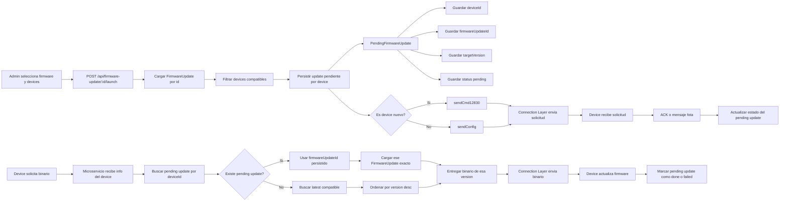

```mermaid
flowchart LR
    A[Admin selecciona firmware y devices] --> B[POST /api/firmware-update/:id/launch]
    B --> C[Cargar FirmwareUpdate por id]
    C --> D[Filtrar devices compatibles]
    D --> E[Persistir update pendiente por device]

    E --> E1[PendingFirmwareUpdate]
    E1 --> E2[Guardar deviceId]
    E1 --> E3[Guardar firmwareUpdateId]
    E1 --> E4[Guardar targetVersion]
    E1 --> E5[Guardar status pending]

    E --> F{Es device nuevo?}
    F -- Si --> G[sendCmd12830]
    F -- No --> H[sendConfig]

    G --> I[Connection Layer envia solicitud]
    H --> I

    I --> J[Device recibe solicitud]
    J --> K[ACK o mensaje fota]
    K --> L[Actualizar estado del pending update]

    M[Device solicita binario] --> N[Microservicio recibe info del device]
    N --> O[Buscar pending update por deviceId]

    O --> P{Existe pending update?}
    P -- Si --> Q[Usar firmwareUpdateId persistido]
    Q --> R[Cargar ese FirmwareUpdate exacto]
    R --> S[Entregar binario de esa version]

    P -- No --> T[Buscar latest compatible]
    T --> U[Ordenar por version desc]
    U --> S

    S --> V[Connection Layer envia binario]
    V --> W[Device actualiza firmware]
    W --> X[Marcar pending update como done o failed]
```
